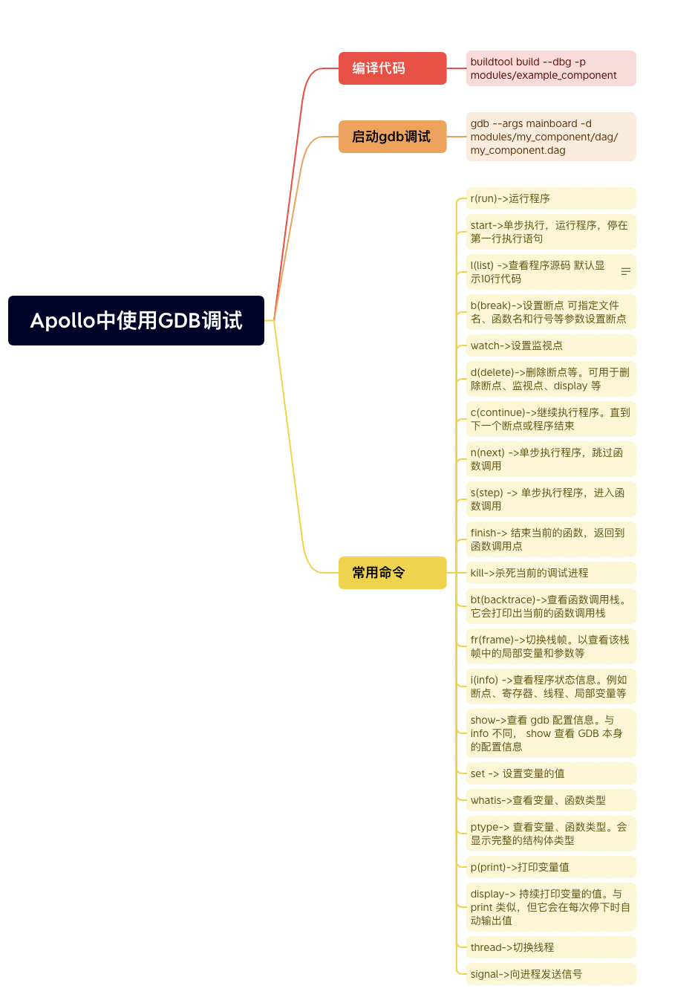
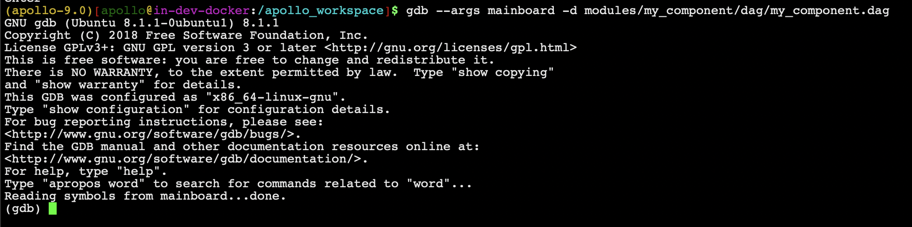
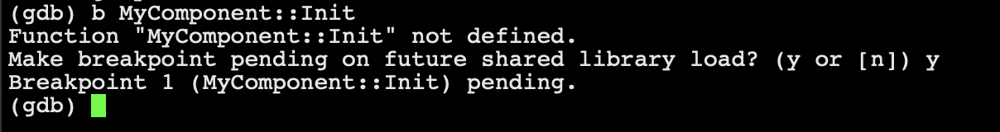
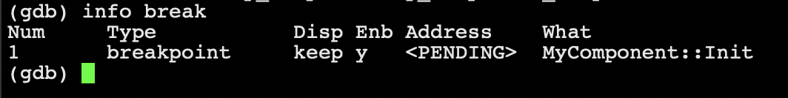
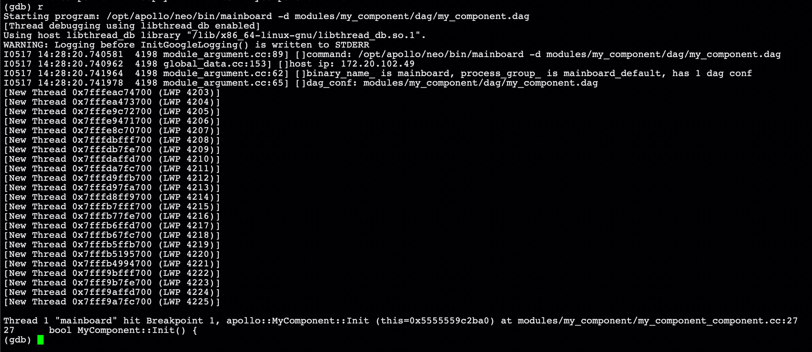
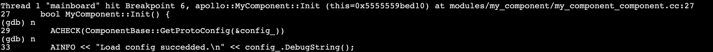
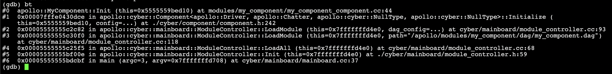

### 如何使用gdb工具调试？



#### GDB概述

GDB，GNU项目调试器，允许您查看另一个程序在执行时“内部”发生了什么，或者其他程序在崩溃时正在做什么。

GDB可以做四种主要的事情（加上其他支持这些事情的事情）来帮助您在行动中捕捉错误：

- 启动程序，指定任何可能影响其行为的内容
- 使程序在指定条件下停止
- 检查程序停止时发生了什么
- 更改程序中的内容，以便您可以尝试纠正一个错误的影响，然后继续了解另一个错误

这些程序可能与GDB（本地）在同一台机器上执行，也可能在另一台机器（远程）上执行，或者在模拟器上执行。GDB可以在大多数流行的UNIX和Microsoft Windows变体以及macOS上运行。

#### 下载gdb工具

在apollo容器中没有内置gdb调试工具，需要用户自行下载

```shell
sudo apt install gdb
```

#### 使用gdb编译Apollo代码

在使用buildtool工具编译代码时，可通过参数--dbg将调试信息加到编译结果中

```shell
buildtool build --dbg 
```

#### 启动GDB

##### gdb program

在Apollo中，启动一个模块通常是通过mainboard+dag文件的方式启动，所以我们可以将mainboard作为progarm, dag文件作为参数传入

```shell
gdb --args mainboard -d modules/my_component/dag/my_component.dag
```



输出 "Reading symbols from mainboard...done." 表明程序已加载

#### 调试程序

##### 设置断点

设置断点的命令是break, 缩写形式为b

- 设置断点在MyComponent::Init()函数入口处
  
  ```shell
  (gdb) b MyComponent::Init
  ```



注：命令行会提示“Function "MyComponent::Init" not defined”，这是因为我们想要调试的程序是动态库，此时还没有被调用。下一行“Make breakpoint pending on future shared library load? (y or [n])”会询问在之后共享库加载后设置断点，此时输入"y"即可

##### 查看断点信息

查看断点信息的命令是info break, 缩写形式为i b

```shell
(gdb) info break
```

在上一步中我们在MyComponent::Init函数处设置了断点，通过info break，我们可以看到设置的断点信息



##### 运行程序

当我们设置好断点后，此时我们再次运行，断点等信息即可加入到调试中

```shell
(gdb) r
```



程序运行到断点处(MyComponent::Init)

##### 单条语句执行

单条运行程序命令是next和step,缩写形式为n和s

next: 单步执行程序，跳过函数调用

step: 单步执行程序，进入函数调用

```shell
(gdb) n
```

```shell
(gdb) s
```



##### 查看函数堆栈信息

查看函数堆栈信息的命令是backtrace, 缩写形式为bt

```shell
(gdb) bt
```



##### 继续运行，直到结束

```shell
(gdb) c
```


这时我们已经简单的调试了我们的程序，如果您有更多的调试项，可参考[gdb官方文档](https://www.sourceware.org/gdb/documentation/)
