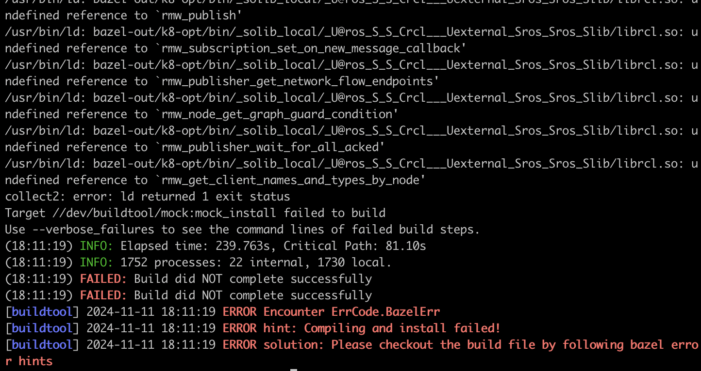

### 问题描述:

通过 buildtool rosenv 配置ros环境后编译报错:



### 问题原因:

要使用ros_bridge的功能，必须先手动source ros的setup.sh文件，否则链接器会找不到ros的动态库从而无法链接

### 解决方案:
根据配置的ros版本source对应的setup.sh文件再编译：

```bash
source /opt/ros/iron/setup.sh     # 如果使用 22.04 且默认配置了 iron 发行版的 ros
source /opt/ros/galactic/setup.sh # 如果使用 20.04 且默认配置了 galactic 发行版的 ros
```