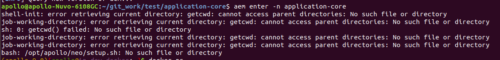

### 问题描述:
按照操作流程启动了容器，然后移动了工程目录的路径，再次进入容器后提示
* 找不到setup.sh文件
* 找不到buildtool、aem等工具
* 模块无法正常启动等

### 问题原因:
容器在启动时，会在工程目录创建.aem文件夹，并挂载到容器内apollo软件包的安装、产出路径，用于保存这个工程安装和编译的内容。当工程目录移动后，容器内就找不到这个挂载点，导致文件丢失了
建议启动容器后不要移动工程目录路径

### 解决方案：
在工程目录下 aem remove 删除容器以及已安装内容，然后aem start重新启动容器，后续再重新部署工程
