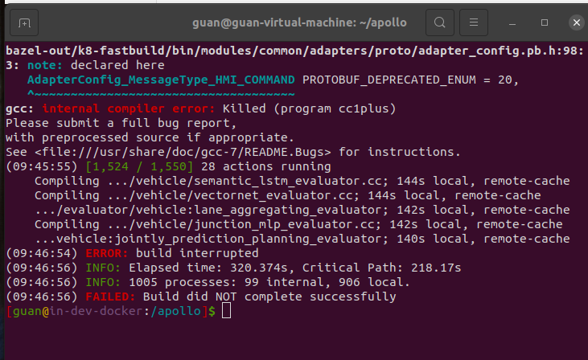

### 问题描述:

编译模块报错 gcc: internal compiler error: killed (program cc1plus)

### 问题原因:

错误表明GCC编译器在编译C++代码时遇到了一个内部错误，并且被操作系统的某种机制（如OOM killer）杀死了。这通常是由于系统资源不足

### 解决方案:

buildtool build 时添加-j, -m参数限制编译资源

