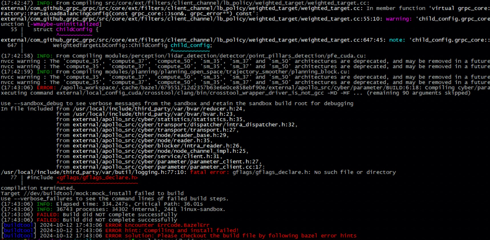
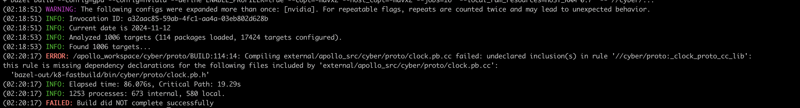

### 问题描述:

升级 Apollo 10.0 后，未对缓存进行清理导致的报错:

* 各类头文件 include 失败，编译报错：


* 编译报错 undeclared inclusion(s) 提示：


### 问题原因:

9.0与10.0的缓存不互通，使用会导致 include 头文件找不到 / 冲突 等问题，导致编译失败

### 解决方案:
删除工作空间的编译缓存，再重新编译

```bash
rm -rm .cache
```