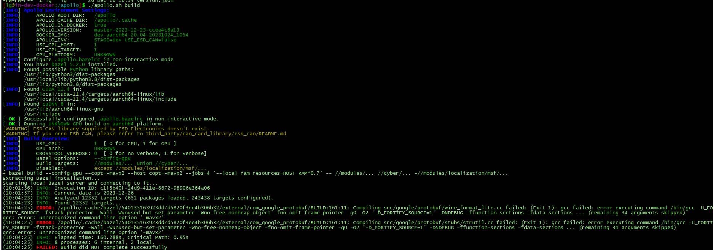
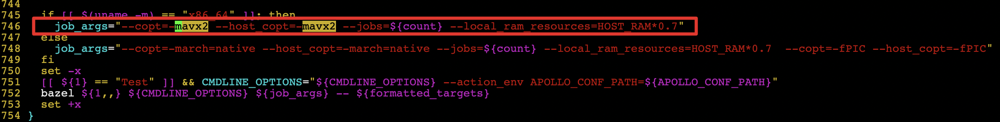

### 问题描述:

源码环境，编译报错: gcc error: unrecognized command line option '-mavx2'

### 问题原因:

这个错误表明GCC编译器不识别命令行选项-mavx2

### 解决方案:

改下scripts/apollo_base.sh的746行，把-mavx2改成-march=native
这行有两处，都改成上面说到的这种形式
改成这样
job_args="--copt=-march=native --host_copt=-march=native --jobs=${count} --local_ram_resources=HOST_RAM*0.7"

export TF_NEED_CUDA=1

export GPU_PLATFORM="NVIDIA"

