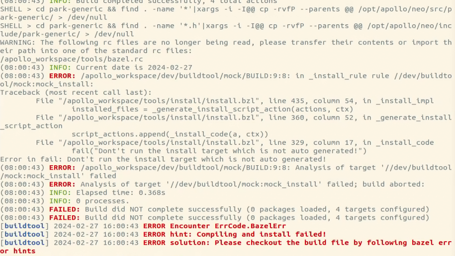

### 问题描述:

编译报错: Don't run the install target which is not auto generated

### 问题原因:

老版本的镜像预装了一些第三方的包，这些版本的第三方包与当前的apollo不兼容，而最新的buildtool默认不会更新这类软件包，导致老版本的第三方包与目前apollo不匹配导致报错。
最新版本的镜像已经删除了这些老版本的第三方包，可以使用最新版本的镜像重新部署。

### 解决方案:
方案1. 确定工程下的.env文件中的tag是否为 9.0-latest，如果不是可以修改成该tag，然后aem remove删除容器，再重新部署工程
方案2. buildtool build的时候添加 --keep-3rd-latest 参数更新第三方包，保证第三方包与当前apollo保持兼容
