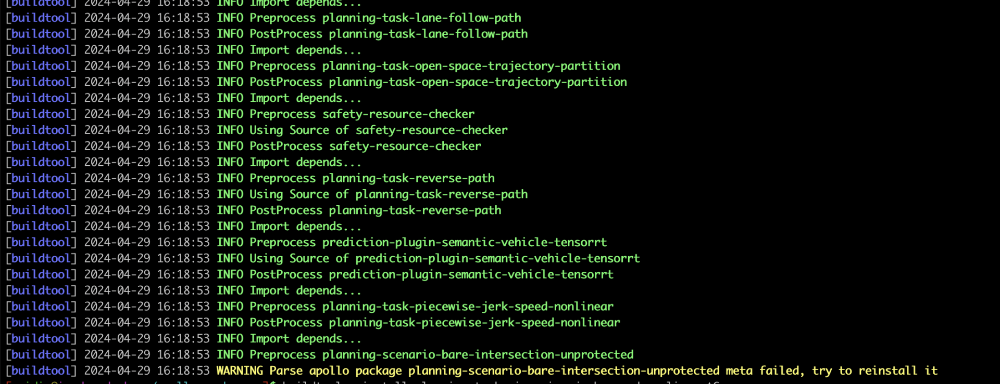

### 问题描述:

正常编译、使用后立即强制断电，导致重新启动后再次编译、运行各模块时出现报错：
* 重新编译显示解析元信息错误，然后退出：


* 运行模块时显示找不到动态库：


### 问题原因:
linux内核对于写入硬盘的数据会先暂存到缓存中，稍后再写入硬盘。马上断电会导致linux内核没来得及将缓存中的编译产出写入到产出路径下，导致后续的编译、运行出现问题。
建议不要直接下电强制关闭域控，而是命令行输入
shutdown
后再进行下电，保证缓存中的数据写入硬盘中

### 解决方案:
#### 如果使用的是包管理：
1. 对于编译报错，可以使用最新版本的buildtool，会自动处理这些文件丢失错误：
```shell
buildtool upgrade && buildtool build
```

2. 对于模块运行报错，重新编译让buildtool自动安装丢失依赖后，手动删除ld缓存再运行脚本重新生成，然后再次运行模块
```shell
sudo rm -f /etc/ld.so.conf.d/apollo.conf && sudo bash /opt/apollo/neo/update_dylib.sh
```

#### 如果使用的源码：
1. 重新编译apollo：
```bash
bash apollo.sh build_opt_gpu
```
