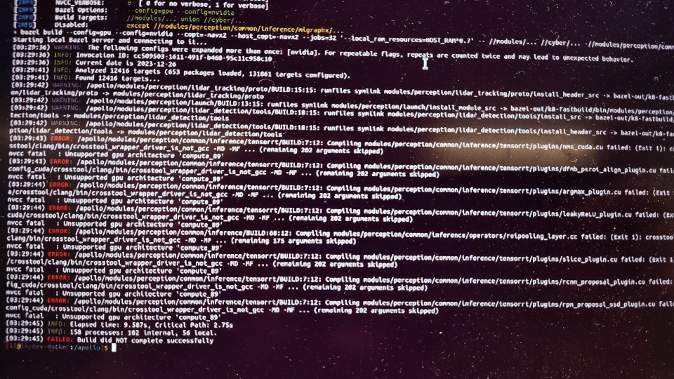

### 问题描述:

编译报错: nvcc fatal : Unsupported gpu architecture 'compute_89'

### 问题原因:

这种情况一般是用户是用户的显卡型号是40系，部署9.0 apollo-core的工程出现的问题。在x86架构下，apollo分为以下几个版本：
apollo-core：即apollo开源版本，对应的是github上的application-core仓库，其中9.0的版本只支持30系及30系及以下的显卡型号，不支持40系显卡。
apollo-universe：即x86架构下的apollo通用园区版，园区版支持40系及40系以下的显卡型号，如果您使用的是40系显卡，请使用通用园区版的工程，具体部署方式以及显卡驱动要求可以参考园区版本的安装文档。

### 解决方案:

如果必须需要使用9.0，可以使用apollo通用园区版。如果可以使用更新的版本，请使用Apollo 10.0，默认支持40系显卡。
