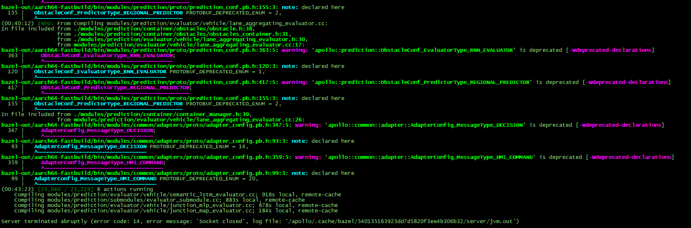
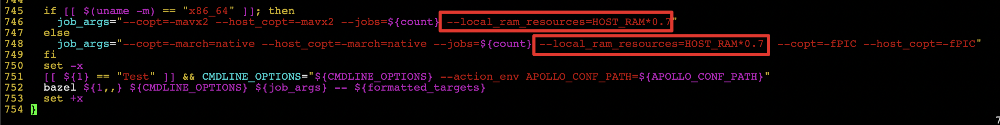
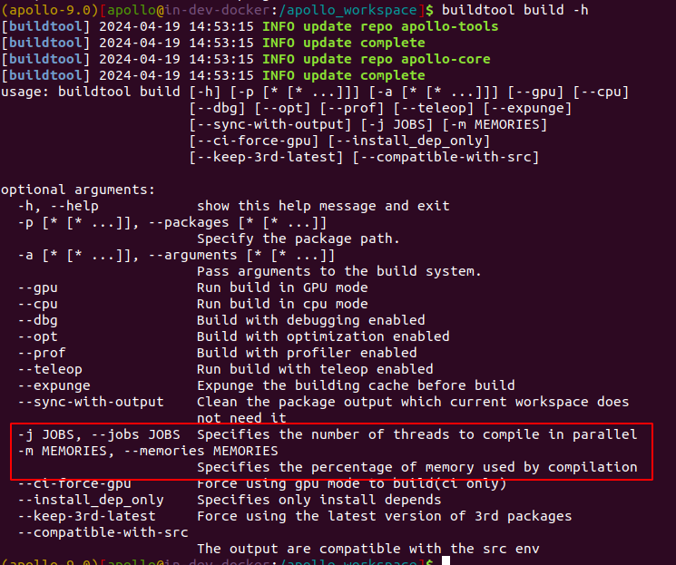

### 问题描述:

编译报错: Server terminated abruptly (error code: 14, error message: 'Socket closed')



### 问题原因:

硬件资源耗尽导致OOM

### 解决方案:

#### 9.0 源码

修改脚本来控制编译使用的硬件资源: scripts/apollo_base.sh中746和748行

```shell
--jobs=${count} --local_ram_resources=HOST_RAM*0.7
改为
--jobs=2 --local_ram_resources=HOST_RAM*0.5
```



#### 9.0 包管理 和 10.0

在编译时可以使用-j和-m参数控制使用的线程数量以及内存百分比，例如buildtool build -j 4 -m 0.5 为使用4个线程，总内存的50%用量进行编译


