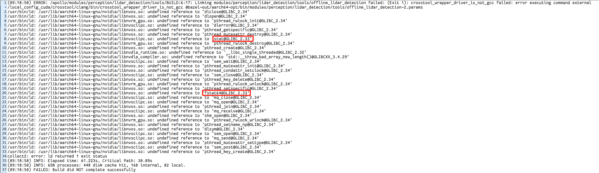

### 问题描述:

编译报错: collect2: error: ld returned 1 exit status，并且出现glibc符号

### 问题原因:

在arm架构下的nvidia-docker-runtime，会将宿主机的和gpu相关的一些动态库挂载进容器内。
目前apollo适配的ubuntu系统版本是20.04，对应glibc版本是2.31，当用户使用22.04的ubuntu时，对应的glibc版本是2.33+，容器内缺少这些符号，导致链接这些动态库的时候ld报错。

### 解决方案:

arm架构下，目前apollo支持的版本是ubuntu 20.04，建议用户使用这一版本的ubuntu
x86则没有这个问题

