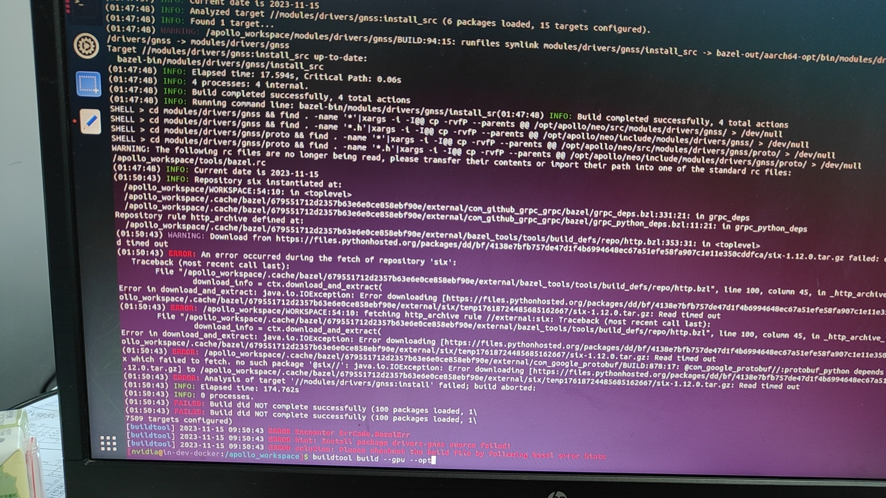

### 问题描述:

编译报错:An error occurred during the fetch of repository'six'



### 问题原因:

网络问题，访问files.pythonhosted.org 会出现下载失败现象，该网站访问不稳定

### 解决方案:
可以重试下解决。
出现 Fetching@six;fetching 超过20s就重试下，可能重试的次数比较多，但是成功一次就可以了。后续非必要不要删容器重新跑。
此外，我们在WORKSPACE文件里面加上了下面这段

```shell
http_archive(    name = "six",
    sha256 = "5f58270f0c9fd489690bbf4bc98300e991cd456ce74124042014d5ebc6eaf093",
    urls = ["https://apollo-system.cdn.bcebos.com/archive/9.0/futures-3.3.0.tar.gz"],
)http_archive(    name = "enum34",
    strip_prefix = "enum34-1.1.6",
    sha256 = "8a87c334b113b18b2020d4ffafb0ec0557e103c6c347132140b64167457db558",
    urls = ["https://apollo-system.cdn.bcebos.com/archive/9.0/enum34-1.1.6.tar.gz"],
)http_archive(    name = "futures",
    strip_prefix = "futures-3.3.0",
    sha256 = "a5181a85f08c870672d9546f860575ab364d319ea6a3a2ec8cd732a030d505b6",
    urls = ["https://apollo-system.cdn.bcebos.com/archive/9.0/futures-3.3.0.tar.gz"],
)
```
