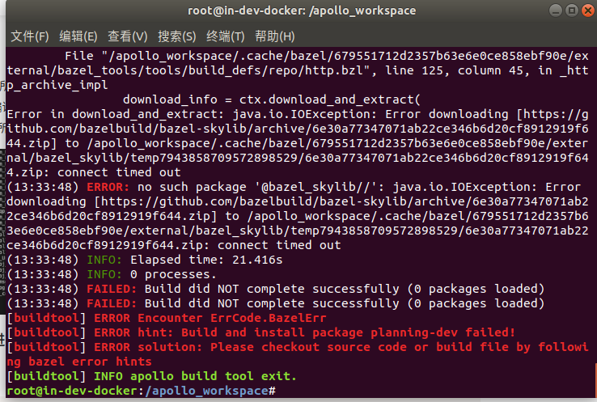

### 问题描述:

编译过程中下载bazel相关依赖失败downloading [https://github.com/bazelbuild/...... connect time out

### 问题原因:

网络问题导致下载bazel依赖失败

### 解决方案:

目前已提供预下载缓存，用户可根据自身需求下载对应缓存文件
- [Apollo 8.0预下载缓存](https://apollo-system.cdn.bcebos.com/bazel_deps/3.7.1/cache.tar.gz)
- [Apollo 9.0 x86预下载缓存](https://apollo-system.cdn.bcebos.com/bazel_deps/5.2.1/cache.tar.gz)
- [Apollo 9.0 arm预下载缓存](https://apollo-system.cdn.bcebos.com/bazel_deps/arm-5.2.1/cache.tar.gz)
