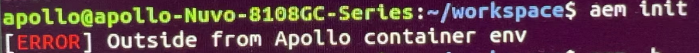

### 问题描述:

执行aem init报错: outside from Apollo container env

### 问题原因:

Apollo8.0版本需要在容器内执行aem init初始化工作空间

注: aem init是8.0初始化工作空间的方式，9.0版本推荐按照教程clone github的工程，不需要自己再初始化来安装apollo

### 相关文档：

- [步骤四：安装示例工程](https://apollo.baidu.com/docs/apollo/latest/md_docs_2_xE5_xAE_x89_xE8_xA3_x85_xE6_x8C_x87_xE5_x8D_x97_2_xE5_x8C_x85_xE7_xAE_xA1_xE7_x90_x86_410bb1324792103828eeacd86377c551.html)
