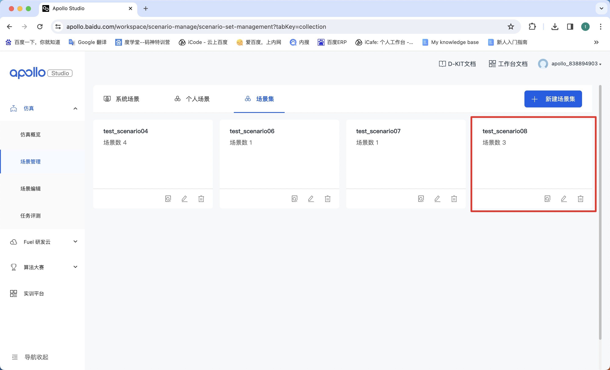
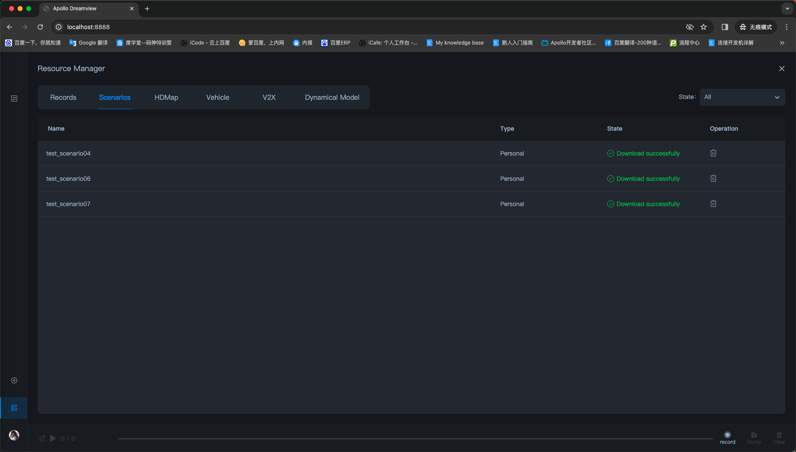
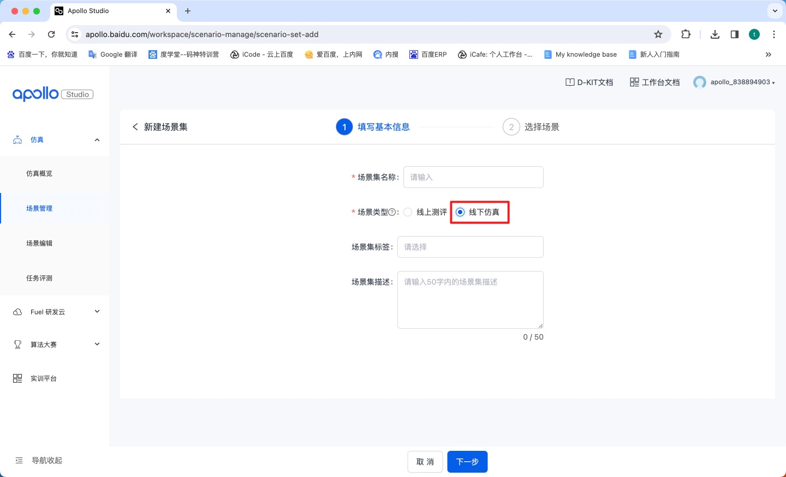
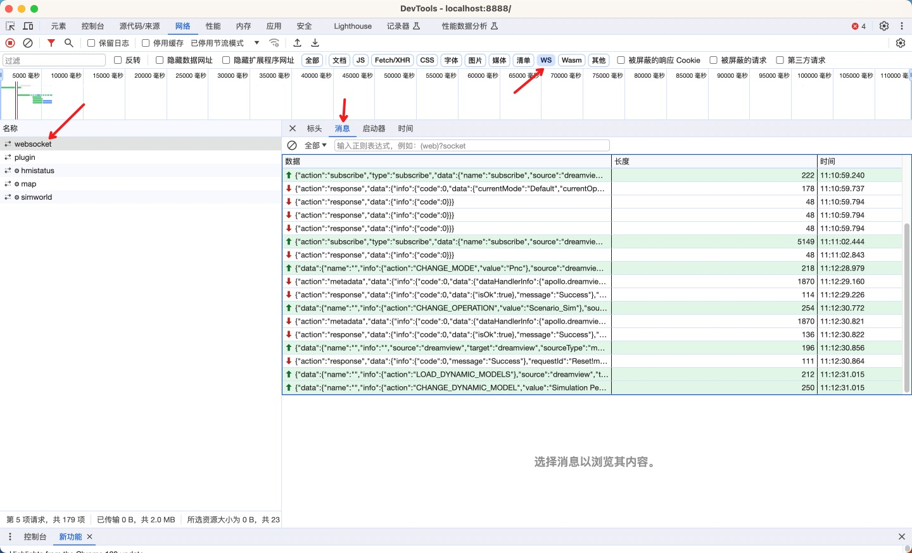
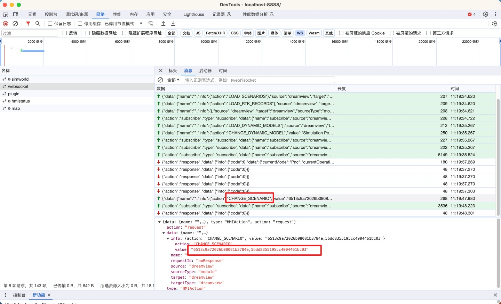
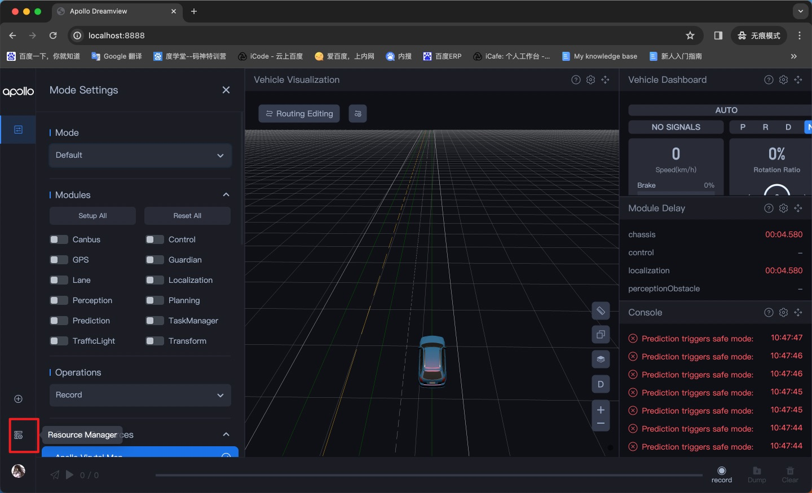
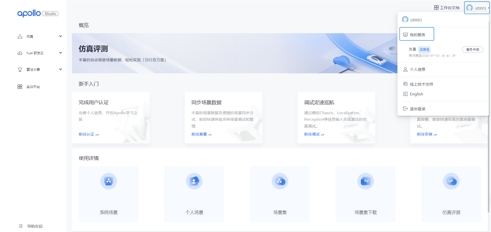
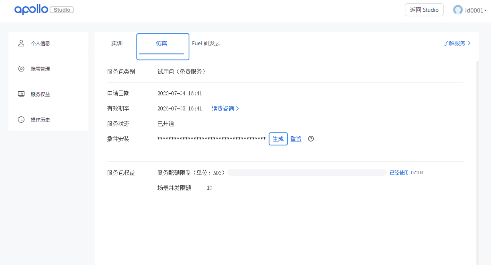
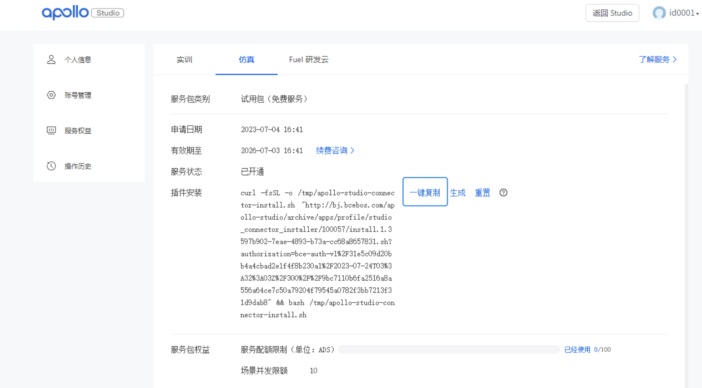

# 1.场景集同步

## 为什么在 studio 上制作的场景集在 Dreamview+ 中没有显示？

### 问题现象

用户创建如下场景集

在Dreamview+ 的resource manager中并没有显示该场景集

### 原因解析

创建场景集时，场景类型选择了“线上评测”，Dreamview+ 插件只同步线下仿真类型的场景集，线上评测类型的场景集在本地不一定可用。

### 解决方法

请重新创建该场景集，并将场景类型选择为“线下仿真”。

## 为什么下载某个场景集后，场景集中的相关场景没有加载出来/无法选择？

### 问题现象

选择某个场景集里的某个场景，无法触发选中态，查看**data/log/dreamview_plus.INFO**，报出类似如下图的log

### 原因解析

本地没有场景匹配的地图

### 解决方法

- 如果是apollo的默认下载的地图，而地图缺失，请通过命令**buildtool reinstall map**重新下载所需要的地图
- 如果是用户创建的地图，请在容器中将地图放入**/apollo/modules/map/data**目录下

# 2.场景仿真

## 为什么开启场景仿真，选择场景启动后没有障碍物？

### 问题现象

启动场景仿真时，车辆启动，但没有障碍物

### 原因解析

- 场景中没有障碍物
- 未安装sim_obstacle
- sim_obstacle进程因为某些原因退出

### 解决方法

- 场景中没有障碍物

步骤一：在Dreamview+ 中打开前端控制台，打开后刷新页面

步骤二：选择名称为websocket的socket

步骤三：点击没有障碍物的场景，在前端控制台中会出现一条action为CHANGE_SCENARIO的消息，点击该消息并展开，其中value的第一个值为场景集id，第二个值为场景id
这里我们的场景集id为6513c9a72026b08081b3784e，场景id为5bdd8355195cc4004461bc03

步骤四：进入该场景集目录，并输出该场景的内容

`cd	 ~/.apollo/resources/scenario_sets/6513c9a72026b08081b3784e/scenarios`
`cat 5bdd8355195cc4004461bc03.json`

步骤五：通过查看agent字段是否有内容判断该场景是否存在障碍物，如果存在内容，则说明场景有障碍物，否则没有

- 未安装sim_obstacle

请在容器中通过命令**ls /opt/apollo/neo/bin/sim_obstacle**查看是否存在sim_obstacle，若不存在，则通过**buildtool reinstall --legacy sim-obstacle**命令安装

- sim_obstacle进程因为某些原因退出

若场景中存在障碍物，且sim_obstacle存在，则通过命令**ps -ef | grep sim_obstacle**查看是否存在sim_obstacle进程，
若不存在，则说明sim_obstacle进程异常退出，通过命令**tail -500f data/log/sim_obstacle.INFO**输出报错信息，并及时联系我们，我们将进行排查

# 3.插件

## 为什么插件没同步成功？

### 问题现象

已经从studio下载了插件，但是打开Dreamview+ 并没有显示resource manager的入口

### 原因解析

可能是因为没有安装Dreamview+ 插件或者插件为旧版本

### 解决方法

步骤一：登录**Apollo Studio**工作台

步骤二：在账户信息中，单击**我的服务**

步骤三：选择**仿真**页签，在插件安装中单击**生成**

步骤四：单击**一键复制**，之后在您的docker环境中运行该指令，插件同步（Dreamview+的登录）就完成了

重新启动并进入Dreamview+，左下角出现头像和资源中心按钮，即插件同步成功，可以开始资源下载了
