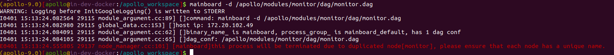
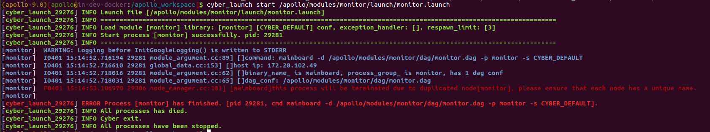
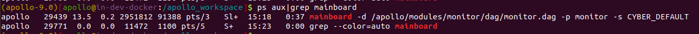

### 问题描述:

使用mainboard或cyber_lanuch启动模块报错：this process will be terminated due to duplicated node[模块名], please ensure that each node has a unique name.

### 问题原因:

模块已启动，再次启动失败

### 解决方案:

可通过ps查询当前启动了哪些模块，使用kill停止已启动的模块后再重新启动

