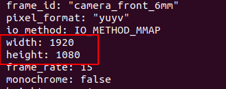
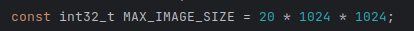
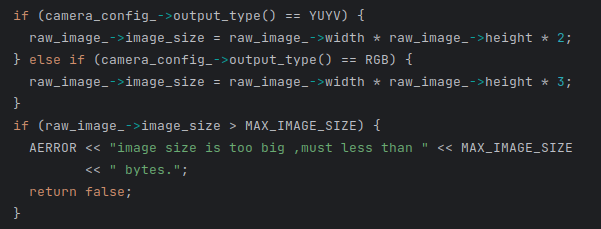

### 问题描述:

camera的driver launch文件运行时报出segemation fault

### 问题原因:

相机分辨率和默认配置不匹配

### 解决方案:

修改配置文件/apollo/modules/drivers/camera/conf/camera_front_6mm.pb.txt和/apollo/modules/drivers/camera/conf/camera_front_12mm.pb.txt

**注意：** 目前apollo支持部分相机分辨率，4k分辨率(3840×2160)暂不支持

常见支持相机分辨率如下

- 640×480
- 1280×720
- 1920×1080
- 2560×1920

支持相机分辨率计算方式如下

