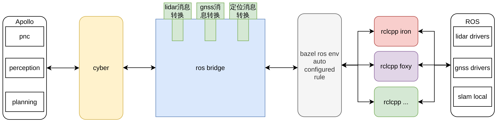

## 概述

新版本cyber对框架进行了改造，支持了cyber与ros的通信。具有以下功能亮点：

**实现常用消息的转换功能，低成本即开即用：**

新版本的cyber打通了部分常用传感器的消息通信，实现了相应消息转换功能，包括点云、IMU等消息格式，关心这部分消息通信的用户只需在配置中对齐两端的channel，启动即可使用

**插件化的消息转换框架，提升开发效率：**

如果用户还想实现除上述消息以外的消息通信，新版本cyber还提供了基于插件化的消息转换框架，用户无需关心cyber和ros的通信接口，只需实现消息转换函数，配置好对应的channel，就能在Apollo各模块中接收由ros发送出来的消息，进一步提升开发效率

## 技术方案

### 打平通信屏障

ros 使用 rclcpp 的通信接口，而 cyberRT 本身也有一套通信接口，由于消息中间件的底层版本/应用层接口的巨大差异，两者互不兼容，并且迁移和适配成本会相当高。

因此，在新的 cyberRT 版本中，我们打平了通信中间件的版本，开发了 ros-bridge 适配了 ros 2 的通信接口，实现了 消息从 cyber 到 ros_bridge 到 ros 的通路，以及从 ros 到 ros_bridge 到 cyber 的通路：

]

### 插件化的消息转换框架，更低开发成本

除了依赖打平和接口适配以外，由于 Apollo 的消息与 ros 消息定义的不同，用户使用 ros bridge 的时候是逃不开相互之间的消息转换逻辑的。而这部分消息转换代码与 cyber 的通信接口、ros 的 rclcpp 接口强耦合，学习成本高，易用性低，并且难以维护。因此，我们基于 Apollo 9.0 中的 cyber 插件机制，解耦消息转换逻辑与 ros_bridge 内部运行逻辑：



## 使用方式

### 1. 前序工作：部署Apollo

要使用新版本cyber的性能分析功能，只需部署最新版本的Apollo即可

#### 源码

clone Apollo最新代码

```bash
git clone https://github.com/ApolloAuto/apollo.git
```

使用脚本启动并进入容器

```bash
bash docker/scripts/dev_start.sh
```

编译Apollo

```bash
bash apollo.sh build
```

配置ros环境

```bash
buildtool rosenv -t # -t 指的是使用清华源
```

> 如果需要实现非ros官方的消息通信，用户需要使用 -p 参数指明非标准消息的源码路径，一般指定用户已有的ros工程中的src路径
> 如果要指定ros发行版可以使用 -c 参数，例如 buildtool rosenv -c humble -t，目前 ubuntu 22 支持 iron 与 humble，ubuntu 20 支持 foxy 与 galactic 

source ros的脚本

```bash
source /opt/ros/iron/setup.sh    # 如果您的ubuntu是22.04
source /opt/ros/galactic/setup.sh # 如果您的ubuntu是20.04
```

> 编译 ros_bridge 之前请务必 source ros 的 setup.sh 脚本，否则编译会失败

编译 ros bridge

```bash
bash apollo.sh build cyber
```

#### 包管理

clone 最新Apollo工程

```bash
git clone https://github.com/ApolloAuto/application-core.git
```

安装aem，启动并进入容器

```bash
sudo install -m 0755 -d /etc/apt/keyrings
curl -fsSL https://apollo-pkg-beta.cdn.bcebos.com/neo/beta/key/deb.gpg.key | sudo gpg --dearmor -o /etc/apt/keyrings/apolloauto.gpg
sudo chmod a+r /etc/apt/keyrings/apolloauto.gpg
echo \
    "deb [arch="$(dpkg --print-architecture)" signed-by=/etc/apt/keyrings/apolloauto.gpg] https://apollo-pkg-beta.cdn.bcebos.com/apollo/core"\
    $(. /etc/os-release && echo "$VERSION_CODENAME") "main" | \
    sudo tee /etc/apt/sources.list.d/apolloauto.list
sudo apt-get update
sudo apt install apollo-neo-env-manager-dev --reinstall
aem start
```

安装Apollo软件包

```bash
buildtool build
```

安装cyber源码

```bash
buildtool install cyber
```

配置ros环境

```bash
buildtool rosenv -t # -t 指的是使用清华源
```

> 如果需要实现非ros官方的消息通信，用户需要使用 -p 参数指明非标准消息的源码路径，一般指定用户已有的ros工程中的src路径即可

source ros的脚本

```bash
source /opt/ros/iron/setup.sh    # 如果您的ubuntu是22.04
source /opt/ros/galactic/setup.sh # 如果您的ubuntu是20.04
```

编译 ros bridge

```bash
buildtool build -p cyber
```

### 2. 分场景使用 cyber 中的 ros_bridge 程序

> 注意事项：
>
> 1.  ros的软件包可以在apollo环境下或者在同一台域控制器内的非apollo环境下运行：
>
>     1. （推荐）假如 ros_bridge 与 ros 程序不在同一个环境中，需要配置 DOMAIN_ID，请在 ros 工程中的shell窗口以及运行 ros_bridge 的窗口配置以下环境变量，使得ros能够跨环境通信：
>
>        export ROS_DOMAIN_ID=0
>
>     2. 假如 ros_bridge 与 ros 程序在 Apollo 环境中，可以直接拷贝 ros 程序的源码到 Apollo 工程目录的 ros_ws 路径下，然后使用 rosdep、colcon 安装依赖和编译

#### 2.1. 基础驱动消息通信

假设您的域控制器内已存在一个 ROS 工程，如果您的需求只是单纯打通 ros 中的 lidar 驱动、gnss 驱动或者定位算法与 Apollo 各模块的通信，ros_bridge 程序已经内置这些基础消息的转换逻辑，只需在相应的配置文件中修改两方的 channel 即可：

##### lidar 消息转换插件

配置文件：

```text
/apollo/cyber/ros_bridge/converters/common_plugins/pointcloud_msg_converter/conf/default.pb.txt
```

```text
name: "lidar"
apollo_channel_name_0: "/apollo/lidar/pointcloud2"
ros_topic_name_0: "/ros/lidar/pointcloud2"
```

其中，apollo_channel_name_0 指的是 apollo 读取 lidar 消息的 channel，ros_topic_name_0 指的是 ros 程序发送 lidar 消息的 topic。设置完毕后，输入：

```bash
ros_bridge
```

启动 ros_bridge 程序，ros_bridge 将会从 ros topic "/ros/lidar/pointcloud2" 中读取 lidar 的消息，进行一定规则转换，发送到 "/apollo/lidar/pointcloud2" 的 apollo channel 中，供下游 Apollo 模块使用

##### gnss 消息转换插件

lidar 消息转换是一对一的关系，而 gnss 部分则相对复杂，涉及到多对多才能完成 ros 的 gnss 消息转换到 apollo 的过程

配置文件：

```text
/apollo/cyber/ros_bridge/converters/common_plugins/gnss_msg_converter/conf/heading_msg_fusion.pb.txt      # 融合 ros 的 nav_sat_fix、odometry，输出 Apollo Heading 消息转换插件
/apollo/cyber/ros_bridge/converters/common_plugins/gnss_msg_converter/conf/imu_msg_converter.pb.txt       # 转换 ros 的 imu，输出 Apollo imu 的消息转换插件
/apollo/cyber/ros_bridge/converters/common_plugins/gnss_msg_converter/conf/nav_msg_converter.pb.txt       # 转换 ros 的 nav_sat_fix，输出 Apollo gnss best pose 的消息转换插件
/apollo/cyber/ros_bridge/converters/common_plugins/gnss_msg_converter/conf/odometry_msg_converter.pb.txt  # 假如 ros 的 gnss 驱动本身不输出 odometry，这个插件基于卡尔曼滤波融合了 imu 和 nav_sat_fix,输出 ros odometry
/apollo/cyber/ros_bridge/converters/common_plugins/gnss_msg_converter/conf/odometry_parser.pb.txt         # 转换 ros 的 odometry，输出 Apollo odometry 的消息转换插件
```

配置文件的 channel 配置与 lidar 消息转换插件类似，此处不再过多叙述

##### 定位消息转换插件

定位消息插件 ros odometry 的消息类型转换成 apollo 的 localization_estimate 以及 transform，此处定位输出的消息必须是世界坐标系的消息，或者能够对应的上 apollo 地图的坐标

#### 2.2. 自行开发消息转换插件

除上述消息以外，如果您想实现其他消息的转换，可以自行实现消息转换插件，具体逻辑可以参考 lidar 消息转换插件：

```text
.
├── BUILD
├── conf
│   └── default.pb.txt    # 配置文件
├── lidar_pointcloud.cc   # 转换插件的实现文件
├── lidar_pointcloud.h    # 转换插件的头文件
└── plugins.xml           # 插件描述文件
```

`lidar_pointcloud.h`

```cpp
#pragma once

#include <algorithm>
#include <memory>
#include <cstring>
#include <string>

// 引入 cyber 的必要头文件
#include "cyber/cyber.h"
#include "cyber/plugin_manager/plugin_manager.h"
#include "cyber/ros_bridge/converter_base/convert_interface.h"
#include "modules/common_msgs/sensor_msgs/pointcloud.pb.h"

// 引入 ros 对应消息的头文件
#include "sensor_msgs/point_cloud2_iterator.hpp"

// 定义输入输出
using InputMsg = sensor_msgs::msg::PointCloud2;
using OutputMsg = apollo::drivers::PointCloud;

using InputMsgPtr = std::shared_ptr<InputMsg>;
using OutputMsgPtr = std::shared_ptr<OutputMsg>;


namespace apollo {
namespace cyber {

...

// 继承 apollo::cyber::RosApolloMessageConverter 基类
class LidarPointcloud :
  public apollo::cyber::RosApolloMessageConverter<
    InputTypes<InputMsgPtr>, OutputTypes<OutputMsgPtr>> {
// apollo::cyber::RosApolloMessageConverter<InputTypes<InputMsgPtr>, OutputTypes<OutputMsgPtr>> 指的是1对1消息转换插件，目前 apollo 支持最高4对4消息转换插件，例如：
// apollo::cyber::RosApolloMessageConverter<InputTypes<InputMsgPtr1, InputMsgPtr2>, OutputTypes<OutputMsgPtr>> 是将 ROS 中的两个消息转换成 Apollo 1个消息的消息转换插件
// apollo::cyber::ApolloRosMessageConverter<InputTypes<InputMsgPtr1, InputMsgPtr2>, OutputTypes<OutputMsgPtr>> 是将 Apollo 中的两个消息转换成 ROS 的1个消息的消息转换插件
 public:
  LidarPointcloud() {}
  ~LidarPointcloud() {}

  ...

  // 定义 ConvertMsg 函数
  virtual bool ConvertMsg(
    InputTypes<InputMsgPtr>&, OutputTypes<OutputMsgPtr>&);

    return value;
  }

  ...

};

// 使用cyber提供的宏注册插件，第一个参数是插件类名，第二个参数是固定是apollo::cyber::MessageConverter
CYBER_PLUGIN_MANAGER_REGISTER_PLUGIN(
  apollo::cyber::LidarPointcloud, apollo::cyber::MessageConverter)

}  // namespace cyber
}  // namespace apollo
```

`lidar_pointcloud.cc`

```cpp
#include "cyber/ros_bridge/converters/common_plugins/pointcloud_msg_converter/lidar_pointcloud.h" // NOLINT

namespace apollo {
namespace cyber {

// 实现消息转换逻辑
bool LidarPointcloud::ConvertMsg(
  InputTypes<InputMsgPtr>& in, OutputTypes<OutputMsgPtr>& out) {
  auto in_msg = std::get<0>(in.values);
  auto out_msg = std::get<0>(out.values);
  ...

  for (size_t i = 0; i < cloud_msg.height * cloud_msg.width; ++i) {
    auto pointcloud = out_msg -> add_point();
    pointcloud -> set_x(x);
    pointcloud -> set_y(y);
    pointcloud -> set_z(z);
    pointcloud -> set_intensity(static_cast<uint32_t>(std::round(intensity)));
    pointcloud -> set_timestamp(static_cast<uint64_t>(timestamp * 10e9));
  }

  return true;
}

}  // namespace cyber
}  // namespace apollo
```

`BUILD`

```python
load("//tools:cpplint.bzl", "cpplint")
load("//tools:apollo_package.bzl", "apollo_package", "apollo_plugin")
load("//tools/platform:build_defs.bzl", "if_aarch64", "if_gpu")

package(default_visibility = ["//visibility:public"])

filegroup(
    name = "runtime_files",
    srcs = glob([
        "conf/**",
        "data/**",
    ]),
)

apollo_plugin(
    name = "liblidar_pointcloud_plugin.so",
    srcs = ["lidar_pointcloud.cc"],
    hdrs = ["lidar_pointcloud.h"],
    description = ":plugins.xml",
    deps = [
        "//cyber",
        "//modules/common_msgs/sensor_msgs:pointcloud_proto",
        "//cyber/ros_bridge:converter_base",
        "//cyber/proto:simple_proto",
        "//cyber/ros_bridge/proto:converter_conf_proto",
        "@ros" # 说明依赖ros
    ],
)

apollo_package()

cpplint()
```

`plugins.xml`

```xml
<library path="cyber/ros_bridge/converters/common_plugins/pointcloud_msg_converter/liblidar_pointcloud_plugin.so"> // 指明插件动态库的相对路径
    <class type="apollo::cyber::LidarPointcloud" base_class="apollo::cyber::MessageConverter"></class> // 指明插件类名，基类名使用apollo::cyber::MessageConverter即可
</library>
```

`default.pb.txt`

```text
name: "lidar"
apollo_channel_name_0: "/apollo/lidar/pointcloud2" # 对应 apollo 第一个消息的 channel
ros_topic_name_0: "/ros/lidar/pointcloud2"         # 对应 ros 第一个消息中的 channel
```

完成开发后，还需为 ros_bridge 指定加载这个新插件：

```bash
vim /apollo/cyber/ros_bridge/conf/ros_bridge_conf.pb.txt
```

假设新插件类型名为：SamplePlugin

```text
converter {
  type: "LidarPointcloud"
}

converter {
  type: "HeadingMsgFusion"
}

converter {
  type: "ImuMsgConverter"
}

converter {
  type: "NavMsgConverter"
}

converter {
  type: "OdometryMsgConverter"
}

# 加入以下内容
converter {
  type: "SamplePlugin"
}
```

修改完毕使用 buildtool build -p cyber 编译，然后正常启动 ros_bridge即可
