## 性能分析能力介绍

随着自动驾驶系统复杂度的增加，越来越多性能问题出现在实际开发、路测的流程中，性能优化已成为整个过程中不可或缺的一环。但是如何发现、分析、定位和解决性能问题相对有一定门槛，并且需要付出额外的工作量/为了解决此类痛点，新版本cyber对框架进行了改造，开发了性能可视化工具，建立了性能分析的能力。cyber的性能分析能力有以下特点：

**多维数据采集，全面监控，无所遁形：**

cyber性能分析工具能够监测自动驾驶系统关键的性能指标，包括：

<table>
  <thead>
    <tr>
      <th>分类</td>
      <th colspan="2">指标</td>
      <th>系统级别</td>
      <th>进程级别</td>
    </tr>
  </thead>
  <tbody>
    <tr>
      <td>CPU</td>
      <td colspan="2">CPU使用率</td>
      <td>√</td>
      <td>√</td>
    </tr>
    <tr>
      <td>GPU</td>
      <td colspan="2">GPU使用率</td>
      <td>√</td>
      <td> </td>
    </tr>
    <tr>
      <td>内存</td>
      <td colspan="2">内存使用大小</td>
      <td>√</td>
      <td>√</td>
    </tr>
    <tr>
      <td>显存</td>
      <td colspan="2">显存使用大小</td>
      <td>√</td>
      <td>√</td>
    </tr>
    <tr>
      <td rowspan="6">IO</td>
      <td rowspan="4">块设备</td>
      <td>读写速率</td>
      <td>√</td>
      <td>√</td>
    </tr>
    <tr>
      <td>设备等待时间</td>
      <td>√</td>
      <td> </td>
    </tr>
    <tr>
      <td>设备IOPS</td>
      <td>√</td>
      <td> </td>
    </tr>
    <tr>
      <td>设备等待队列长度</td>
      <td>√</td>
      <td> </td>
    </tr>
    <tr>
      <td rowspan="2">网卡</td>
      <td>读写速率</td>
      <td>√</td>
      <td>√</td>
    </tr>
    <tr>
      <td>设备带宽使用率</td>
      <td>√</td>
      <td> </td>
    </tr>
  </tbody>
</table>

通过对这些关键指标的实时跟踪，您可以快速识别出自动驾驶系统中影响性能的瓶颈进程所在。

**直观的性能可视化界面，洞察一目了然：**

cyber的性能分析能力提供了用户友好的可视化界面，为您展示了所有性能数据的直观视图。借助清晰的图表和报告，您可以轻松解读性能分析结果，指明优化方向。

**进程级别分析，宏观洞察，精准定位：**

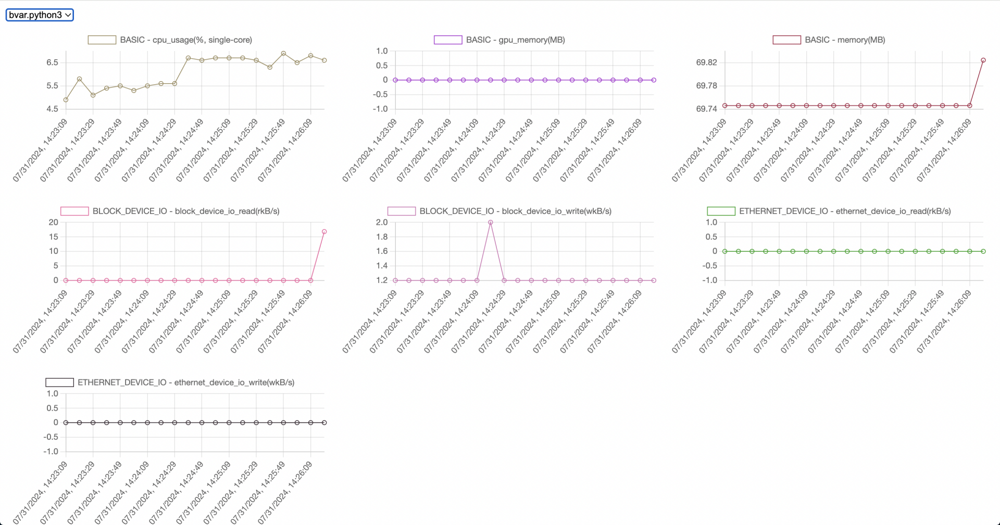

可视化界面提供实时数据允许您观察到每一个进程的性能表现。这种宏观的视角让您可以确定哪一个或哪些进程可能会拖慢整个应用的运行速度，从而作出相应的调整。

**函数级别分析，微观解析，深度调优：**


更进一步，cyber的性能分析能力中，提供了对自动驾驶系统各模块的进程级别分析，通过这一个功能，能够对每个进程生成cpu、内存以及gpu各项指标（依赖于nvidia nsight系列工具）相应的火焰图、有向图等，您可以识别出代码中最需要优化的部分。这种粒度的分析帮助开发者进行深度优化。

## 功能使用

### 前序工作：部署Apollo

要使用新版本cyber的性能分析功能，只需部署最新版本的Apollo即可，整理流程与之前的Apollo部署流程一致

#### 源码

clone Apollo最新代码

```bash
git clone https://github.com/ApolloAuto/apollo.git
```

使用脚本启动并进入容器

```bash
bash docker/scripts/dev_start.sh
```

编译Apollo

```bash
bash apollo.sh build
```

#### 包管理

clone 最新Apollo工程

```bash
git clone https://github.com/ApolloAuto/application-core.git
```

安装aem，启动并进入容器

```bash
sudo install -m 0755 -d /etc/apt/keyrings
curl -fsSL https://apollo-pkg-beta.cdn.bcebos.com/neo/beta/key/deb.gpg.key | sudo gpg --dearmor -o /etc/apt/keyrings/apolloauto.gpg
sudo chmod a+r /etc/apt/keyrings/apolloauto.gpg
echo \
    "deb [arch="$(dpkg --print-architecture)" signed-by=/etc/apt/keyrings/apolloauto.gpg] https://apollo-pkg-beta.cdn.bcebos.com/apollo/core"\
    $(. /etc/os-release && echo "$VERSION_CODENAME") "main" | \
    sudo tee /etc/apt/sources.list.d/apolloauto.list
sudo apt-get update
sudo apt install apollo-neo-env-manager-dev --reinstall
aem start
```

安装Apollo软件包

```bash
buildtool build
```

### 自动驾驶系统中模块级别的性能分析

cyber会记录所有基于cyber的component、可执行的二进制程序的各项性能指标，并且可以实时查看。通过cyber的可视化工具，可以很容易找到定位到自动驾驶系统中对硬件资源占用高的模块，启动可视化界面也很简单：

```bash
cyber_performance
```

启动完毕后，浏览器输入 localhost:5000，即可看见类似下面的网页：


其中左上角的按钮可以用来选择显示的进程，通常是以下的的格式：mainboard.xxx.dag，其中xxx.dag为模块启动的dag名称，例如control模块叫做mainboard.control.dag。另外有两个特例，system表示系统的性能指标，而bvar.python3表示的是cyber_performance这个软件的性能指标。

选择进程后，会有多个图表分别以xx - yy - zz 或者 xx - yy 命名，其中xx代表的是指标的类型，目前有：

- BASIC：记录基础的性能指标，包括cpu占用、gpu占用、内存占用、显存占用
- BLOCK_DEVICE_IO：记录块设备相关IO的指标
- ETHERNET_DEVICE_IO：记录网卡设备IO的指标
- E2E_LATENCY：模块Proc函数的时延

yy指的是指标名字，而zz只会存在BLOCK_DEVICE_IO和ETHERNET_DEVICE_IO这两个类型中，代表的是实际是设备的名称。

通过上述图表，可以迅速判断自动驾驶系统中，不同进程对cpu、gpu、内存，显存和IO分别占用了多少，帮助定位自动驾驶中的进程瓶颈。

> 可视化界面显示的是实时值，cyber会将性能数据dump到data目录下。如果需要计算均值，可以使用/apollo/scripts中的performance_parse.py脚本解析：
>
> python3 /apollo/scripts/performance_parse.py -f data/performance_dumps.07-29-2024.json
>
> 其中：
>
> - -f 指定的是落盘的性能监控文件，目前会生成在工程目录的data目录下

### 自动驾驶系统中函数级别的性能分析

#### cpu及内存

cyber的性能分析功能可以对cpu和内存使用情况进行采样，最终生成热力图或者有向图进行分析。

#### 使用方式

##### mainboard 新增了以下参数：

```bash
I0409 16:54:22.506175 18008 module_argument.cc:113] []command: mainboard -h
I0409 16:54:22.506390 18008 module_argument.cc:33] []Usage:
    mainboard [OPTION]...
Description:
    -h, --help: help information
    -d, --dag_conf=CONFIG_FILE: module dag config file
    -p, --process_group=process_group: the process namespace for running this module, default in manager process
    -s, --sched_name=sched_name: sched policy conf for hole process, sched_name should be conf in cyber.pb.conf
    --plugin=plugin_description_file_path: the description file of plugin
    --disable_plugin_autoload : default enable autoload mode of plugins, use disable_plugin_autoload to ingore autoload
    -c, --cpuprofile: enable gperftools cpu profile
    -o, --profile_filename=filename: the filename to dump the profile to, default value is ${process_group}_cpu.prof. Only work with -c option
    -H, --heapprofile: enable gperftools heap profile
    -O, --heapprofile_filename=filename: the filename to dump the profile to, default value is ${process_group}_mem.prof. Only work with -c option
```

其中 -c 声明开启 cpu 采样功能，-H 开启内存采样功能，可以通过以下命令启动模块：

```bash
mainboard -d /apollo/modules/planning/planning_component/dag/planning.dag -c -H
```

默认会在当前路径下生成 ${process_group}\_cpu.prof 和 ${process_group}\_mem.prof 两个采样文件。

采样功能也可以在launch文件中添加，例如planning的launch

```xml


<cyber>
    <module>
        <name>planning</name>
        <dag_conf>/apollo/modules/planning/planning_component/dag/planning.dag</dag_conf>
        <cpuprofile>/apollo/planning_cpu.prof</cpuprofile>
        <memprofile>/apollo/planning_mem.prof</memprofile>
        <process_name>planning</process_name>
    </module>
</cyber>
```

添加 cpuprofile 与 memprofile 标签，运行该launch后会在/apollo路径下生成planning_cpu.prof、planning_mem.prof的采样文件。

> cpu采样时只会生成一个prof文件，而内存采样时会生成多个prof文件，每个prof文件代表生成时候进程内存使用的情况：

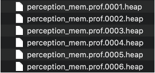

> 由于内存和cpu采样会对性能造成影响，不太建议同时开启两种采样，建议一次启动只开启一种

##### 生成可视化结果

CPU：使用以下命令对采样结果可视化，生成火焰图：

源码：

```bash
bash scripts/sampling.sh planning_cpu.prof
```

包管理：

```bash
buildtool sampling planning_cpu.prof
```

内存：根据需求生成内存采样的有向无环图或者火焰图

分析内存热点：找出哪些代码路径或函数导致了大量的内存分配

```bash
pprof --svg $(which mainboard) planning_mem.prof.0001.heap > a.svg # 生成有向图
```

> 有向图会带有内存信息，更加明确哪个函数分配了多少内存，而火焰图更加直观，开发者根据习惯选择生成何种类型的图即可

分析两个时刻之间哪个函数分配了多少内存，通常用于内存泄漏问题排查

```bash
pprof --svg --base planning_mem.prof.0005.heap $(which mainboard) planning_mem.prof.0001.heap > a.svg
```

##### 分析

cpu

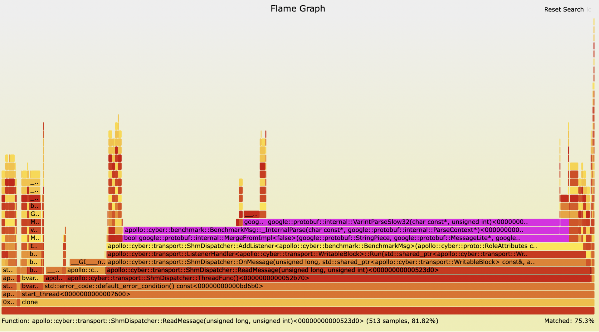

上述为cyber示例通信程序的火焰图，从下到上代表函数调用栈，长度代表函数在整个进程中占用的CPU资源百分比，例如上图中的ReadMessage，占比81.82%，可以看出这部分占用了绝大部分的内存，因此通过火焰图可以得知需要对图中的顶部、较长的函数（占比高）进行优化，从而减少进程对cpu的占用

内存

内存热点分析

通过热力图或有向图找到内存热点分配

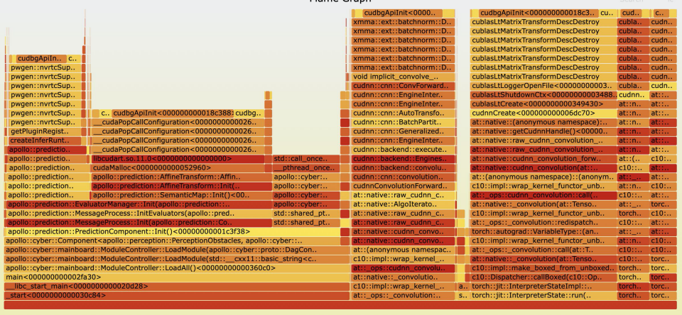


热力图和有向图均可找到内存热点分配，同样，热力图从下到上代表函数调用栈，长度代表函数在整个进程中分配的内存百分比；

而有向图部分：

- 有向图的左上角说明了进程在当前快照时间点中一共分配了多少内存
- 框代表实际的函数，每个框有两个数字：
  - 第一个数字代表当前函数分配了多少内存
  - 第二个数字代表调用的函数分别了多少内存
  - 线代表调用链

通过上述方式可以迅速定位到内存热点分配所在的函数以及相应的调用链。

内存泄漏分析：

内存泄漏通常基于以下命令比较不同时间点的内存分配diff情况：

```bash
pprof --svg --base planning_mem.prof.0005.heap $(which mainboard) planning_mem.prof.0001.heap > a.svg
```

上述命令会生成两个时间点内存diff的有向图，假如发现某个函数在不同时间点的分配的大小一直增加，说明可能存在内存泄露：

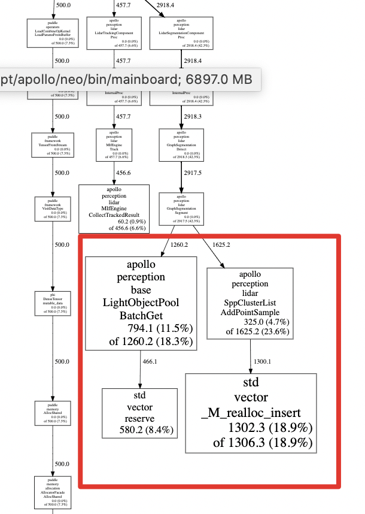

### gpu及显存

GPU的分析需要基于NVIDIA Nsight Systems工具，分别为：

- nsys system：用于查找性能瓶颈、理解应用程序结构、识别同步和并发问题以及优化整体性能
- nsys compute：关注于单个 CUDA 核函数的性能分析，用于调整 CUDA 核函数参数、分析寄存器使用、共享内存使用、执行路径和内存访问模式以提高核函数性能

> 类似gperftools，nsys会对进程性能产生严重影响，应仅在研发、分析阶段使用，日常路测时不应该使用

#### 使用方式

启动工具对进程采样（以感知为例）：

```bash
sudo -E nsys profile --gpu-metrics-device all --cuda-memory-usage true --delay=15 --duration=30 -f true -o preception --trace=cuda,cudnn,cublas,osrt,nvtx mainboard -d /apollo/modules/perception/msg_adapter/dag/msg_adapter.dag -d /apollo/modules/perception/pointcloud_preprocess/dag/pointcloud_preprocess.dag -d /apollo/modules/perception/pointcloud_map_based_roi/dag/pointcloud_map_based_roi.dag -d /apollo/modules/perception/pointcloud_ground_detection/dag/pointcloud_ground_detection.dag -d /apollo/modules/perception/lidar_detection/dag/lidar_detection.dag -d /apollo/modules/perception/lidar_detection_filter/dag/lidar_detection_filter.dag -d /apollo/modules/perception/lidar_tracking/dag/lidar_tracking.dag
```

- profile 指明了要进行采样
- --gpu-metrics-device all 指明了需要采集所有gpu相关的指标
- --cuda-memory-usage true 指明了对cuda中分配的显存进行追踪
- --delay=15 --duration=30 指明了程序启动后15s后才开始采样，采集30秒后结束
- -f true 指明生成的报告文件覆盖现有报告
- -o preception 指明生成报告的名称，采集结束后会在当前路径生成perception.nsys-rep文件
- --trace=cuda,cudnn,cublas,osrt,nvtx 指明采集的接口
- mainboard ... 是正常apollo启动感知的命令

> 注意事项：采集需要用sudo权限

打开nsys图形化界面

```bash
nsys-ui
```

在界面上打开采集生成的文件

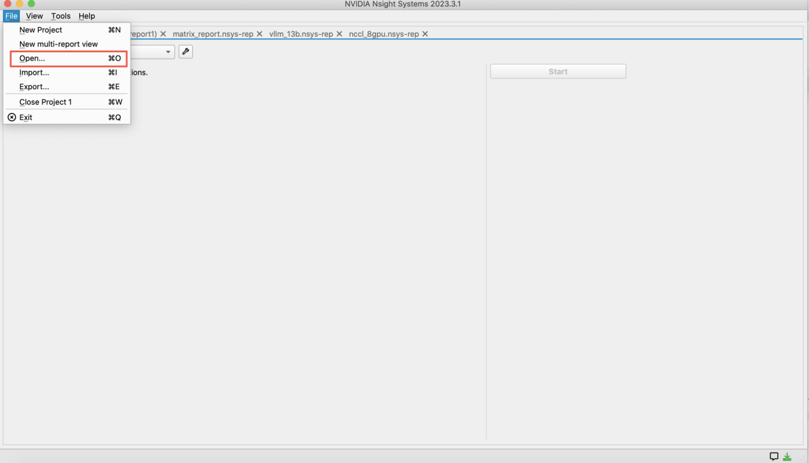

打开后会有以下几栏：

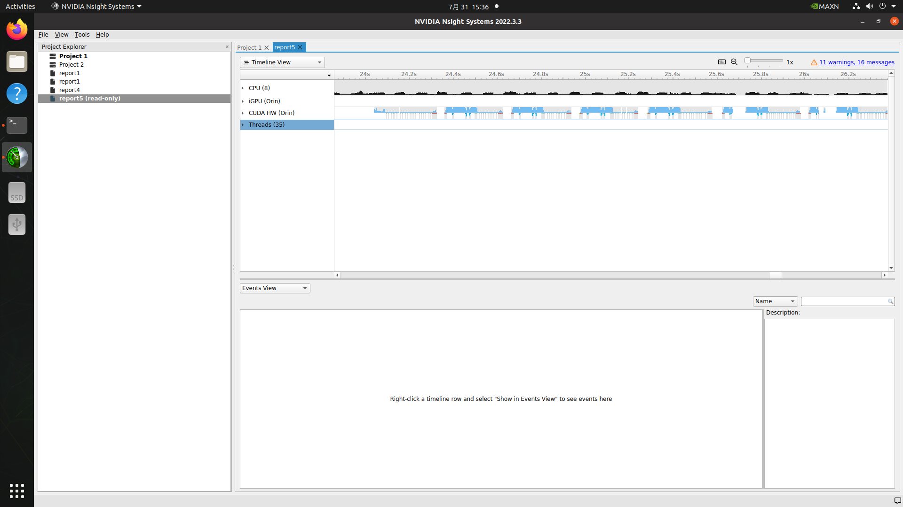

其中：

- cpu栏包括进程运行过程中瞬时的cpu使用率
- iGPU栏包括orin上gpu各项性能指标
- CUDA HW包含各个cuda流中运行的核函数
- Threads包含进程中运行的各个函数，包括cpu系统库以及cuda、cublas、cudnn等接口，这些函数会将对应的核函数放到流的等待队列中，等待被CUDA HW运行

> 简单介绍下执行cuda核函数的逻辑，程序在应用层调用某个核函数时，硬件并不是立刻执行，而是将其发射到等待执行的队列中，等gpu能够处理时再进行执行

横轴为进程运行的时间线

展开后：

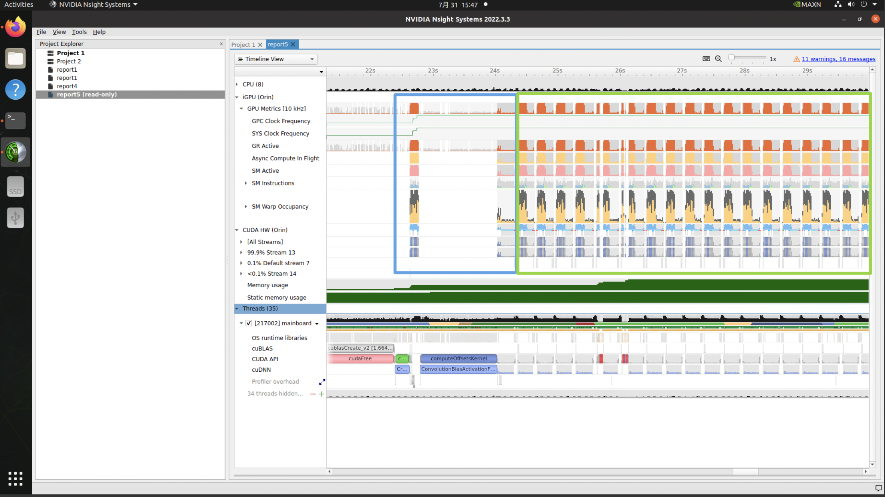

时间轴上可以分为两部分，第二部分（绿色框）可以看出gpu的行为不断重复，可以看出属于模型推理；第一部分（蓝色框）则是模型在进行初始化，性能分析主要关注的是模型推理部分

放大某一次推理：

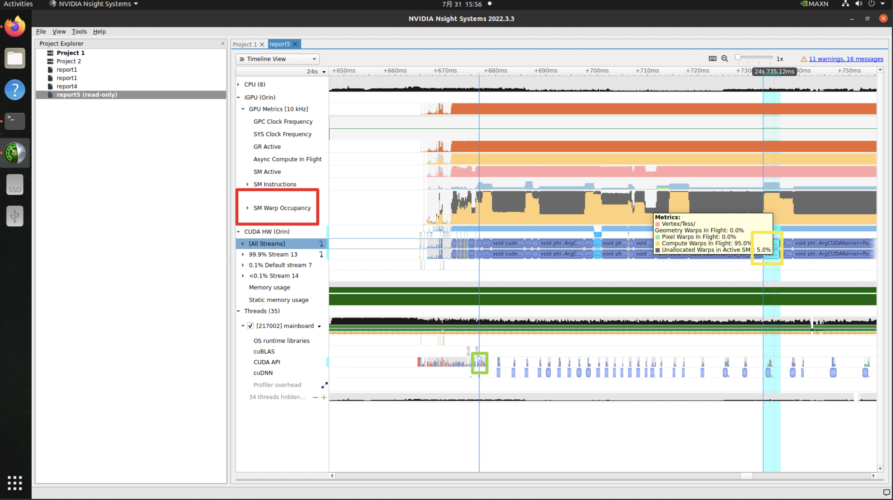

刚才提到，iGPU栏包含多个gpu指标，我们比较关注的是SM占用率（对应红框）；另外，CUDA HW栏则记录着时间线上在硬件执行的核函数；而绿框则是对应用于发射这个核函数的的cuda API

通过SM Warp Occupancy栏，当SM占用率高（如上图所示，占用率达到95%）时，可以迅速定位并获取对应执行的核函数的详细信息：

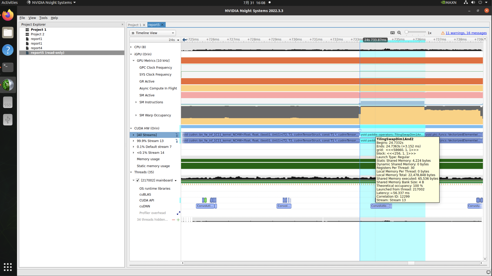

以及发射该核函数处的调用链：

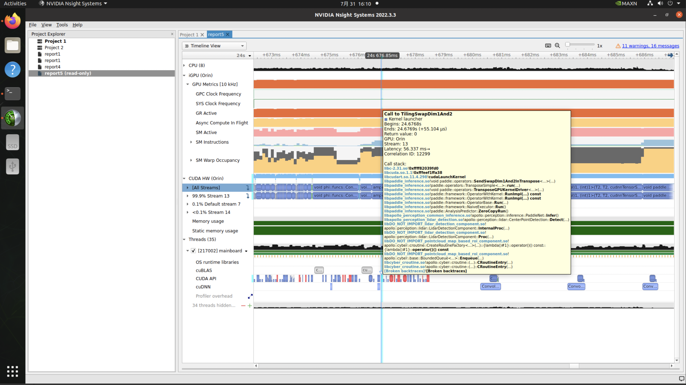

通过以上信息，对于我们自己写的核函数，可以迅速定位到瓶颈；而对于模型推理，情况就相对复杂，因为里面每个核函数相当于是一个算子，没办法精确匹配到模型的哪一层

针对模型推理问题，如果是使用

- tensorRT推理：

  - 可以通过tensorRT的API给层命名的方式确定核函数对应的层，nvinfer1::INetworkDefinition::setLayerName
  - 或者NVTX创建相应的时间点：

  ```cpp
  #include <nvToolsExt.h>

  // 开始一个新的NVTX范围
  nvtxRangePush("LayerName");

  // 执行某个TensorRT层的计算

  // 结束NVTX范围
  nvtxRangePop();
  ```

  - 就可以在nsight system上相应的时间线看到对应核函数的统计

- paddle推理：paddle内置profiler，也可以查看各层各个算子的运行情况，详细可以参考：https://www.paddlepaddle.org.cn/documentation/docs/zh/2.3/guides/performance_improving/profiling_model.html

内存分析方面，nsight system也有类似的输出：

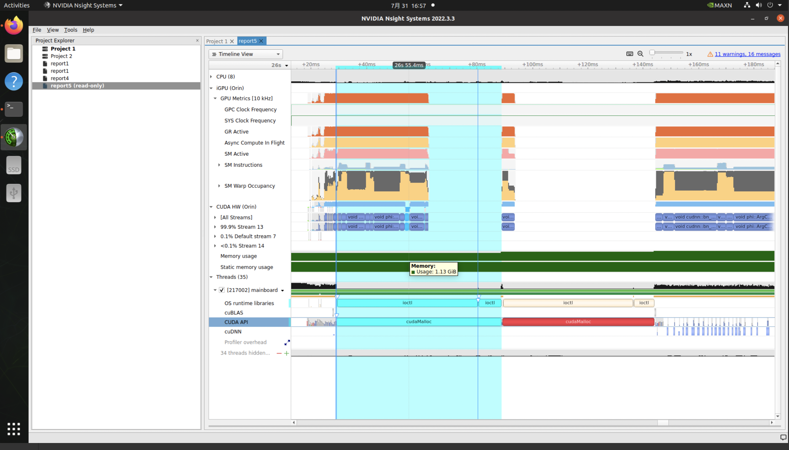

同样，通过以上信息，对于我们自己写的cudaMalloc等分配函数，可以迅速定位到瓶颈；而对于模型推理，也是需要类似NVTX的方式确定属于哪一层分配的内存

## 优化建议

### cpu

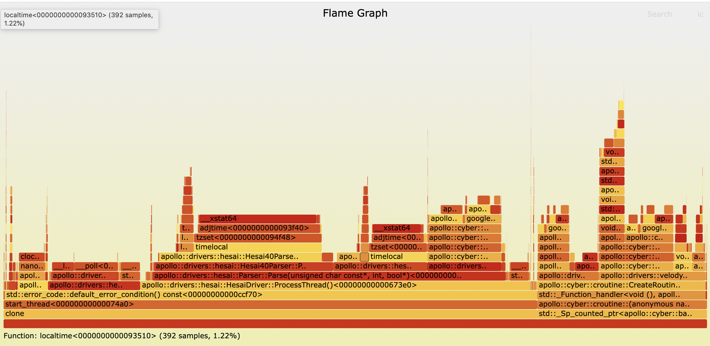

主要的优化思路是对火焰图中的顶部、较长的函数（占比高）进行优化，一般来说可以考虑以下几点：

- 这类函数是否可以去掉：
  - 例如上图中tzset这个函数占用了约20%的cpu时间片，在未设置环境变量TZ时内核会通过复杂计算求解时区，而设置TZ环境变量后则不存在这种计算
- 这类函数涉及到复杂运算：

  - 考虑能否使用更低时间复杂度的算法
  - 考虑运算是否可以并行化：

    - 使用cuda加速运算，并释放占用的cpu时间，降低cpu占用率
    - 使用SIMD指令集并行处理运算：SIMD是单指令多操作的缩写，这类指令集可以同时处理多个数据的数学运算，例如下列代码使用arm架构上的neon指令集并行处理16个像素，将yuyv的图片转换成rgb的图片，降低函数在cpu上占用时间：

    ```cpp
    for (int j = 0; j < height_; j += 2) {
        for (int i = 0; i < width_; i += 16) {
            // 读取16个像素点到双通道寄存器中，其中通道1存储y分量，通道2存储uv分量 (32 bytes)
            uint8x16x2_t row0 = vld2q_u8(usrc + j * width_ * 2 + i * 2);
            uint8x16x2_t row1 = vld2q_u8(usrc + (j + 1) * width_ * 2 + i * 2);

            // 提取y分量
            uint8x16_t y0 = row0.val[0];
            uint8x16_t y1 = row1.val[0];

            // 保存y分量到数组中
            vst1q_u8(yPlane + yIndex, y0);
            vst1q_u8(yPlane + yIndex + width_, y1);
            yIndex += 16;

            // 提取uv分量
            uint8x16_t u0 = row0.val[1];
            uint8x16_t v0 = row1.val[1];

            // 求uv分量均值（减轻下采样丢失数据的影响）
            uint16x8_t u16_low = vaddl_u8(vget_low_u8(u0), vget_low_u8(v0));
            uint16x8_t u16_high = vaddl_u8(vget_high_u8(u0), vget_high_u8(v0));
            uint8x8_t u8_avg_low = vshrn_n_u16(u16_low, 1);
            uint8x8_t u8_avg_high = vshrn_n_u16(u16_high, 1);

            uint16x8_t v16_low = vaddl_u8(vget_low_u8(row0.val[1]), vget_low_u8(row1.val[1]));
            uint16x8_t v16_high = vaddl_u8(vget_high_u8(row0.val[1]), vget_high_u8(row1.val[1]));
            uint8x8_t v8_avg_low = vshrn_n_u16(v16_low, 1);
            uint8x8_t v8_avg_high = vshrn_n_u16(v16_high, 1);

            uint8x16_t u_avg = vcombine_u8(u8_avg_low, u8_avg_high);
            uint8x16_t v_avg = vcombine_u8(v8_avg_low, v8_avg_high);

            // 保存uv分量到数组中
            vst1_u8(uPlane + uIndex, u8_avg_low);
            vst1_u8(vPlane + vIndex, v8_avg_low);
            uIndex += 8;
            vIndex += 8;
        }
        yIndex += width_; // Skip to the next line
    }
    ```

  - 考虑运算能否放在非cpu硬件上执行：例如orin上nvjpeg芯片，可以专门用于处理图片压缩等任务

### 内存

与cpu思路相同，我们需要看有什么函数是我们能够优化的，热力图和有向图能够查看各函数分配内存大概占比以及精确数值，例如预测进程：


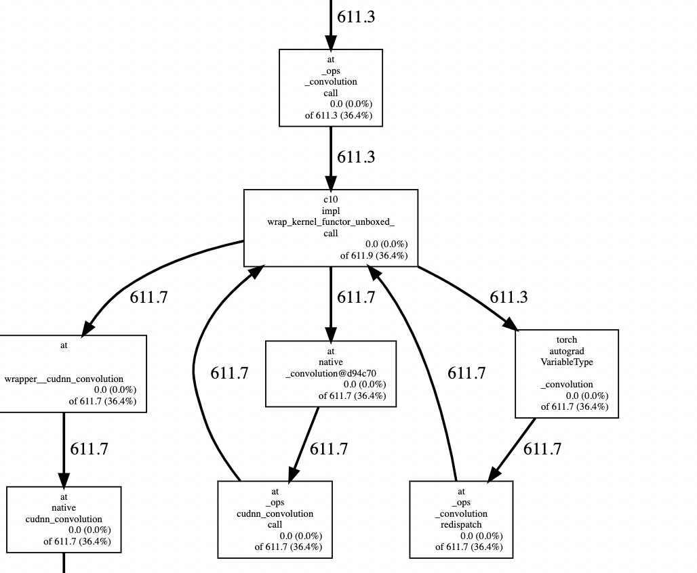

一般来说可以考虑以下几点：

- 进程是否引入了cuda与tensorrt等库：cuda与tensorrt等库会在每个进程中申请内存，而这部分内存类似于c++中的“单例”，换句话说这部分内存是可以复用的。假如分别启动感知与预测进程，这部分内存会申请两份；而将感知和预测在launch文件中合并为启动一个进程时，这部分使用的内存只会申请一份。如果组建的自动驾驶系统有大量使用gpu的进程时，可以合并成一份进一步减少内存
- 是否有申请了的内存但是没被使用的情况，这个可以通过采样结果进行详细分析

### gpu

gpu的优化分为时延优化和使用率优化，这两个对应着不同的目标：

- 时延优化：降低gpu一个或多个核函数的处理时延，这类优化可能会提高gpu使用率
- 使用率优化：降低gpu一个或多个核函数的使用率

#### 算法优化：

采用更高效的模型/时间复杂度更低的算法

#### 工程优化：

##### cpu限制

表现：timeline上的空白：

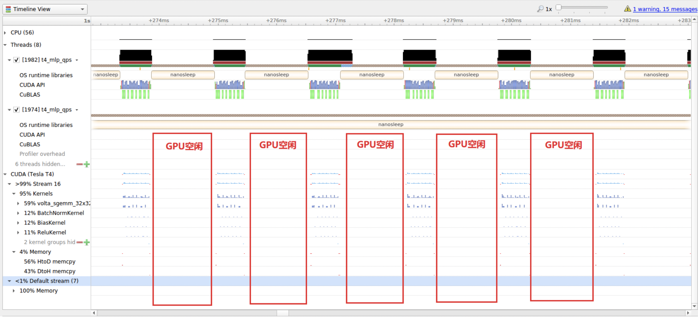

优化方式：确定这段空白时间cpu的行为，并降低空白时间（可参考cpu优化的方式）

对时延有优化效果，对使用率影响不大

##### timeline上的Memcpy操作：


优化方式：

- 减少冗余的传输
- 使用大块传输，尽可能利用带宽
- 如果硬件支持统一内存（orin），使用统一内存减少memcpy：

统一内存使用示例：

```cpp
// 正常分配内存
char* ptr = (char*) malloc(nums * sizeof(char))
char* gpu_ptr = nullptr;
// 标记内存
cudaError_t err = cudaHostRegister(ptr, nums * sizeof(char), cudaHostRegisterMapped);
// 映射ptr中的内容到gpu_ptr中
err = cudaHostGetDevicePointer(&gpu_ptr, ptr, 0);

// 后续在gpu就从gpu_ptr中读取实际的内容
```

对时延和使用率均有优化效果

##### 小kernel数量多，并且kernel发射时间高于执行时间：

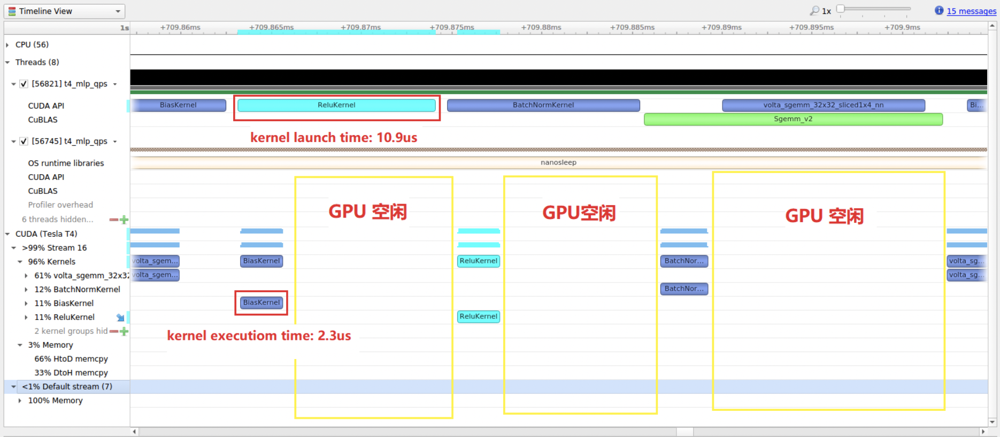

优化方式：

kernel融合：融合小kernel成大kernel，减少发射次数

应用cudaGraph技术：将多次kernel发射合并成1次cudaGraph发射：

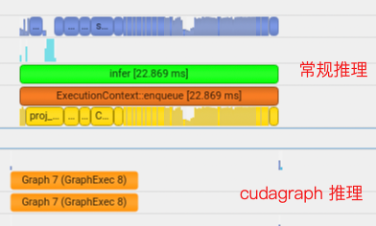

cudaGraph使用示例：

```cpp
#include <cuda_runtime.h>

// 假设你有一个 CUDA 核函数
__global__ void myKernel(int *data, int N) {
    int idx = threadIdx.x + blockIdx.x * blockDim.x;
    if (idx < N) {
        data[idx] += 1;
    }
}

int main() {
    const int N = 1024;
    int *d_data;
    cudaStream_t stream;
    cudaGraph_t graph;
    cudaGraphExec_t graphExec;

    // 分配设备内存
    cudaMalloc(&d_data, N * sizeof(int));

    // 创建 CUDA 流
    cudaStreamCreate(&stream);

    // 开始记录图
    cudaStreamBeginCapture(stream, cudaStreamCaptureModeGlobal);

    // 在记录的图中执行操作
    dim3 blockSize(256);
    dim3 gridSize((N + blockSize.x - 1) / blockSize.x);
    myKernel<<<gridSize, blockSize, 0, stream>>>(d_data, N);

    // 结束记录图
    cudaStreamEndCapture(stream, &graph);

    // 实例化并启动图
    cudaGraphInstantiate(&graphExec, graph, NULL, NULL, 0);
    cudaGraphLaunch(graphExec, stream);

    // 同步流以确保图执行完成
    cudaStreamSynchronize(stream);

    // 清理资源
    cudaGraphExecDestroy(graphExec);
    cudaGraphDestroy(graph);
    cudaStreamDestroy(stream);
    cudaFree(d_data);

    return 0;
}
```

对时延有优化效果，对使用率影响不大

##### 当SM占用率未达100%时，可并行执行无依赖关系的kernel函数，通过多个流的方式实现（即将串行改为并行）

单个stream：

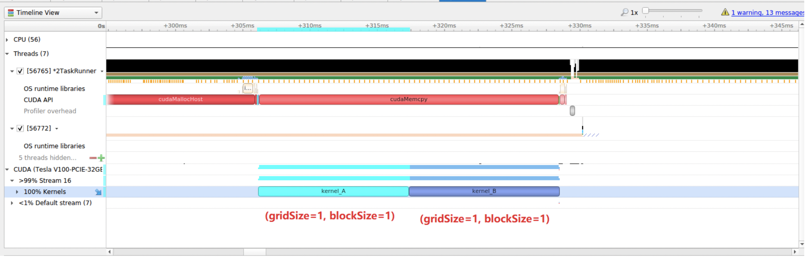

多个stream：

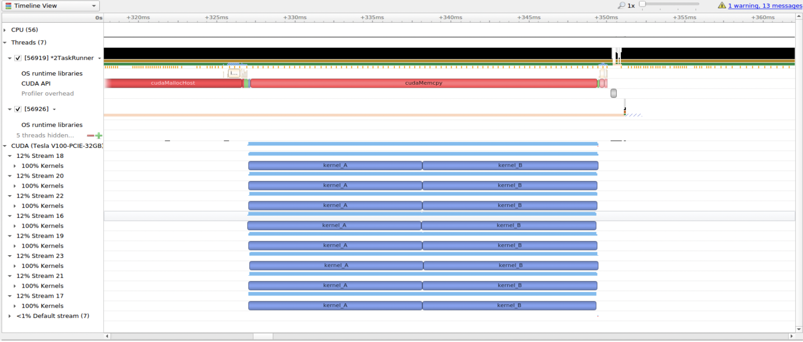

使用示例：

```cpp
#include <cuda_runtime.h>

// 假设你有一个简单的CUDA核函数
__global__ void myKernel(int *data, int N) {
    int idx = blockIdx.x * blockDim.x + threadIdx.x;
    if (idx < N) {
        data[idx] = data[idx] + 1;
    }
}

int main() {
    const int N = 1024 * 1024; // 数据大小
    const int numStreams = 4;  // 使用的流的数量
    const int streamSize = N / numStreams; // 每个流的工作量
    const int blockSize = 256; // 块大小
    const int gridSize = streamSize / blockSize; // 每个流的网格大小

    int *d_data;
    cudaStream_t streams[numStreams];

    // 分配设备内存
    cudaMalloc(&d_data, N * sizeof(int));

    // 创建CUDA流
    for (int i = 0; i < numStreams; ++i) {
        cudaStreamCreate(&streams[i]);
    }

    // 在每个流中启动内核执行
    for (int i = 0; i < numStreams; ++i) {
        int offset = i * streamSize;
        myKernel<<<gridSize, blockSize, 0, streams[i]>>>(d_data + offset, streamSize);
    }

    // 等待所有流完成
    for (int i = 0; i < numStreams; ++i) {
        cudaStreamSynchronize(streams[i]);
    }

    // 清理资源
    for (int i = 0; i < numStreams; ++i) {
        cudaStreamDestroy(streams[i]);
    }
    cudaFree(d_data);

    return 0;
}
```

对时延有优化效果，而使用率也会明显提升

##### 减少kernel的时延：

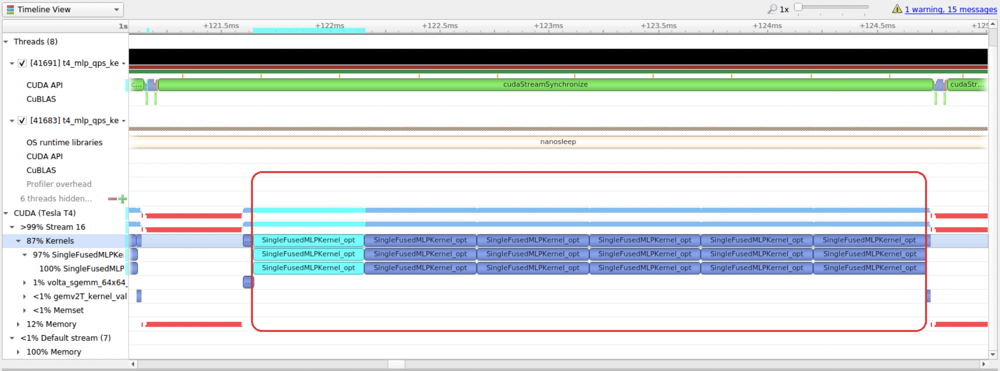

要减少一个kernel的时延，需要了解了解这个kernel的SOL（Speed Of Light）指标，这个指标可以使用nsight compute采样得到：

- Memory SOL: 这个指标表示应用程序在访问全局内存时的效率。它是通过将应用程序实际利用的内存带宽与GPU的最大内存带宽相比较得出的。如果Memory SOL很低，意味着可能存在内存访问瓶颈。
- SM SOL: 这个指标表示应用程序在执行计算任务时的效率。它是通过将应用程序的计算性能与GPU的最大计算性能（浮点运算峰值）相比较得出的。如果SM SOL很低，意味着计算资源可能没有得到充分利用。

一般可能会出现三种情况：

- 访存受限：Memory SOL低

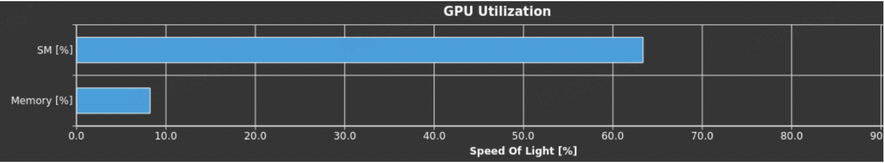

- 计算受限：SM SOL低

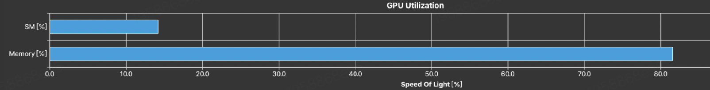

优化方式：

- 访存受限：减少使用全局内存，使用block内的共享内存

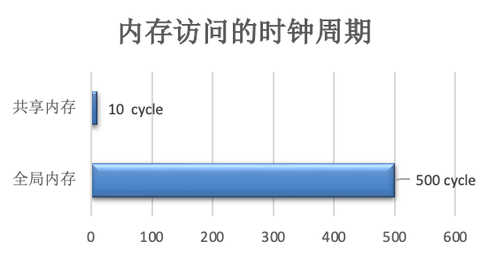

- 计算受限：

  - 使用高吞吐指令：降低精度(fp64->fp32, fp32->fp16/int8)；使用快速数学函数(\_\_func())
  - 减少warp内分支：一个warp是由一定数量的线程组成的执行单元，warp是GPU调度和执行指令的基本单位，其中的所有线程都执行相同的指令序列，假设一个warp有32个线程，对于一个存在分支的核函数：

  ```cpp
  if (threadIdx.x < 16) {
      // 执行某些操作A
  } else {
      // 执行某些操作B
  }
  ```

  warp的前半部分（线程0-15）将执行操作A，后半部分（线程16-31）将执行操作B。GPU将首先为执行操作A的线程然后为执行操作B的线程。这种情况下，warp的效率只有最大的一半，导致计算受限。

  因此，尽可能地确保一个warp内的所有线程执行相同的指令，减少wrap内分支能提升SM的SOL
