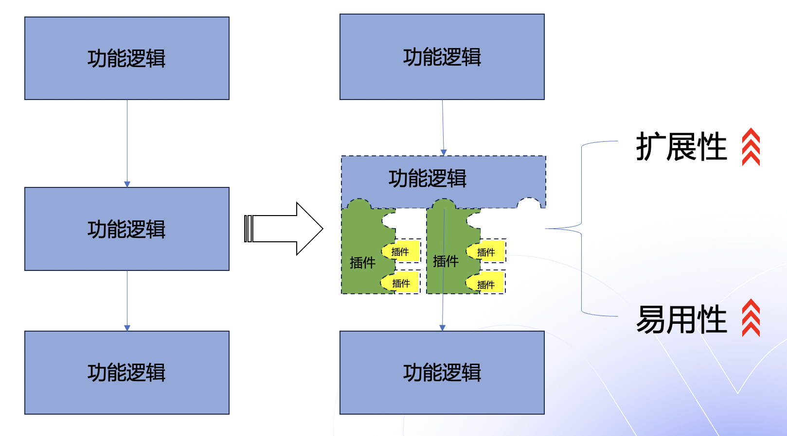
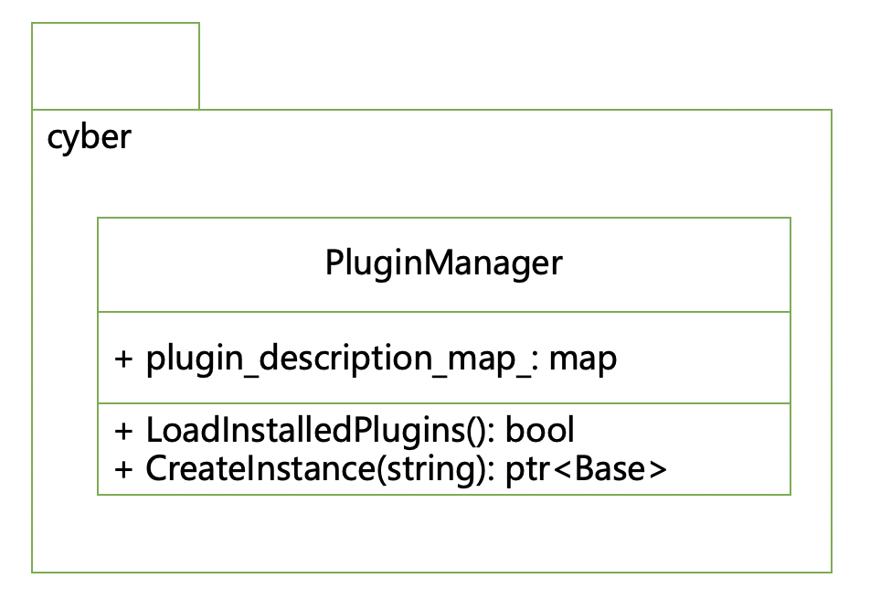
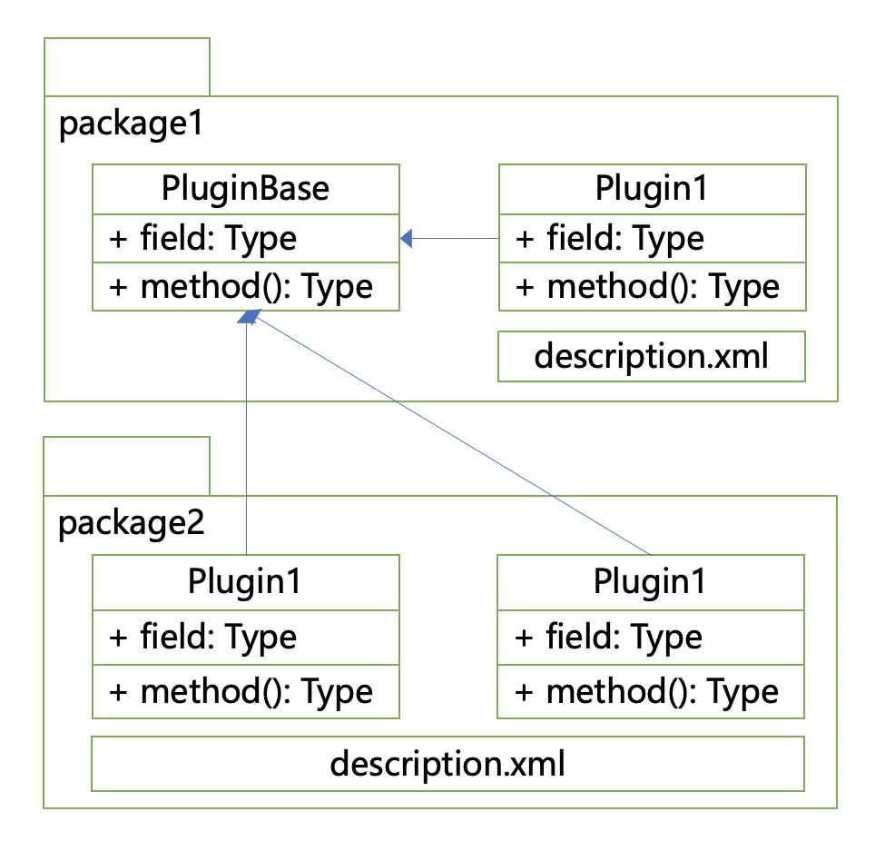
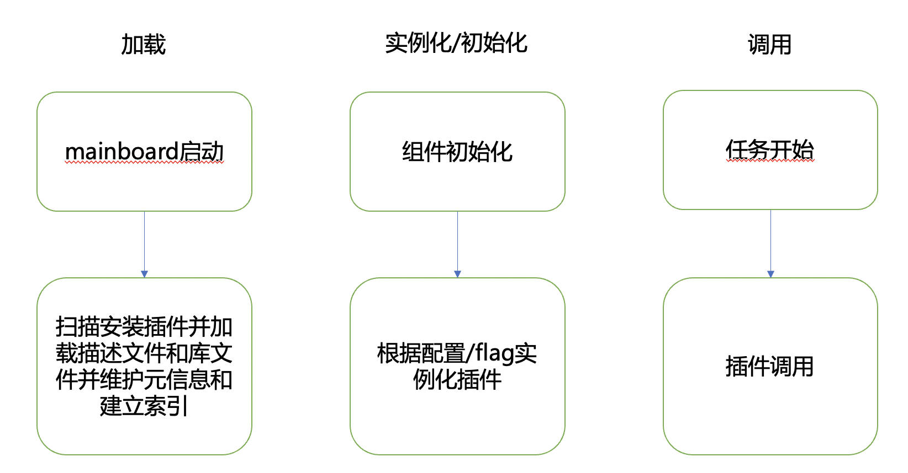

## 概述

首先，什么是插件？其实就是遵循一定规范的应用程序接口编写出来的程序，可以为我们的应用或者系统扩展出原来不存在的特性或功能；一个应用软件拥有了插件机制之后，不管是应用软件维护方，还是第三方开发者可以以更加简单的方式来扩展功能以应对更多更复杂的场景，同时插件机制可以让应用程序的核心逻辑变得更加精简，更容易让人理解和使用

而在 Cyber 里，其实我们熟知的组件（Component）也是一种插件，我们只需要重写 apollo::cyber::Component::Init 和 apollo::cyber::Component::Proc 函数，就可以轻松写出能与感知，规划等组件通信的程序，从而扩展新的自动驾驶能力

## 插件机制设计

整体上来看，插件机制有几个重要的概念，插件管理类，插件基类与插件类，以及插件描述文件

### 插件管理类

插件管理类的代码实现是在 cyber/plugin_manager目录下，是一个单例实现，其中包含两核心方法，和一个插件注册宏

- `apollo::cyber::plugin_manager::PluginManager::LoadInstalledPlugins`: 是用于扫描和加载插件，加载过程中同时也会建立插件基类与插件类的索引，便于后续实例化时使用；我们在mainboard的启动流程已经默认执行了此方法，用户如果是想在组件（Component）中使用的话，无需自行调用；而如果是想在其它自定义的二进制程序中使用的话，则需要用户主动调用一下；

- `apollo::cyber::plugin_manager::PluginManager::CreateInstance`: 是用来创建插件实例的，此方法是一个模板方法，接收一个string类型的参数，传入插件类名，即返回一个插件基类的指针，因此，对于核心流程的逻辑来说，只需知道基类即可，而不需要知晓插件类的定义；将插件功能与应用程序解耦隔离开来；

- `CYBER_PLUGIN_MANAGER_REGISTER_PLUGIN`: 是用将插件类与插件基类绑定的，其逻辑与组件的注册类似，在动态库文件加载时，会自动执行并调用class_loader里的注册方法，只有注册好的插件才能被CreateInstance方法创建

### 插件基类与插件类

插件基类，是插件设计者对于业务逻辑的一个抽象

比如规划模块中的 `apollo:planning::TrafficRule` ，两个核心的接口方法就是 `apollo::planning::TrafficRule::Init` 和 `apollo::planning::TrafficRule::ApplyRule` ，每一个规则插件初始化时都会调用 `Init` 方法，而在应用规则时则调用 `ApplyRule `方法；

再比如 `apollo::planning::Task` ，核心接口是 `apollo::planning::Task::Init` 和 `apollo::planning::Task::Execute` ，同样地，初始化时会调用 `Init` 方法，而在插件调用（即执行规划任务时）则调用 `Execute` 方法；

可以看到，其实插件基类是插件与应用程序之间的接口规范，它定义了插件的基本我以及我们应该如何来编写插件，而插件类就是具体的插件实现，只要继承基类，以及调用插件注册的

### 插件描述文件

即描述插件类与基类以及所在类库之间关系的文件，在加载时，插件描述文件会被解析成 apollo::cyber::plugin_manager::PluginDescription 结构体，并以插件类名建立索引，即通过插件类名可以快速找到其所属基类以及所在的库文件

> 例: `modules/planning/scenarios/lane_follow/plugins.xml`

## 插件工作原理

插件的工作流程基本分这么3个阶段，加载阶段，实例化阶段以及调用阶段

- 首先是加载阶段，通过插件管理类的加载方法，可以扫描插件的安装目录，并读取插件描述文件，在这一阶段，会根据插件类所在动态库地址，类名，基类名等信息构建好插件的索引

  在 mainboard 中的代码实现中( cyber/mainboard/mainboard.cc )，mainboard 加载组件模块时( apollo::cyber::mainboard::ModuleController::LoadAll )，会根据命令行参数，调用 `apollo::cyber::plangin_manager::PluginManager::LoadPlugin` 单独加载指定的插件，或者调用 `apollo::cyber::plugin_manager::PluginManager::LoadInstalledPlugins` 扫描插件安装目录

- 然后是实例化，或者说初始化阶段，这一阶段，插件设计者可以根据配置文件，flag等方式来判断启用了哪些插件，然后通过插件管理类的创建实例的方法来将插件实例化以供使用

  在规划模块中 Scenario 的初始化过程( apollo::planning::ScenarioManager::Init ) ，ScenarioManager 从配置中读取了 Scenario 插件列表，然后通过 CreateInstance 一一初始化它们并存储到 `scenario_list_` 中以待使用

- 最后是调用阶段，在这一阶段，如果判断条件满足了插件的使用，刚通过已经实例化的插件指针，直接调用插件的方法

  还是以规划模块的 Scenario 为例，在 apolo::planning::ScenarioManager::Update 方法中，遍历了 `scenario_list_` 中的所有插件，对于满足条件 `scenario->IsTransferable(current_scenario_.get(), frame)` 的插件执行 `Scenario` 切换逻辑，即调用 `apollo::planning::Scenario::Exit` 方法退出当前 `Scenario` ，然后调用满足条件的 scenario 的 Enter 方法进入新的 Scenario

## 插件有什么应用

其实插件的应用非常广，像对于Linux内核来说，各种硬件驱动等模块就是内核的插件；或者说像游戏中DLC和MOD也是一种插件

回到我们 Apollo 里，我们对规划模块做了插件化改造，抽象了 Scenario ，Task ，以及 TrafficRule 等基类，开发者可以只需要按需重写这些基类方法，就可以轻松实现不同场景的规划能力；

## NEXT

现在，我们已经对插件的概念有了基本的认识，接下来可以在 Apollo Studio 的云实验平台上通过[《通过插件监控CPU和内存信息》](https://apollo.baidu.com/community/course/47)实验项目或者在本地环境安装好Apollo 9.0版本后按照操作步骤实践学习
