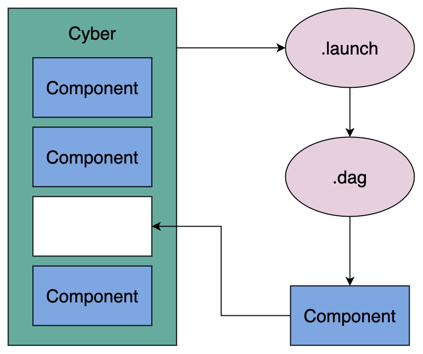

## 概述

Cyber RT是一个高性能、高吞吐、低延时的计算运行框架，其中，动态加载技术和有向无环图（DAG）是其实现高性能重要途径之一。

Cyber RT采用了基于Component模块和有向无环图（DAG）的动态加载配置的工程框架。即将相关算法模块通过Component创建，并通过DAG拓扑定义对各Component依赖关系进行动态加载和配置，从而实现对算法进行统一调度，对资源进行统一分配。采用这个工程框架可以使算法与工程解耦，达到工程更专注工程，算法更专注算法的目的。

## 什么是 Component

Component 是 Cyber RT提供的用来构建功能模块的基础类，可以理解为Cyber RT对算法功能模块的封装，配合Component对应的DAG文件，Cyber RT可实现对该功能模块的动态加载。以Apollo为例， Apollo 中所有的模块都由 Component 构建的。

被 Cyber RT加载的 Component 构成了一张去中心化的网络。每一个Component是一个算法功能模块，其依赖关系由对应的配置文件定义，而一个系统是由多个component组成，各个component由其相互间的依赖关系连接在一起，构成一张计算图。

下图是具有3个component，2个channel的简单网络：


## Component 的类型

Component 有两种类型，分别为 `apollo::cyber::Component` 和 `apollo::cyber::TimerComponent` 。

- Component 提供消息融合机制，最多可以支持 4 路消息融合，当 从多个 Channel 读取数据的时候，以第一个 Channel 为主 Channel。当主 Channel 有消息到达，Cyber RT会调用 Component 的 apollo::cyber::Component::Proc 进行一次数据处理。

- TimerComponent 不提供消息融合，与 Component 不同的是 TimerComponent 的 apollo::cyber::TimerComponent::Proc 函数不是基于主 channel 触发执行，而是由系统定时调用，开发者可以在配置文件中确定调用的时间间隔。

## Component 的创建及如何工作

1、包含头文件；

2、定义一个类，并继承Component或者time Component；根据Component功能需要，选择继承Component或者继承TimeComponent。

3、重写Init()和Proc()函数；Init()函数在 Component 被加载的时候执行，用来对Component进行初始化，如Node创建，Node Reader创建，Node Writer创建等等；Proc()函数是实现该Component功能的核心函数，其中实现了该Component的核心逻辑功能。

4、在Cyber RT中注册该Component，只有在Cyber RT中注册了该Component，Cyber RT才能对其进行动态的加载，否则，cyber RT动态加载时报错。

```cpp
//1、包含头文件
#include "cyber/component/component.h"
#include "test/proto/examples.pb.h"

// 2、定义一个类，继承以Driver和Chatter为参数的Component模版类
class ComponentSample : public Component<Driver, Chatter> {
public:
  //3、重写Init() 函数和Proc() 函数
  bool Init() override;
  bool Proc(const std::shared_ptr<Driver>& msg0,
  const std::shared_ptr<Chatter>& msg1) override;
};
//4、 在cyber中注册ComopnentSample
CYBER_REGISTER_COMPONENT(ComponentSample)
```

> Component 的通信是基于 Channel 通信实现的，使用 reader 和 writer 对 channel 读写实现数据读取与写出。

## Component 如何被加载

在 Cyber RT中，所有的 Comopnent 都会被编译成独立的.so文件，Cyber RT 会根据开发者提供的配置文件，按需加载对应的 Component。所以，开发者需要为.so文件编写好配置文.dag文件和.launch文件，以供 Cyber RT正确的加载执行Component。

Cyber RT提供两种加载启动Component的方式，分别是使用cyber_launch工具启动component对应的launch文件，和使用mainboard启动component对应的dag文件。

cyber_launch工具可以启动dag文件和二进制文件，而mainboard执行启动dag文件。



## Component 的优点

相较于在 main() 函数中写通信逻辑并编译为单独的可执行文件的方法，Component 有以下优点：

- 可以通过配置 launch 文件加载到不同进程中，可以弹性部署。
- 可以通过配置 DAG 文件来修改其中的参数配置，调度策略，Channel 名称。
- 可以接收多个种类的消息，并有多种消息融合策略。
- 接口简单，并且可以被 Cyber 框架动态地加载，更加灵活易用。
