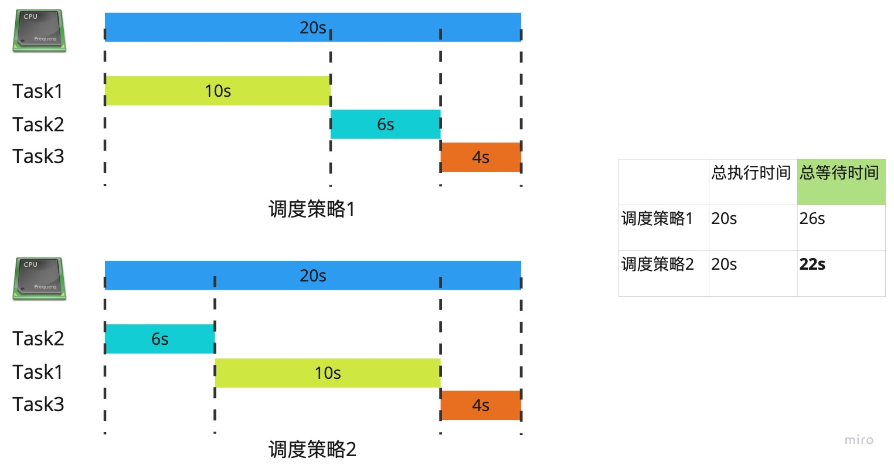
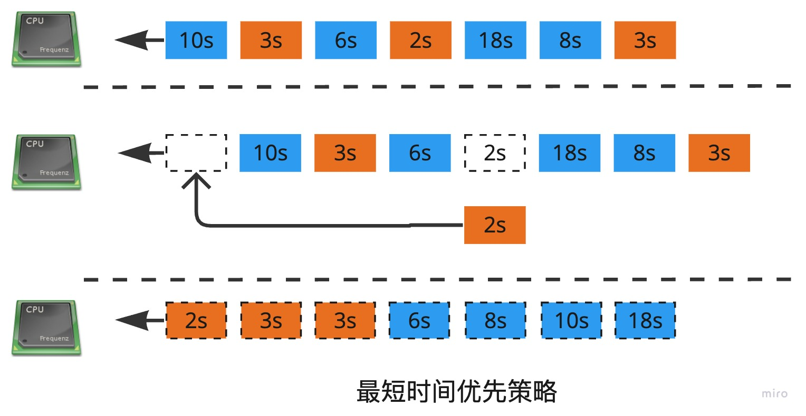
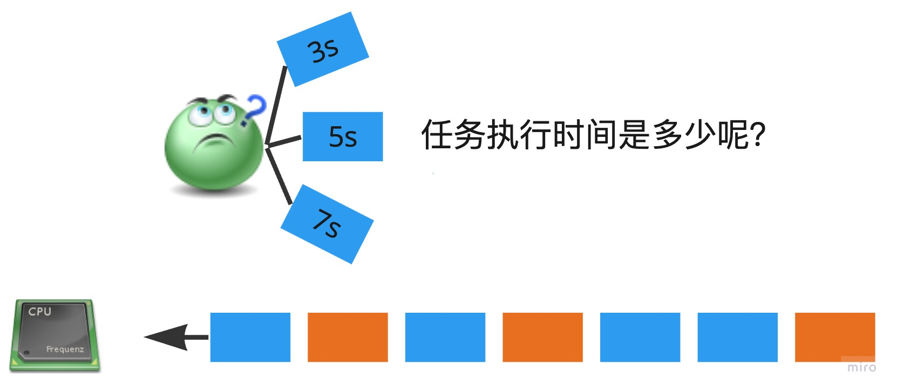
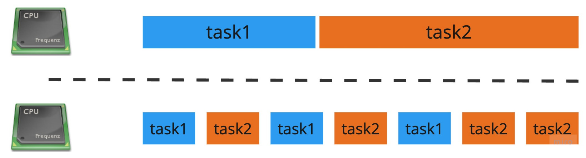
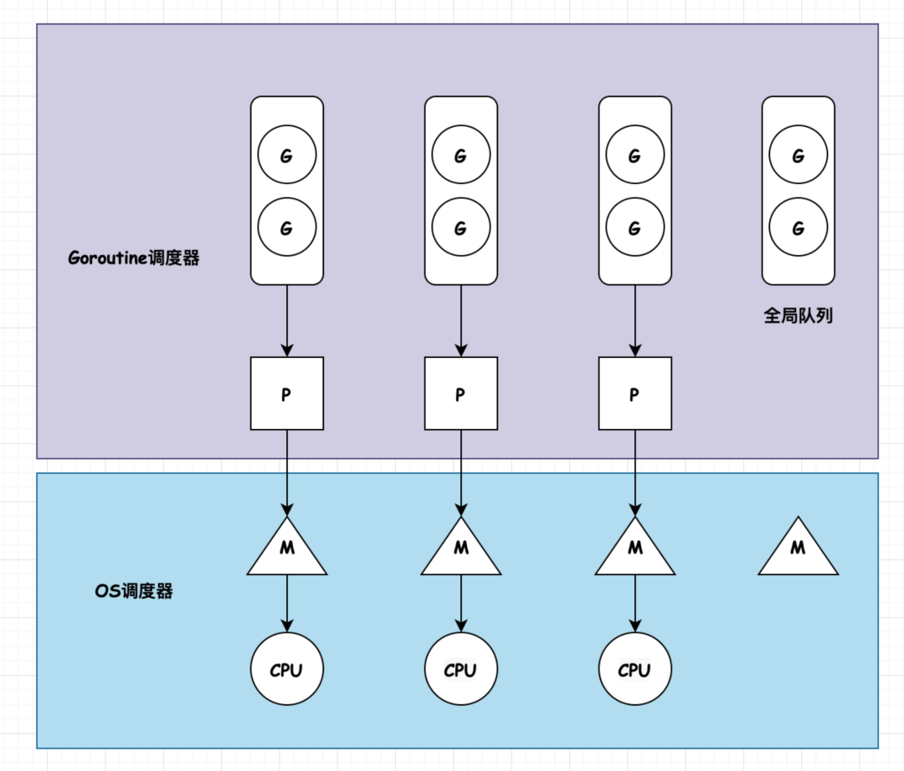
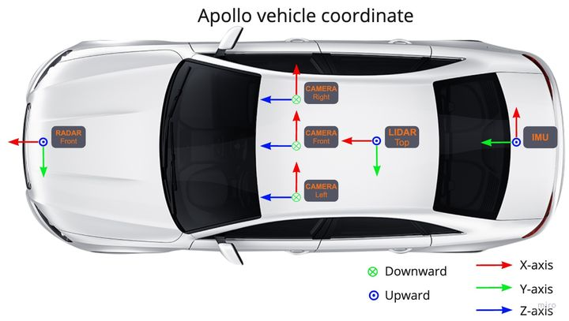

## Cyber RT调度整体介绍

随着人工智能技术的不断发展，自动驾驶汽车已经开始变为可能。自动驾驶汽车需要同时完成多项任务，包括定位、感知、规划、控制等。如何合理调度编排这些任务，让它们运行得稳定、高效，是我们今天介绍的主要内容。

### 操作系统调度策略

操作系统进行调度的目的是为了最大化利用系统资源（特别是CPU资源）。调度往往是对有限资源的妥协，本质是为了：效率最大化，兼顾公平。

#### 调度改变了什么？

先看以下的例子，有3个任务，当一个任务执行完成之后，再开始执行另一个任务，3个任务的执行时间分别为10s，6s和4s，我们应该如何编排任务呢？



通过上面的例子可以看出，策略1和策略2的CPU总执行时间不变，但是等待时间变少了。也就是说调度系统帮我们减少了任务的总等待时间。
超市里经常遇到排队的场景，当只买了少量的东西，和买大量东西的人排一队的时候，可能就会遇到等待时间过长的问题。


#### 最短时间优先？

回到上面的例子，最优的调度策略诞生了，它就是最短时间优先，每次最短时间的任务优先执行，这样可以保证任务总等待时间最短。



#### 如何保证公平？

可能马上就有人想到了，每次只创建小任务，这样可以保证自己的任务每次都可以插队，被优先执行。但问题来了，这会导致大任务总是得不到执行，一直处于饥饿状态。oh!!! 效率最大化会导致CPU利用的不公平，而我们要兼顾公平。

#### 程序时间可以预知吗？

最短时间优先的策略很棒，但我们忘记了一个重要问题，在任务执行完之前，我们并不知道任务会执行多久！！！策略失效了！！！



别灰心，有新的方法：时间片轮转。交替执行各个任务，每个任务分配一小段CPU时间，时间用尽则退出，让给其它任务使用。



Tips

> 要支持时间片轮转，操作系统和硬件配合，实现任务抢占。

### Cyber RT的改进

#### 实时操作系统

- 实时操作系统，通过给linux打实时补丁，支持抢占。
- 中断绑定，摄像头，激光雷达，串口等外设需要不停的处理中断，因此可以绑定中断处理程序在一个核上。

Tips

> 实时操作系统不是万能的。很多人可能会问，假如我有一个实时系统，那么是否意味着任务总是可以按时完成，想法很美好，也符合实时操作系统的定义，但资源是有限的，例如你不可能同时吃饭还喝水。
> 只凭借有限的资源，却能保证完成无限的事情，如果有这样的系统我想它的成就不亚于永动机。因此当程序处理不过来的时候，我们要检查资源是否足够，特别是忙碌的时候。

#### 资源限制&优先级

Cgroup是 Linux 内核的一个特性，用于限制、记录和隔离一组进程的资源使用（CPU、内存、磁盘 I/O、网络等）。Cgroup 具有以下特性：

- 资源限制 —— 您可以配置 cgroup，从而限制进程可以对特定资源（例如内存或 CPU）的使用量。
- 优先级 —— 当资源发生冲突时，您可以控制一个进程相比另一个 cgroup 中的进程可以使用的资源量（CPU、磁盘或网络）。
- 记录 —— 在 cgroup 级别监控和报告资源限制。
- 控制 —— 您可以使用单个命令更改 cgroup 中所有进程的状态（冻结、停止或重新启动）。

```text
pthread_setaffinity_np

    choreography_conf {
        choreography_processor_num: 8
        choreography_affinity: "range"
        choreography_cpuset: "0-7" # bind CPU cores
        choreography_processor_policy: "SCHED_FIFO" # policy: SCHED_OTHER,SCHED_RR,SCHED_FIFO
```

#### 协程

协程。用户态的线程，由用户控制切换。协程的定义可以参考go语言中的GMP 模型

- M，Machine，表示系统级线程，goroutine 是跑在 M 上的。线程想运行任务就得获取 P，从 P 的本地队列获取 G，P 队列为空时，M 也会尝试从全局队列拿一批G放到P的本地队列，或从其他P的本地队列偷一半放到自己P的本地队列。M运行G，G执行之后，M会从P获取下一个G，不断重复下去。
- P，processor，是 goroutine 执行所必须的上下文环境，可以理解为协程处理器，是用来执行 goroutine 的。processor 维护着可运行的 goroutine 队列，里面存储着所有需要它来执行的 goroutine。
- G，goroutine，协程。


协程相对线程的优势

- 系统消耗少。线程的切换用户态->中断->内核态，协程的切换只在用户态完成，减少了系统开销。
- 轻量。协程占用资源比线程少，一个线程往往消耗几兆的内存。

Tips

> 只能自己yeild，最好不要使用sleep，或者io，不然就会主动休眠

为什么引入协程？因为自动驾驶系统涉及到很多消息传输，因此会导致大量的IO消耗，那么如何减少任务切换带来的开销就显得尤为重要。

引入协程可以减少任务切换带来的开销，从而提高程序的效率。在自动驾驶系统中，大量的IO消耗会使得系统性能下降。通过使用协程，可以将系统的IO操作和非IO操作分别处理，减少任务切换的次数，从而提高系统的响应速度和效率。

此外，使用协程还可以简化代码结构，提高代码的可读性和可维护性。在自动驾驶系统中，涉及到大量的数据的处理和传输，如果使用传统的多线程编程方式，将会使得代码结构复杂，难以维护。而使用协程可以将代码结构简化，使得代码更加清晰易懂，从而提高代码的可读性和可维护性。

综上所述，引入协程可以减少任务切换带来的开销，提高系统的响应速度和效率，同时也可以简化代码结构，提高代码的可读性和可维护性。



## Cyber RT调度策略

### 多优先级队列

对应到GMP模型，Cyber的每个任务都被视为一个协程，协程在线程上运行，并且可以设置协程的优先级。协程通过一个多优先级队列来管理，每次从优先级最高的协程开始执行。



### 任务窃取

有意思的是有些Processor上的任务分配的比较少，有些Processor上的任务可能分配的比较多，这样会导致一些Processor闲置，而另一些则处于饱和状态。为了提高效率，空闲的Processor会从饱和的Processor上偷取一半的任务过来执行，从而提高CPU利用率。

### 二种任务类型

#### 组件

组件是Apollo中的最小执行单元，每个组件对应某一项特定的任务，例如定位、控制。多个组件联合起来可以实现更加复杂的功能，例如感知。Apollo一共有2种类型的组件：消息触发型和定时触发型。

```cpp
class CommonComponentSample : public Component<Driver> {
 public:
  bool Init() override;
  bool Proc(const std::shared_ptr<Driver>& msg0) override;
};
CYBER_REGISTER_COMPONENT(CommonComponentSample)
```

#### 自定义任务

如果在程序中想启动新的任务并发处理，可以使用cyber::Async接口，创建的任务会在协程池中由cyber统一调度管理。

```cpp
class Foo {
 public:
  void RunOnce() {
    auto res = Async(&Foo::Task, this, 10);
    EXPECT_EQ(res.get(), 10);
  }

  uint32_t Task(const uint32_t& input) { return input; }
};
```

Tips

> 手动创建的线程并没有设置cgroup，因此最好不要手动创建线程，如果有需要可以通过cyber配置来设置cgroup。
