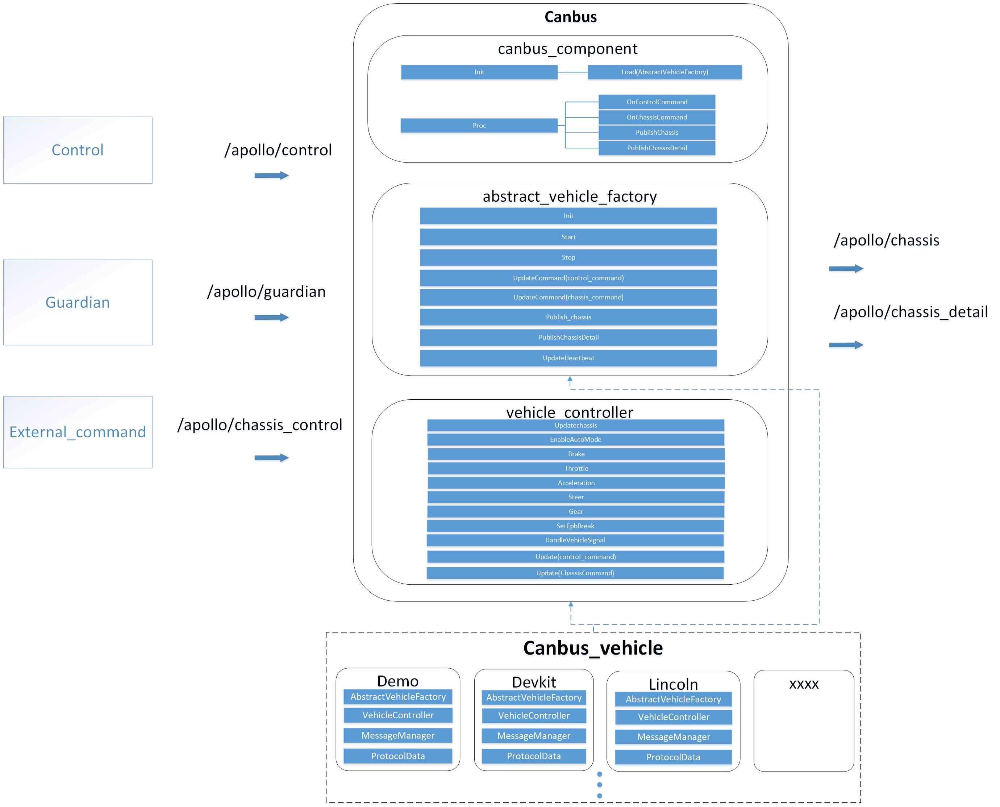

# CANBUS组件

## 介绍

- CANBUS组件主要目的是解析底盘CAN总线数据，获取车辆的信息（如车辆速度、档位、方向盘转角、运行状态、安全等信息）；接收控制模块指令，将控制指令解析成底盘CAN总线数据，发送至车辆进行运动控制；执行底盘交互逻辑，使能或退出自动驾驶；进行底盘安全监控，对底盘故障或接管等情况进行监控。



- Canbus组件主要实现流程创建基于车型的工厂对象，通过调用车型工厂的接口方法，实现初始化，实现处理控制指令[ControlCommand](./../common_msgs/control_msgs/control_cmd.proto)，实现解析底盘数据并将底盘数据写入到[chassis.proto](./../common_msgs/chassis_msgs/chassis.proto)。在车型工厂类[AbstractVehicleFactory](./vehicle/abstract_vehicle_factory.h)内，定义了初始化，启动和关闭，解析控制指令，解析底盘命令，发布底盘消息，发布底盘报文解析数据，更新心跳等方法，这些方法调用了车辆控制器的对象进行实现。车辆控制器[VehicleController](./vehicle/vehicle_controller.h)定义了初始化，启动和关闭，通过底盘反馈报文更新chassis数据，处理控制指令方法，处理底盘命令方法，车辆使能方法，实现油门、刹车、转向，档位、驻车、灯光等车辆的控制逻辑。

- 每一类车型，继承车型工厂类[AbstractVehicleFactory](./vehicle/abstract_vehicle_factory.h)和车辆控制器类[VehicleController](./vehicle/vehicle_controller.h)，创建CanClient客户端，创建CanSender、CanReceiver对象，实现相应的初始化、更新chassis、处理控制指令等方法。，创建消息管理器[MessageManager](./../drivers/canbus/can_comm/message_manager.h)对象，对该车型的发送/接收报文进行管理。车型的每一条报文数据格式定义继承[ProtocolData](./../drivers/canbus/can_comm/protocol_data.h)，并实现报文协议解析。每一类车型代码通过包管理的方式进行组织，具体车型实现可移动到`/modules/canbus_vehicle`进行查看。

- CanClient客户端是CAN卡硬件驱动的实例，它是被不同的使用CAN总线协议的传感器共享的。如果现有的CAN卡驱动不满足使用，可以通过继承[CanClient](./../drivers/canbus/can_client.h)类在*drivers/canbus/can_client*的文件夹中实现新的CAN卡驱动。CanClient客户端实现可以移动到`/modules/drivers/canbus/client`进行查看。


## 文件组织结构及说明
```shell
modules/canbus
├── common                  // 模块全局gflag定义
├── conf                    // 模块配置文件，参数文件目录
├── dag                     // 模块启动文件(mainboard)
├── launch                  // 模块启动文件(cyber_launch)
├── proto                   // 组件定义的配置文件
├── testdata                // 单元测试的数据文件
├── tools                   // 调试工具teleop等
├── vehicle                 // 车辆底盘(canbus_vehicle)组件的基类代码文件
├── BUILD                   // 构建规则文件
├── canbus_component.cc     // 组件实现的代码文件
├── canbus_component.h      // 组件实现的代码文件
├── canbus_test.cc          // 组件单元测试文件
├── cyberfile.xml           // 包管理配置文件
├── README_cn.md            // 说明文档
└── README.md               // 说明文档
```


## 模块输入输出与配置

### CANBUS组件

#### 输入
|  Channel名称  | 类型  | 描述  |
| ---- | ---- | ---- |
| `/apollo/control` | [apollo::control::ControlCommand](./../common_msgs/control_msgs/control_cmd.proto) | 控制指令 |
| `/apollo/guardian`  | [apollo::GuardianCommand](./../common_msgs/guardian_msgs/guardian.proto) | 安全指令 |
| `/apollo/chassis_control`| [apollo::ChassisCommand](./../common_msgs/external_command_msgs/chassis_command.proto) | 外部底盘命令 |

#### 输出
| Channel名称  | 类型  | 描述 |
| ---- | ---- | ---- |
| `/apollo/chassis` | [apollo::Chassis](./../common_msgs/chassis_msgs/chassis.proto) | 车辆底盘信息接口数据，包括车辆速度、方向盘转角、档位、底盘状态等信息 |
| `/apollo/chassis_detail` | [apollo::${Vehicle_Type}](#Vehicle_type) | 车辆底盘详细信息，展示发送和接收底盘报文解析数据 |

#### 配置文件
| 文件路径 | 类型/结构 | 说明 |
| ---- | ---- | ---- |
| [`modules/canbus/conf/canbus_conf.pb.txt`](./conf/canbus_conf.pb.txt) | [apollo::canbus::CanbusConf](./proto/canbus_conf.proto) | [CanbusComponent](./canbus_component.cc) 的配置文件 |
| [`modules/canbus/conf/canbus.conf`](./conf/canbus.conf) | `command line flags` | 命令行参数配置 |

#### Flags
| flagfile | 类型 | 描述 |
| ---- | ---- | ------ |
| `canbus_gflags.cc` | `flags` | Canbus组件flags变量定义文件 |
| `canbus_gflags.h` | `declare` | Canbus组件flags声明文件 |

#### 使用方式

##### 使用 mainboard 启动

```shell
mainboard -d modules/canbus/dag/canbus.dag
```

##### 使用 cyber_launch 启动

```shell
cyber_launch start modules/canbus/launch/canbus.launch
```
