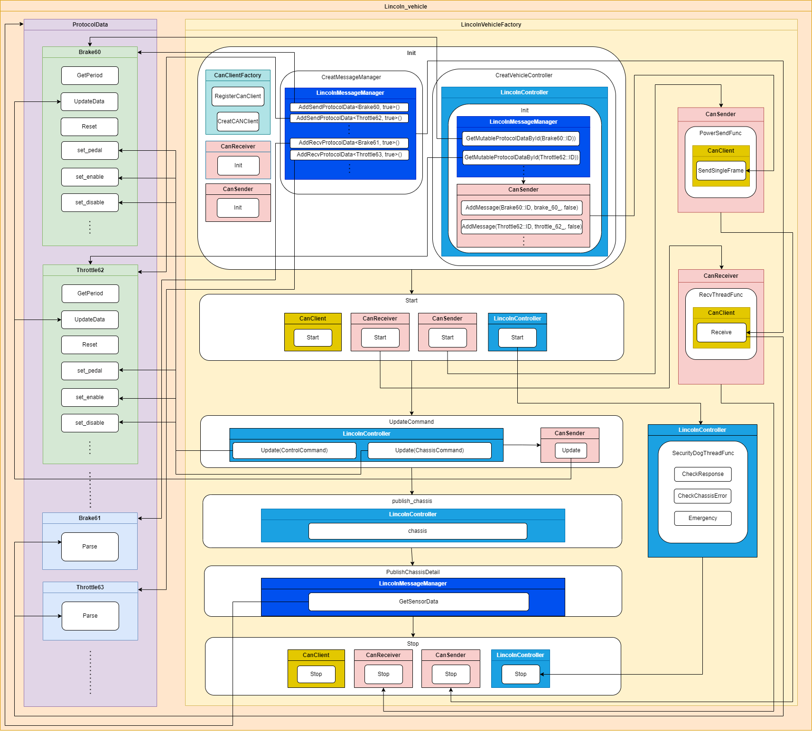

# canbus-vehicle-lincoln

## 介绍

- canbus-vehicle-lincoln 包是lincoln mkz车型底盘协议适配的实现包，它不是一个单独的组件，是继承自canbus包内的车型工厂类AbstractVehicleFactory和车辆控制器类VehicleController的具体实现，是canbus模块的一个插件。Lincoln车型所实现的方法调用逻辑是由canbus组件的调用逻辑定义的，相关流程可参考[canbus组件说明文档](../../canbus/README_cn.md)。
- 下图是[lincoln](./lincoln)车型包的实现框架流程。



- 在lincoln车型实现中，有3个独立的线程需要关注：

    (1) CanSender发送控制报文线程：Apollo发送至车辆底盘的CAN数据称为控制报文，由CanSender创建独立线程，按照协议报文周期进行发送，而所发送的报文数据则由CanSender::Update方法进行更新；

    (2) CANReceiver接收底盘控制报文线程：车辆发出的底盘信息CAN数据称为反馈报文，由CanReceiver创建独立线程进行接收（接收方式有阻塞或非阻塞，取决于使用的是哪种CanClient，MessageManager调用ProtocolData的Prase方法，解析收到的底盘数据，并更新Lincoln.proto数据；

    (3) 底盘状态实时监控线控：在LincolnController中，会创建一个单独的看门狗线程，SecurityDogThreadFunc()方法实现对底盘的驾驶模式、底盘故障进行实时监控，如果底盘被监控到退出自动驾驶（被接管）或底盘存在故障，会执行Emergency()方法，将所有控制报文初始化，并将Chassis::DrivingMode置为Emergency或Chassis_Error。

- Lincoln车型的协议报文都是继承父类ProtocolData，控制报文和反馈报文继承实现的方法不同，区分一个报文是控制还是反馈报文，就看它实现了哪些方法。

    | 方法 | 说明 | 控制报文 | 反馈报文 |
    | --- | --- | --- | --- |
    | GetPeriod | 定义报文周期 | √ | × |
    | Reset | 定义报文的默认数据 | √ | × |
    | UpdateData | 定义报文的更新数据 | √ | × |
    | UpdateData_Heartbeat | 定义心跳信号的更新内容 | √ | × |
    | Prase | 定义报文的协议数据解析 | × 或 √ | √ |

    如`Brake60`是控制报文协议解析，`Brake61`是反馈报文协议解析。

- `/apollo/chassis`channel是通过VehicleController中Chassis方法，将必要的ProtocolData协议的Parse数据写入到apollo::Chassis中进行发布；

- `/apollo/chassis_detail`channel是调用ProtocolData的Parse后，写入到对应车型Proto数据中，查看对应车型的Proto文件进行查询，并进行发布该车型proto类型的数据。

- CanClient客户端是CAN卡硬件驱动的实例，它是被不同的使用CAN总线协议的传感器共享的。如果现有的CAN卡驱动不满足使用，可以通过继承CanClient类在`drivers/canbus/can_client`的文件夹中实现新的CAN卡驱动。


## 文件组织结构及说明
因为每一类车型的文件组织结构相同，这里以lincoln车型为例进行说明，其它车型的目录结构可以自行查看。
```shell
modules/canbus_vehicle/
└── lincoln                                 // lincoln车型协议及车辆控制等实现文件
    ├── BUILD                               // 构建规则文件
    ├── cyberfile.xml                       // 包管理配置文件
    ├── lincoln_controller.cc               // lincoln车型控制器实现文件
    ├── lincoln_controller.h                // lincoln车型控制器声明文件
    ├── lincoln_controller_test.cc          // lincoln车型控制器单元测试文件
    ├── lincoln_message_manager.cc          // lincoln车型发送/接收报文管理器实现文件
    ├── lincoln_message_manager.h           // lincoln车型发送/接收报文管理器声明文件
    ├── lincoln_message_manager_test.cc     // lincoln车型发送/接收报文管理器单元测试文件
    ├── lincoln_vehicle_factory.cc          // lincoln车型车型工厂实现文件
    ├── lincoln_vehicle_factory.h           // lincoln车型车型工厂声明文件
    ├── lincoln_vehicle_factory_test.cc     // lincoln车型车型工厂单元测试文件
    ├── docs/                               // 说明文档相关文件
    ├── README_cn.md                        // 包说明文档
    ├── proto/                              // 车型协议变量定义文件夹
    │   ├── BUILD                           // 构建规则文件
    │   └── lincoln.proto                   // lincoln车型协议变量类型定义文件
    ├── protocol/                           // 协议解析实现文件夹
    │   ├── brake_60.cc                     // 制动报文控制协议解析实现文件
    │   ├── brake_60.h                      // 制动报文控制协议解析实现文件
    │   ├── brake_60_test.cc                // 制动报文控制协议解析单元测试文件
    │   ├── brake_61.cc                     // 制动报文反馈协议解析实现文件
    │   ├── brake_61.h                      // 制动报文反馈协议解析实现文件
    │   ├── brake_61_test.cc                // 制动报文反馈协议解析单元测试文件
    │   .
    │   .
    │   .
    └── testdata                            // 单元测试测试数据文件夹
```


## 模块输入输出与配置

### canbus-vehicle-lincoln插件

#### 输入
|  Channel名称  | 类型  | 描述  |
| ---- | ---- | ---- |
| `/apollo/control` | apollo::control::ControlCommand | canbus模块订阅该消息，LincolnVehicleFactory继承AbstractVehicleFactory基类方法UpdateCommand(ControlCommand)传入该参数，作为lincoln车型插件的输入 |
| `/apollo/chassis_control`| apollo::ChassisCommand | canbus模块订阅该消息，LincolnVehicleFactory继承AbstractVehicleFactory基类方法UpdateCommand(ChassisCommand)传入该参数，作为lincoln车型插件的输入 |

#### 输出
| Channel名称  | 类型  | 描述 |
| ---- | ---- | ---- |
| `/apollo/chassis_detail` | apollo::lincoln::Lincoln | lincoln车辆底盘详细信息，展示底盘总线报文解析数据 |

#### 配置文件
| 文件路径 | 类型/结构 | 说明 |
| ---- | ---- | ---- |

| `modules/canbus/conf/canbus.conf` | `command line flags` | 命令行参数配置 |

#### Flags
| flagfile | 类型 | 描述 |
| ---- | ---- | ------ |
| `canbus_gflags.cc` | `flags` | Canbus组件flags定义文件 |
| `canbus_gflags.h` | `declare` | Canbus组件flags声明文件 |

#### 使用方式

##### 修改车型包加载配置
在`modules/canbus/conf/canbus.conf`中，修改`--load_vehicle_library`和`--load_vehicle_class_name`参数，加载Lincoln车型包，在包管理和源码下配置参数不同：
- // 包管理下
```
--load_vehicle_library=/opt/apollo/neo/lib/modules/canbus_vehicle/lincoln/liblincoln_vehicle_factory_lib.so
--load_vehicle_class_name=LincolnVehicleFactory
```

- // 源码下
```
--load_vehicle_library=/apollo/bazel-bin/modules/canbus_vehicle/lincoln/liblincoln_vehicle_factory_lib.so
--load_vehicle_class_name=LincolnVehicleFactory
```

##### 使用 mainboard 启动

```shell
mainboard -d modules/canbus/dag/canbus.dag
```

##### 使用 cyber_launch 启动

```shell
cyber_launch start modules/canbus/launch/canbus.launch
```
