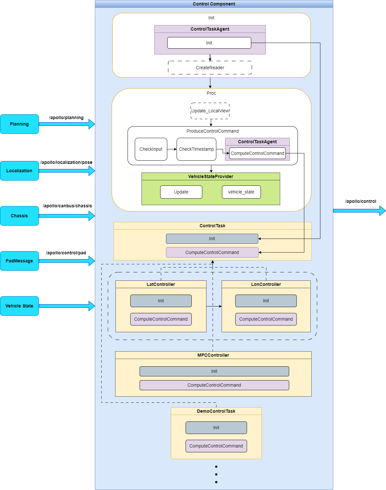
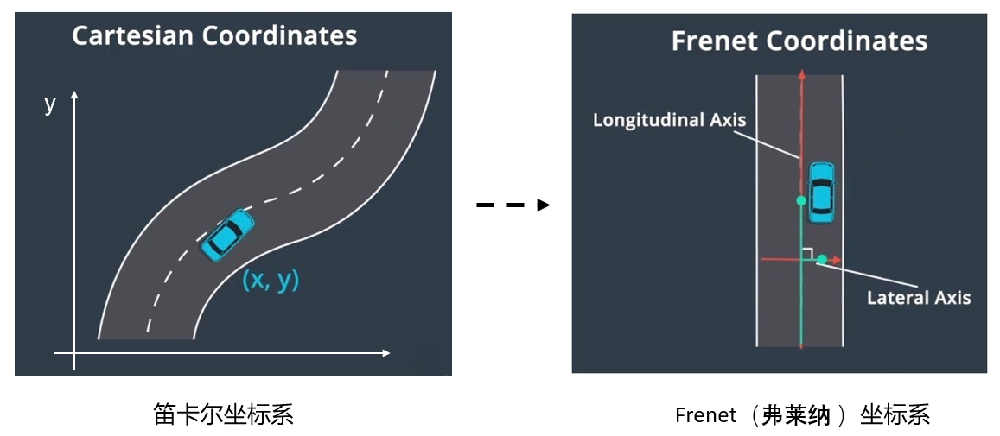

control
==============

## 简介

Control模块主要由control组件包和controller控制器包组成，control组件包是control模块的基础组件，包含control的整体架构和流程。control根据上游模块输入planning模块的期望轨迹信息，定位模块的当前定位信息，车辆底盘及车身状态信息，通过不同的控制算法计算控制车辆的指令（包含转向、油门、刹车等）输出给canbus模块，为自动驾驶车辆提供舒适的驾驶体验。



#### control_component
control_component是继承于apollo::cyber::TimerComponent的子类，是一个定时触发的组件，通过dag配置可以修改定时器周期。Init和Proc是入口函数，在初始化函数中，主要实现了ControlTaskAgent的初始化，以及control上游的相关消息的订阅。在Proc执行函数中，分别执行了几步操作：获取订阅消息的当前最新数据-->检查订阅消息输入数据（代码里主要检查了对轨迹线数据是否为空的检查，其它消息数据的检查也可以自行添加）是否完整-->检查订阅消息输入数据时间戳是否在容差范围内（上游消息的数据周期是否超时，如果超时control会有紧急处理）-->更新车身姿态信息-->进行control控制计算（这部分调用ControlTaskAgent的ComputeControlCommand方法，ControlTaskAgent通过配置文件，管理控制器ControlTask的加载和执行顺序，进而完成控制指令的计算）-->输出底盘控制指令。

#### control_task_base
control_component/controller_task_base/主要包含ControlTaskAgent和ControlTask定义。ControlTaskAgent用来管理ControlTask插件的加载和执行顺序，ControlTask是controller控制器插件的父类，Control/controller控制器插件都继承于ControlTask，目前Apollo已经支持的控制器插件有横向控制器（LatController），纵向控制器（LonController），MPC控制器（MPCController），以及DemoControlTask任务器（DemoControlTask）。

#### controller
Apollo对车辆的控制是将车辆在车体坐标系转换到Frenet坐标系下进行位置跟踪，沿着道路方向为纵向，垂直与道路方向的为横向，因此可以将车辆跟踪轨迹的运动分解为横向运动和纵向运动，通过对车体的动力学建模，选取合适的状态变量对车辆的跟踪情况进行观测，再通过横向和纵向的控制算法，计算合理的控制指令，达到对轨迹线的跟踪目标。


因此在控制器插件内有横向控制器（基于LQR控制算法）、纵向控制器（基于PID控制算法）、MPC控制器（基于MPC算法完成横纵向的控制）。Demo任务器演示了一个车辆的加速度限幅的控制策略。在控制器设计中，可以设计一个整体功能的控制器，如横向控制器、纵向控制器等，也可以设计一个只有部分功能的任务器，如针对某个限定场景下限幅（限制输出）或限速等的控制逻辑，这一类控制是执行一个具体的逻辑任务，我们称之为任务器，如Demo任务器。控制器或任务器的插件可以根据使用需求进行自定义。

#### 相关文档
- [controller_task_base介绍说明](./docs/controller_task_base_readme_cn.md)

## 文件组织结构及说明

control目录包含2个子目录，分别是control_component组件基础包和controllers插件包。
```shell
control/
├── control_component/                  // control基础组件
└── controllers/                        // 控制器算法或逻辑任务组件
```

control_component目录是组件基础包，插件父类相关实现和配置文件等。
```shell
control/
└── control_component
    ├── common                          // 模块全局gflag定义
    ├── conf                            // 模块配置文件，参数文件目录，包含gflags变量的配置，插件启用的配置文件，车辆标定表等通用的配置文件
    ├── controller_task_base/           // control控制器父类组件
    │   ├── common/                     // 数学公式，算法公式，滤波函数，轨迹分析
    │   ├── integration_tests/          // 单元测试文件夹
    │   ├── control_task_agent.cc       // 控制器加载管理器实现文件
    │   ├── control_task_agent.h        // 控制器加载管理器实现文件
    │   └── control_task.h              // 控制器父类实现文件
    ├── dag/                            // 模块启动文件(mainboard)
    ├── docs/                           // 相关模块说明文档
    ├── launch/                         // 模块启动文件(cyber_launch)
    ├── proto/                          // 组件定义的配置文件
    ├── submodules/                     // control子模块
    ├── testdata/                       // 单元测试数据
    ├── tools/                          // 调试工具
    ├── BUILD                           // 构建规则文件
    ├── control_component.cc            // 组件实现的代码文件
    ├── control_component.h             // 组件实现的代码文件
    ├── control_component_test.cc       // 组件单元测试文件
    ├── control.json                    // 打包描述文件
    ├── cyberfile.xml                   // 包管理配置文件
    └── README_cn.md                    // 说明文档
```

controllers目录是控制器插件目录，control支持定义基于算法的控制器插件，也可以定义基于逻辑规则的控制器插件。
```shell
modules/control/
└── controllers                         // 控制器插件目录
    ├── demo_control_task               // demo控制器插件包
    │   ├── proto/                      // 控制器的配置定义文件夹
    │   ├── conf/                       // 控制器配置文件夹
    │   ├── BUILD                       // 构建规则文件
    │   ├── cyberfile.xml               // 包管理配置文件
    │   ├── demo_control_task.cc        // demo控制器实现文件
    │   ├── demo_control_task.h         // demo控制器实现文件
    │   └── plugins.xml                 // 插件规则文件
    ├── lat_based_lqr_controller        // LQR横向控制器插件包
    │   ├── proto/                      // 控制器的配置定义文件夹
    │   ├── conf/                       // 控制器配置文件夹
    │   ├── BUILD                       // 构建规则文件
    │   ├── cyberfile.xml               // 包管理配置文件
    │   ├── lat_controller.cc           // LQR横向控制器实现文件
    │   ├── lat_controller.h            // LQR横向控制器实现文件
    │   ├── lat_controller_test.cc      // LQR横向控制器单元测试文件
    │   ├── lateral_controller_test     // 控制器测试数据
    │   └── plugins.xml                 // 插件规则文件
    ├── lon_based_pid_controller        // PID纵向控制器插件包
    │   ├── proto/                      // 控制器的配置定义文件夹
    │   ├── conf/                       // 控制器配置文件夹
    │   ├── BUILD                       // 构建规则文件
    │   ├── cyberfile.xml               // 包管理配置文件
    │   ├── lon_controller.cc           // PID纵向控制器实现文件
    │   ├── lon_controller.h            // PID纵向控制器实现文件
    │   ├── lon_controller_test.cc      // PID纵向控制器单元测试文件
    │   ├── longitudinal_controller_test// 控制器测试数据
    │   └── plugins.xml                 // 插件规则文件
    └── mpc_controller                  // MPC横纵向控制器插件包
        ├── proto/                      // 控制器的配置定义文件夹
        ├── conf/                       // 控制器配置文件夹
        ├── BUILD                       // 构建规则文件
        ├── cyberfile.xml               // 包管理配置文件
        ├── mpc_controller.cc           // MPC控制器实现文件
        ├── mpc_controller.h            // MPC控制器实现文件
        ├── mpc_controller_test.cc      // MPC控制器单元测试文件
        ├── mpc_controller_test_data    // 控制器测试数据
        └── plugins.xml                 // 插件规则文件
```


## 模块输入输出与配置

### Control组件

#### 输入
| Channel名称 | 类型 | 描述 |
| ---- | ---- | ---- |
| `/apollo/planning` | apollo::planning::ADCTrajectory | 车辆规划轨迹线信息 |
| `/apollo/localization/pose`  | apollo::localization::LocalizationEstimate | 车辆定位信息 |
| `/apollo/canbus/chassis`| apollo::canbus::Chassis | 车辆底盘信息 |
| - | apollo::common::VehicleState | 车身姿态信息 |
| `/apollo/control/pad` | apollo::control::ControlCommand::PadMessage | 自动驾驶使能（请求进入自动驾驶）指令 |

#### 输出
| Channel名称  | 类型  | 描述 |
| ---- | ---- | ---- |
| `/apollo/control` | apollo::control::ControlCommand | 车辆的控制指令，如方向盘、油门、刹车等信息 |

#### 配置文件
| 文件路径 | 类型/结构 | 说明 |
| ---- | ---- | ---- |
| `modules/control/control_component/conf/pipeline.pb.txt` | apollo::control::ControlPipeline | ControlComponent的配置文件 |
| `modules/control/control_component/conf/control.conf` | `command line flags` | 命令行参数配置 |
| `modules/control/control_component/conf/calibration_table.pb.txt` |  apollo::control::calibration_table | 车辆纵向标定表配置 |

#### Flags
| flagfile | 类型 | 描述 |
| ---- | ---- | ------ |
| `modules/control/control_component/common/control_gflags.cc` | `flags` | Control组件flags变量定义文件 |
| `modules/control/control_component/common/control_gflags.h` | `declare` | Control组件flags声明文件 |

#### 使用方式

##### 配置加载的controller控制器

根据需要启动的控制器，修改`modules/control/control_component/conf/pipeline.pb.txt`中的配置参数，启动对应的控制器或任务器，控制器的执行顺序根据pipeline配置的顺序进行加载执行，因此要注意配置控制器的先后顺序，避免造成错误。配置参数中`name`表示控制器的名称，这个由用户自定义，表达清楚是哪个控制器即可，`type`是控制器的子类名称，请注意，如果和子类名称不一致，会导致加载控制器失败。 下面示例表示先加载`LatController`，再加载`LonController`。
```
controller {
  name: "LAT_CONTROLLER"
  type: "LatController"
}
controller {
  name: "LON_CONTROLLER"
  type: "LonController"
}
```

##### 使用 mainboard 启动

```shell
mainboard -d modules/control/dag/control.dag
```

##### 使用 cyber_launch 启动

```shell
cyber_launch start modules/control/launch/control.launch
```
