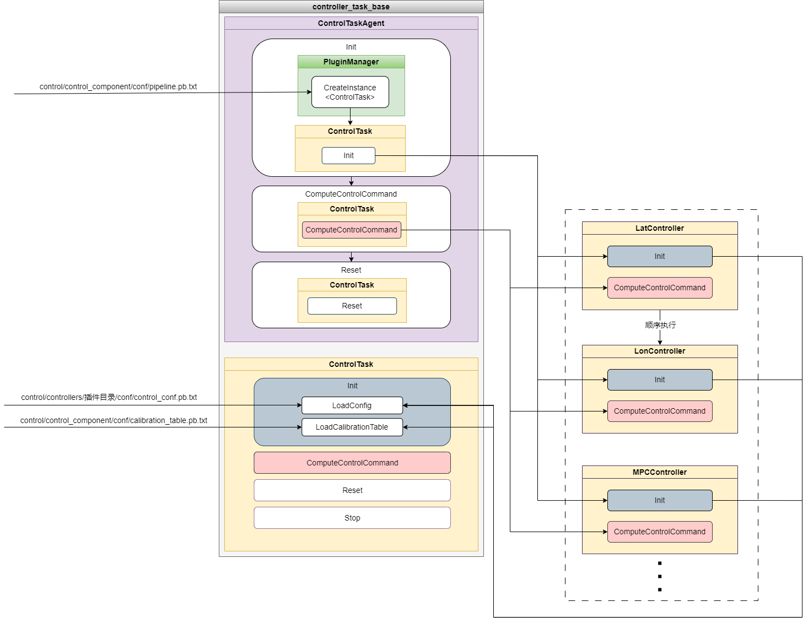
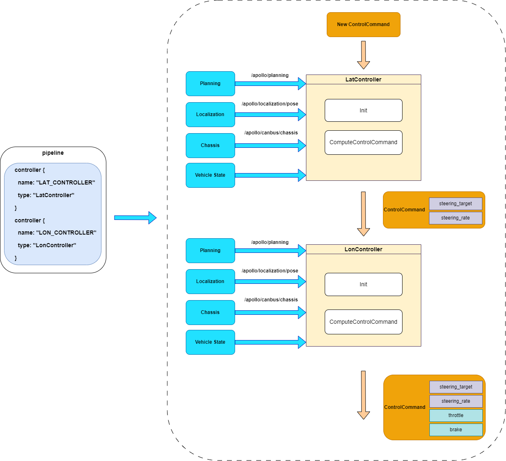

controller_task_base介绍说明
==============

## 简介

control_task_base主要包含控制器管理器ControlTaskAgent、控制器基类ControlTask、控制器插件包需要使用的控制器算法、滤波算法、数值计算方法、轨迹分析方法等，放置一些control模块通用的方法，控制器的通用配置配置参数等。



#### control_task_agent
ControlTaskAgent是管理控制器插件的管理器，ControlTask的Init方法用于读取加载控制器的配置文件（`modules/control/control_component/conf/pipeline.pb.txt`），并调用插件管理器PluginManager创建插件实例，加载的控制器顺序按照配置文件内的顺序加载，然后调用控制器实例的初始化Init方法，执行控制器的初始化。在ComputeControlCommand方法中，按照Init方法内的ControlTask加载顺序，顺序执行控制器ControlTask内的ComputeControlCommand方法，进行控制指令计算。如下`modules/control/control_component/conf/pipeline.pb.txt`配置为例，
```
controller {
  name: "LAT_CONTROLLER"
  type: "LatController"
}
controller {
  name: "LON_CONTROLLER"
  type: "LonController"
}
```
表示先加载横向控制器LatController，再加载纵向控制器LonController，执行顺序也是先执行LatController，再执行LonController。根据实际控制器执行逻辑进行对应的加载。

#### control_task
ControlTask是控制器插件的父类，Control/controller控制器插件都继承于ControlTask，ControlTask有个几个公共的方法，分别是Init是初始化，ComputeControlCommand是计算控制指令，LoadConfig是加载控制器的配置参数，控制器的配置文件在控制器插件包下的`control/controllers/xxxx_controller/conf/controller_conf.pb.txt`文件，LoadCalibrationTable是加载车辆标定配置文件，车辆配置参数属于通用参数，放置于`modules/control/control_component/conf/calibration_table.pb.txt`。每一个控制器都是继承ComputeControlCommand方法并实现，所以输入都是定位，底盘，规划轨迹线数据，通过控制器计算后，写入ControlCommand某些控制量，比如横向控制器LatController写入ControlCommand->steering_target控制量，然后通过纵向控制器输出ControlCommand->throttle、ControlCommand->brake等控制量。下图以横向控制器LatController和纵向控制器LonController说明ControlCommand内的数据写入顺序。



因此，可以设计不同控制器或者任务器，计算需要输出的控制指令，通过定义这些控制/任务器的执行顺序，达到想要控制的目的。目前Apollo已经支持的控制器插件有横向控制器（LatController），纵向控制器（LonController），MPC控制器（MPCController），以及DemoControlTask任务器（DemoControlTask）。


## 文件组织结构及说明
```shell
control/
└── control_component
│   ├── controller_task_base
│   │   ├── BUILD
│   │   ├── common
│   │   │   ├── BUILD
│   │   │   ├── dependency_injector.h                  // 
│   │   │   ├── hysteresis_filter.cc                   // 之后滤波器
│   │   │   ├── hysteresis_filter.h                    // 
│   │   │   ├── hysteresis_filter_test.cc              //
│   │   │   ├── interpolation_1d.cc                    // 一维插值查表方法
│   │   │   ├── interpolation_1d.h                     //
│   │   │   ├── interpolation_1d_test.cc               //
│   │   │   ├── interpolation_2d.cc                    // 二维插值查表方法
│   │   │   ├── interpolation_2d.h                     //
│   │   │   ├── interpolation_2d_test.cc               //
│   │   │   ├── leadlag_controller.cc                  // 超前滞后调节器
│   │   │   ├── leadlag_controller.h                   //
│   │   │   ├── leadlag_controller_test.cc             //
│   │   │   ├── mrac_controller.cc                     // 模型参考自适应控制器
│   │   │   ├── mrac_controller.h                      //
│   │   │   ├── mrac_controller_test.cc                //
│   │   │   ├── pid_BC_controller.cc                   // PID抗饱和控制器
│   │   │   ├── pid_BC_controller.h                    //
│   │   │   ├── pid_BC_controller_test.cc              //
│   │   │   ├── pid_controller.cc                      // PID控制器
│   │   │   ├── pid_controller.h                       //
│   │   │   ├── pid_controller_test.cc                 //
│   │   │   ├── pid_IC_controller.cc                   // PID抗饱和控制器   
│   │   │   ├── pid_IC_controller.h                    //
│   │   │   ├── pid_IC_controller_test.cc              //
│   │   │   ├── trajectory_analyzer.cc                 // 轨迹投影frenet坐标方法
│   │   │   ├── trajectory_analyzer.h                  // 
│   │   │   └── trajectory_analyzer_test.cc            //
│   │   ├── control_task_agent.cc                      // 控制器插件加载管理器
│   │   ├── control_task_agent.h                       // 
│   │   ├── control_task.h                             // 控制器插件基类 
│   │   └── integration_tests                          // 单元测试
│   │       ├── BUILD                                  //
│   │       ├── control_test_base.cc                   //
│   │       ├── control_test_base.h                    //
│   │       ├── relative_position_test.cc              //
│   │       └── simple_control_test.cc                 //
```


## 模块输入输出与配置

### Control组件

#### 输入
| Channel名称 | 类型 | 描述 |
| ---- | ---- | ---- |
| `modules/control/control_component/conf/pipeline.pb.txt` | apollo::control::ControlPipeline | 控制器加载配置说明 |

#### 输出
| Channel名称  | 类型  | 描述 |
| ---- | ---- | ---- |
| `/apollo/control` | apollo::control::ControlCommand | 车辆的控制指令，如方向盘、油门、刹车等信息 |

#### 配置文件
| 文件路径 | 类型/结构 | 说明 |
| ---- | ---- | ---- |
| `modules/control/control_component/conf/pipeline.pb.txt` | apollo::control::ControlPipeline | 控制器加载配置说明 |
