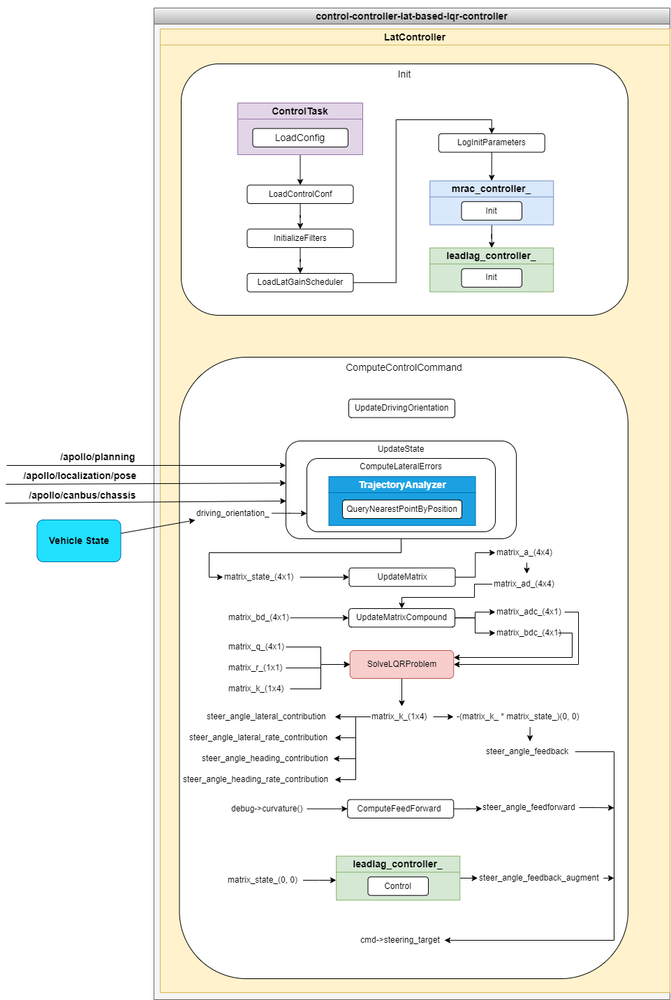

control-controller-lat-based-lqr-controller
==============

## 简介

control-controller-lat-based-lqr-controller 插件包是基于 LQR 控制算法进行车辆横向控制的控制器实现。车辆横向控制是在 Frenet 坐标系下，沿着道路参考线切线的法线方向，控制车辆的横向位置、车身朝向角按照规划轨迹线的方向进行行驶。车辆的横向控制算法有很多种，本插件是设计一种基于 LQR 控制算法的横向控制方法。



control-controller-lat-based-lqr-controller 插件主要包含 LatCotroller 的实现文件，LatCotroller 是继承 ControlTask 的子类，实现 Init、ComputeControlCommand、Reset、Name 等方法。主要的计算逻辑在 ComputeControlCommand 方法，输入是规划轨迹线（apollo::planning::ADCTrajectory），车体位置信息（apollo::localization::LocalizationEstimate），车体姿态信息（VehicleStateProvider），车体底盘信息（apollo::canbus::Chassis）等。根据车辆转弯的动力学建模，建立车辆动力学的微分方程，设计[横向位置误差，横向位置误差变化率，航向角误差，航向角误差变化率]^T为控制系统的状态变量，可以通过观测值（计算误差）进行状态变量的获取，推到出系统状态转移矩阵（A）和控制矩阵（B），将连续时间作用的系统状态方程离散化，设计 Q ，R 矩阵，进行 LQR 计算求解 Riccati 方程得到反馈矩阵K，根据反馈矩阵K计算出的控制量为 steer_angle_feedback ， 另一部分是车辆前馈 steer_angle_feedforward ，横向误差还设计了超前滞后调节器，对横向进行补偿，最终将三者相加，作为一次控制量输入到车辆，完成 1 次控制。

#### 横向误差计算

横向误差计算在 ComputeLateralErrors() 方法中，核心思想是根据车辆当前位置通过最近距离计算方法（apollo::control::TrajectoryAnalyzer::QueryNearestPointByPosition）找到当前车辆位置距离规划轨迹线上的最近点（轨迹线上的点match_point），然后将实际坐标（VRF）投影到轨迹线上的 match_point(Frenet) ，这里匹配点（match_point）就是横向的参考轨迹点，则车辆的横向位置误差即为投影变化的L方向距离（d_matched），横向距离有一个方向的假设，左转为正，横向误差正数表示当前车辆偏离参考轨迹点左侧，轨迹线上的曲率正数表示左转，转向角输出正数，控制车辆为左转车轮。航向角误差为车辆当前航向角-参考轨迹点航向角，横向位置误差变化率为车身姿态的运动速度（VRF坐标系）在横向的投影分量，航向角变化率为车身姿态的横摆角速度。

通过当前的查询方法找到当前的规划轨迹线上的目标轨迹点，然后将车辆当前位置的坐标（VRF坐标，车体坐标系），投影到规划的目标轨迹点坐标系（Frenet），投影后只考虑纵向的误差，等于参考点减实际点，即纵向误差=规划轨迹线的参考值（位置、速度）-当前车辆的实际值（投影后的纵向位置、纵向速度），轨迹线参考坐标的处理参考 apollo::control::TrajectoryAnalyzer::ToTrajectoryFrame 方法（`modules/control/control_component/control_task_base/common/trajectory_analyzer.cc`）。

#### LQR控制器

LQR 控制器全称是线性二次型调节器（linear quadratic regulator），方法定义在`modules/common/math/linear_quadratic_regulator.cc`，静态方法有 SolveLQRProblem （Riccati方程矩阵差计算），通过设定系统迭代的容差值（eps）和最大迭代次数（max_iteration），改变精度和求解时间。

#### 车辆动力学模型


## 文件组织结构及说明

```shell
control/controllers/lat_based_lqr_controller/
├── conf/                                                  // 控制器配置参数文件
├── docs/                                                  // 文档相关
├── lateral_controller_test/                               // 单元测试数据
├── proto
│   ├── BUILD
│   └── lat_based_lqr_controller_conf.proto                // 控制器配置参数定义
├── BUILD                                                  // 规则构建文件
├── cyberfile.xml                                          // 插件包管理配置文件
├── lat_controller.cc                                      // 控制器实现文件
├── lat_controller.h                                       // 控制器实现文件
├── lat_controller_test.cc                                 // 控制器单元测试文件
├── plugins.xml                                            // 插件配置文件
└── README_cn.md                                           // 说明文档
```


## 模块输入输出与配置

### control-controller-lat-based-lqr-controller插件

#### 输入
| Channel名称 | 类型 | 描述 |
| ---- | ---- | ---- |
| `/apollo/planning` | apollo::planning::ADCTrajectory | 车辆规划轨迹线信息（轨迹点信息），control_component 订阅此消息， LatController 继承 ControlTask 基类方法 ComputeControlCommand 传入参数 |
| `/apollo/localization/pose` | apollo::localization::LocalizationEstimate | 车辆定位信息（世界坐标系位置），control_component 订阅此消息， LatController 继承 ControlTask 基类方法 ComputeControlCommand 传入参数 |
| `/apollo/canbus/chassis` | apollo::canbus::Chassis | 车辆底盘信息（车辆实际转向角，车辆速度），control_component 订阅此消息， LatController 继承 ControlTask 基类方法 ComputeControlCommand 传入参数 |
| - | apollo::common::VehicleState | 车身姿态信息（车体坐标系航向角，车身速度） |

#### 输出
| Channel名称  | 类型  | 描述 |
| ---- | ---- | ---- |
| `/apollo/control` | apollo::control::ControlCommand | 车辆的控制指令：方向盘转角指令 |

#### 配置文件
| 文件路径 | 类型/结构 | 说明 |
| ---- | ---- | ---- |
| `modules/control/control_component/conf/pipeline.pb.txt` | apollo::control::ControlPipeline | ControlComponent 的配置文件 |
| `modules/control/control_component/conf/control.conf` | `command line flags` | 命令行参数配置，配置全局的flag变量 |
| `modules/control/controllers/lat_based_lqr_controller/conf/controller_conf.pb.txt` | apollo::control::LatBaseLqrControllerConf | LQR 横向控制器配置文件 |

#### Flags
| flagfile | 类型 | 描述 |
| ---- | ---- | ------ |
| `modules/control/control_component/common/control_gflags.cc` | `flags` | 定义全局的flag变量在LatController使用，通过control.conf进行配置 |
| `modules/control/control_component/common/control_gflags.h` | `declare` | flags声明文件 |

#### 使用方式

##### 配置加载LonController控制器

在 `modules/control/control_component/conf/pipeline.pb.txt` 中的增加配置加载的控制器参数，配置参数中 `name` 表示控制器的名称，这个由用户自定义，表达清楚是哪个控制器即可， `type` 是 LatController 控制器的类名称，即 LatController 。请注意，如果配置文件内的 `type` 名称和加载的类名称不一致，会导致加载控制器失败。
```
controller {
  name: "LAT_CONTROLLER"
  type: "LatController"
}
```

##### 配置合适的LatController控制器配置参数

横向控制器配置参数的设置在 `modules/control/controllers/lat_based_lqr_controller/conf/controller_conf.pb.txt` 文件，主要目的是适配不同的车型，不同车型的转向系统、质量分布不同，找到控制效果最佳的控制参数，在实际使用该插件时，也要根据控制效果的评价，调整控制参数，达到评价效果的要求。

##### 配置合适的LatController控制器用到的全局变量配置参数

纵向控制器的配置参数内，有一些是在 `modules/control/control_component/common/control_gflags.cc` 定义的全局变量，这部分参数如果修改默认值，需要在 `modules/control/control_component/conf/control.conf` 文件内配置生效。

##### 使用 mainboard 启动

```shell
mainboard -d modules/control/dag/control.dag
```

##### 使用 cyber_launch 启动

```shell
cyber_launch start modules/control/launch/control.launch
```
