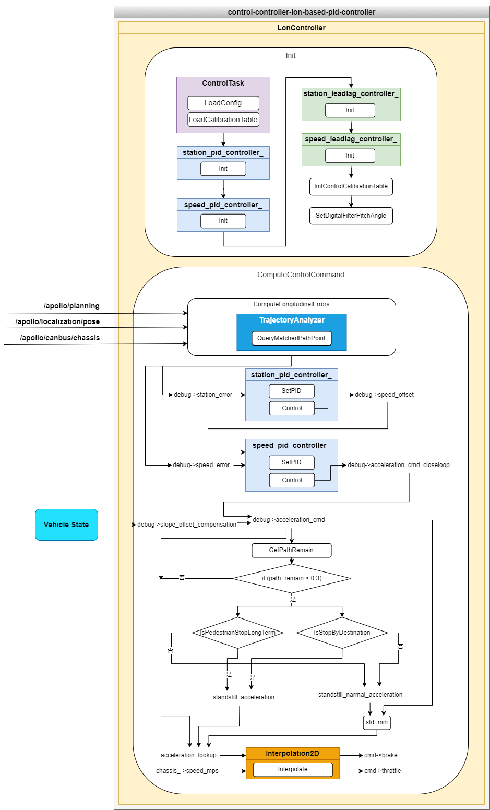

control-controller-lon-based-pid-controller
==============

## 简介

control-controller-lon-based-pid-controller 插件包是基于 PID 控制器进行车辆纵向控制计算的控制器实现，车辆纵向控制是在 Frenet 坐标系下，沿着道路参考线切线的方向，控制车辆的位置、速度、加速度按照规划轨迹线的参考位置、参考速度行驶。车辆纵向控制的算法有很多种，本插件是设计一种基于PID控制器的控制方法。



control-controller-lon-based-pid-controller 插件主要包含LonController的实现文件， LonController 是继承 ControlTask 的子类，实现 Init、ComputeControlCommand、Reset、Name 等方法。主要的计算逻辑在 ComputeControlCommand 方法，输入是规划轨迹线（apollo::planning::ADCTrajectory），车体位置信息（apollo::localization::LocalizationEstimate），车体姿态信息（VehicleStateProvider），车体底盘信息（apollo::canbus::Chassis）等，通过求解纵向误差（位置误差，速度误差）、期望的车辆加速度，加上两级的PID控制器的控制量，可以选择是否需要增加坡度加速度补偿，如果车辆在接近规划轨迹线终点时，可以设置接近终点的加速度进行准确停车，如果车辆前方长时间停着行人，也可以配置对应的加速度作用车辆，求解完成加速度后，然后查询车辆标定表转化成车辆的控制接口如油门踏板或刹车踏板，输入给车辆，完成 1 次控制。

#### 纵向误差计算

纵向误差计算在 ComputeLongitudinalErrors() 方法中，核心思想是通过绝对时间的查询方法找到规划轨迹线上的点作为控制参考的目标点，然后通过最优距离计算方法（apollo::control::TrajectoryAnalyzer::QueryMatchedPathPoint）找到当前车辆位置在轨迹线上的最佳匹配点（规划线上的点matched_point），将车辆当前位置的坐标（VRF坐标，车体坐标系），投影到最佳匹配轨迹点坐标系（Frenet），求出当前车辆位置投影到S轴（Frenet纵向方向）的距离（PathPoint.s)（这个距离是相对于规划起点定义的），这样纵向误差的计算就在相同的规划轨迹线的坐标系下进行计算，即实际的纵向位置（Frenet:S轴）误差=规划轨迹线的参考点纵向距离（TrajectoryPoint.s）-当前车辆投影在轨迹线上的匹配点纵向距离（s_matched.s），轨迹线参考坐标的处理参考 apollo::control::TrajectoryAnalyzer::ToTrajectoryFrame 方法（`modules/control/control_component/control_task_base/common/trajectory_analyzer.cc`）。

#### PID控制器

PID控制器全称是比例-积分-微分控制器（Proportional–Integral–Derivative controller），方法定义在 `modules/control/control_component/control_task_base/common/pid_controller.cc` ，PIDController的方法有Init（初始化），SetPID（设置p,i,d参数），Reset（重置），Reset_integral（积分量重置），Control（PID计算）。PID是根据误差的大小，误差的积分，误差的微分求和，作用至控制系统，达到消除误差的目标。 PID 有比例参数 kp ，积分参数 ki ，微分参数 kd ，不同的参数调节作用和效果不同，调试时可以先调kp，从小到大逐渐增加，在适当增加ki消除，有必要时增加kd，提升作用系统的调节速度。先调速度环 speed_pid ，再适当增加位置环 station_pid 。

#### 车辆标定表
不同的车辆控制接口不一致，Apollo 支持的线控车辆主要的控制接口是基于油门、刹车接口，油门/刹车控制量与车辆的行驶速度是线性相关的，这个相关性车辆可能无法直接提供相应的数据或计算公式，为了通过线控接口比较准确的控制车辆速度，需要进行作用量与观测值的定量标定，获得相关性的关系。选取车辆在不同车速下，进行加速或减速直线行驶，记录当前时刻的车体纵向的加速度。如此往复，记录不同速度下，急加速，缓加速，急减速，缓减速等，形成一个标定表，如 `modules/control/control_component/conf/calibration_table.pb.txt` 所示，打印出如下图所示。

油门标定表


刹车标定表


## 文件组织结构及说明

```shell
control/controllers/lon_based_pid_controller/
├── conf/                                                 // 控制器配置参数文件
├── docs/                                                 // 文档相关
├── longitudinal_controller_test/                         // 单元测试数据
├── proto
│   ├── BUILD
│   └── lon_based_pid_controller_conf.proto               // 控制器配置参数定义
├── BUILD                                                 // 规则构建文件
├── cyberfile.xml                                         // 插件包管理配置文件
├── lon_controller.cc                                     // 控制器实现文件
├── lon_controller.h                                      // 控制器实现文件
├── lon_controller_test.cc                                // 控制器单元测试文件
├── plugins.xml                                           // 插件配置文件
└── README_cn.md                                          // 说明文档
```


## 模块输入输出与配置

### control-controller-lon-based-pid-controller插件

#### 输入
| Channel名称 | 类型 | 描述 |
| ---- | ---- | ---- |
| `/apollo/planning` | apollo::planning::ADCTrajectory | 车辆规划轨迹线信息（轨迹点信息），control_component 订阅此消息， LonController 继承 ControlTask 基类方法 ComputeControlCommand 传入参数 |
| `/apollo/localization/pose` | apollo::localization::LocalizationEstimate | 车辆定位信息（世界坐标系位置），control_component 订阅此消息，LonController 继承 ControlTask 基类方法 ComputeControlCommand 传入参数 |
| `/apollo/canbus/chassis` | apollo::canbus::Chassis | 车辆底盘信息（底盘车速），control_component订阅此消息， LonController 继承 ControlTask 基类方法 ComputeControlCommand 传入参数 |
| - | apollo::common::VehicleState | 车身姿态信息（车身俯仰角） |
| `/apollo/control` | apollo::control::ControlCommand | 车辆控制指令（方向盘控制指令），control_component 订阅此消息， LonController 继承 ControlTask 基类方法 ComputeControlCommand 传入参数 |

#### 输出
| Channel名称  | 类型  | 描述 |
| ---- | ---- | ---- |
| `/apollo/control` | apollo::control::ControlCommand | 车辆的控制指令：油门、刹车指令 |

#### 配置文件
| 文件路径 | 类型/结构 | 说明 |
| ---- | ---- | ---- |
| `modules/control/control_component/conf/pipeline.pb.txt` | apollo::control::ControlPipeline | ControlComponent 的配置文件 |
| `modules/control/control_component/conf/control.conf` | `command line flags` | 命令行参数配置，配置全局的 flag 变量 |
| `modules/control/controllers/lon_based_pid_controller/conf/controller_conf.pb.txt` | apollo::control::LonBasedPidControllerConf | PID 纵向控制器配置文件 |

#### Flags
| flagfile | 类型 | 描述 |
| ---- | ---- | ------ |
| `modules/control/control_component/common/control_gflags.cc` | `flags` | 定义全局的 flag 变量在 LonController 使用，通过 control.conf 进行配置 |
| `modules/control/control_component/common/control_gflags.h` | `declare` | flags 声明文件 |

#### 使用方式

##### 配置加载LonController控制器

在`modules/control/control_component/conf/pipeline.pb.txt` 中的增加配置加载的控制器参数，配置参数中 `name` 表示控制器的名称，这个由用户自定义，表达清楚是哪个控制器即可， `type` 是 LonController 控制器的类名称，即 LonController 。请注意，如果配置文件内的 `type` 名称和加载的类名称不一致，会导致加载控制器失败。
```
controller {
  name: "LON_CONTROLLER"
  type: "LonController"
}
```
##### 配置合适的LonController控制器配置参数

纵向控制器配置参数的设置在 `modules/control/controllers/lon_based_pid_controller/conf/controller_conf.pb.txt` 文件，主要目的是适配不同的车型，不同的动力学系统，找到控制效果最佳的控制参数，在实际使用该插件时，也要根据控制效果的评价，调整控制参数，达到评价效果的要求。同时要注意修改动力学标定表，在 `modules/control/control_component/conf/calibration_table.pb.txt` 文件下，修改成要适配车型的动力学标定表。

##### 配置合适的LonController控制器用到的全局变量配置参数

纵向控制器的配置参数内，有一些是在 `modules/control/control_component/common/control_gflags.cc` 定义的全局变量，这部分参数如果修改默认值，需要在 `modules/control/control_component/conf/control.conf` 文件内配置生效。

##### 使用 mainboard 启动

```shell
mainboard -d modules/control/dag/control.dag
```

##### 使用 cyber_launch 启动

```shell
cyber_launch start modules/control/launch/control.launch
```
