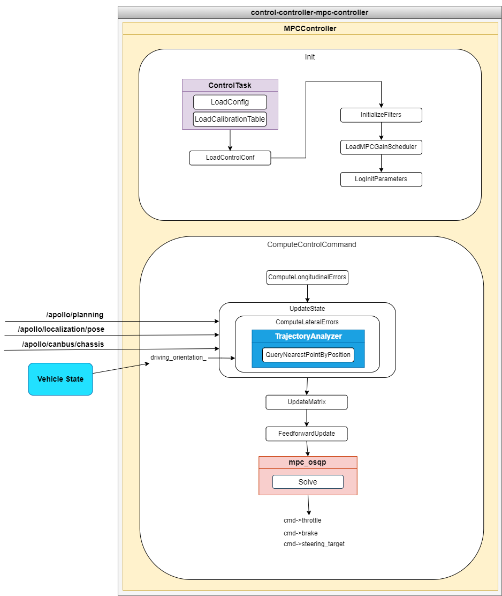

control-controller-mpc-controller
==============

## 简介

control-controller-mpc-controller 插件包是基于 MPC 控制算法进行车辆横纵向联合控制的控制器实现，通过该算法求解，可以同时输出控制车辆的方向盘转角、油门、刹车指令等。



control-controller-mpc-controller 插件主要包含 MPCController 的实现文件， MPCController 是继承 ControlTask 的子类，实现 Init 、ComputeControlCommand 、Reset 、Name 等方法。主要的计算逻辑在 ComputeControlCommand 方法，输入是规划轨迹线（ apollo::planning::ADCTrajectory ），车体位置信息（ apollo::localization::LocalizationEstimate ），车体姿态信息（ VehicleStateProvider ），车体底盘信息（ apollo::canbus::Chassis ）等。建立车辆横纵向动力学的微分方程，根据轨迹跟踪设计 [横向位置误差，横向位置误差变化率，航向角误差，航向角误差变化率，纵向误差，纵向速度误差]^T 为控制系统的状态变量，构建优化的代价函数，求解在给定优化空间内，使系统状态变量的微分方程趋于0最优解作为系统的控制量，输入到车辆，完成 1 次控制。

#### 横纵向误差计算

横向误差计算在 ComputeLateralErrors() 方法中，与横向控制器（ apollo::control::LatController::ComputeLongitudinalErrors ）的计算方法一致；纵向误差计算在 ComputeLongitudinalErrors() 方法中，与纵向控制器（ apollo::control::LonController::ComputeLongitudinalErrors ）的计算方法一致，详细说明可参考对应控制器文档。

#### MPC控制器

MPC 控制器全称是模型预测控制（ Model predictive control ），顾名思义是根据模型进行模型的预测，并在给定约束条件下，求解满足代价函数（通过最小控制量使系统状态变量趋近于0）的最优解，然后取最优解第一个项作为控制输出给给系统输入，求解二次优化方法定义在 `apollo/modules/common/math/mpc_osqp.cc` ，所用的二次优化求解器是 [OSQP](https://osqp.org/) 。


## 文件组织结构及说明

```shell
control/controllers/lat_based_lqr_controller/
├── conf/                                                  // 控制器配置参数文件
├── docs/                                                  // 文档相关
├── lateral_controller_test/                               // 单元测试数据
├── proto
│   ├── BUILD
│   └── mpc_controller.proto                               // 控制器配置参数定义
├── BUILD                                                  // 规则构建文件
├── cyberfile.xml                                          // 插件包管理配置文件
├── mpc_controller.cc                                      // 控制器实现文件
├── mpc_controller.h                                       // 控制器实现文件
├── mpc_controller_test.cc                                 // 控制器单元测试文件
├── plugins.xml                                            // 插件配置文件
└── README_cn.md                                           // 说明文档
```


## 模块输入输出与配置

### control-controller-mpc-controller 插件

#### 输入
| Channel名称 | 类型 | 描述 |
| ---- | ---- | ---- |
| `/apollo/planning` | apollo::planning::ADCTrajectory | 车辆规划轨迹线信息（轨迹点信息），control_component 订阅此消息， LatController 继承 ControlTask 基类方法 ComputeControlCommand 传入参数 |
| `/apollo/localization/pose` | apollo::localization::LocalizationEstimate | 车辆定位信息（世界坐标系位置），control_component 订阅此消息， LatController 继承 ControlTask 基类方法 ComputeControlCommand 传入参数 |
| `/apollo/canbus/chassis` | apollo::canbus::Chassis | 车辆底盘信息（车辆实际转向角，车辆速度），control_component 订阅此消息， LatController 继承 ControlTask 基类方法 ComputeControlCommand 传入参数 |
| - | apollo::common::VehicleState | 车身姿态信息（车体坐标系航向角，车身速度） |

#### 输出
| Channel名称  | 类型  | 描述 |
| ---- | ---- | ---- |
| `/apollo/control` | apollo::control::ControlCommand | 车辆的控制指令：方向盘转角、油门、刹车指令 |

#### 配置文件
| 文件路径 | 类型/结构 | 说明 |
| ---- | ---- | ---- |
| `modules/control/control_component/conf/pipeline.pb.txt` | apollo::control::ControlPipeline | ControlComponent 的配置文件 |
| `modules/control/control_component/conf/control.conf` | `command line flags` | 命令行参数配置，配置全局的flag变量 |
| `modules/control/controllers/mpc_controller/conf/controller_conf.pb.txt` | apollo::control::MPCControllerConf | MPC横纵向控制器配置文件 |

#### Flags
| flagfile | 类型 | 描述 |
| ---- | ---- | ------ |
| `modules/control/control_component/common/control_gflags.cc` | `flags` | 定义全局的 flag 变量在 MPCController 使用，通过control.conf进行配置 |
| `modules/control/control_component/common/control_gflags.h` | `declare` | flags 声明文件 |

#### 使用方式

##### 配置加载 MPCController 控制器

在 `modules/control/control_component/conf/pipeline.pb.txt` 中的增加配置加载的控制器参数，配置参数中 `name` 表示控制器的名称，这个由用户自定义，表达清楚是哪个控制器即可， `type` 是 MPCController 控制器的类名称，即 MPCController 。请注意，如果配置文件内的 `type` 名称和加载的类名称不一致，会导致加载控制器失败。
```
controller {
  name: "MPC_CONTROLLER"
  type: "MPCController"
}
```

##### 配置合适的 MPCController 控制器配置参数

MPC 控制器配置参数的设置在 `modules/control/controllers/mpc_controller/conf/controller_conf.pb.txt` 文件，主要包含适配不同的车型质量、轴距、轮胎侧偏刚度等信息、不同车型的转向动力系统的标定表、以及相关的算法控制参数，在实际使用该插件时，也要根据控制效果的评价，调整控制参数，达到评价效果的要求。

##### 配置合适的 MPCController 控制器用到的全局变量配置参数

纵向控制器的配置参数内，有一些是在 `modules/control/control_component/common/control_gflags.cc` 定义的全局变量，这部分参数如果修改默认值，需要在 `modules/control/control_component/conf/control.conf` 文件内配置生效。

##### 使用 mainboard 启动

```shell
mainboard -d modules/control/dag/control.dag
```

##### 使用 cyber_launch 启动

```shell
cyber_launch start modules/control/launch/control.launch
```
