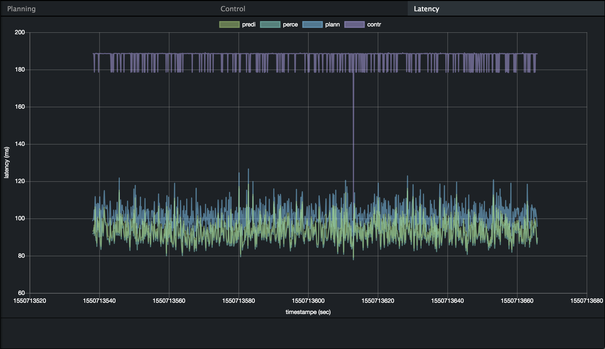

# Dreamview

## Introduction
Dreamview or Apollo's HMI module provides a web application that helps developers visualize the output of other relevant autonomous driving modules, e.g. the vehicle's planning trajectory, car localization, chassis status etc. 

## Input
  Currently Dreamview monitors the following messages:
  * Localization, defined by Protobuf message `LocalizationEstimate`, which can be found in file `localization/proto/localization.proto`.
  * Chassis, defined by Protobuf message `Chassis`, which can be found in file `canbus/proto/chassis.proto`.
  * Planning, defined by Protobuf message `ADCTrajectory`, which can be found in file `planning/proto/planning.proto`.
  * Monitor, defined by Protobuf message `MonitorMessage`, which can be found in file `common/monitor/proto/monitor.proto`.
  * Perception Obstacles, defined by Protobuf message `PerceptionObstacles`, which can be found in file `perception/proto/perception_obstacle.proto`.
  * Prediction, defined by Protobuf message `PredictionObstacles`, which can be found in file `prediction/proto/prediction_obstacle.proto`.
  * Routing, defined by Protobuf message `RoutingResponse`, which can be found in file `routing/proto/routing.proto`.
  
## Output
  A web-based dynamic 3D rendering of the monitored messages in a simulated world.

## Features introduced in Apollo 3.5

### Latency graph

The Simulation team is proud to introduce the Latency graph tab in Dreamview which is included to display the difference in time when the module receives sensor input data to when it will publish this data.
To view this tab:
1. Build Apollo and run Dreamview on your web browser
2. On the right-hand side, you should be able to view the Planning, Control, Latency graphs as seen below

3. Click on the "Latency" tab to view the latency graph

4. The Latency Graph can be used to track the latency each individual faces. The graphs are coloured differently to help distinguish the modules and a key is included for better understanding. The graph is plotted as Latency measured in ms vs Timestamp measure in seconds as seen in the image below.

