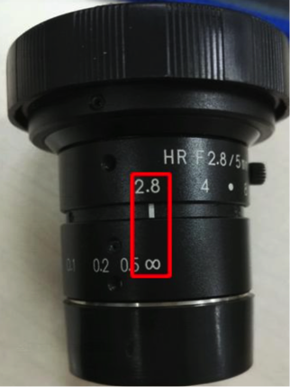

# Apollo Data Format and Evaluation Criteria

This document describes the data format and relevant evaluation criteria of the end-to-end driving platform in the Baidu Apollo Project.

## Introduction of datasets

The data are collected through Baidu’s own map collection vehicles. At present, the data cover the entire road network in China with a total length of millions of kilometers. The dataset provides two types of data, including images in front of vehicles and the vehicle motion status. The map collection vehicles capture 360-degree view images. However, due to the limits of file sizes, Apollo provides only the .jpg format of images with the 320 * 320 resolution in front of vehicles. The vehicle motion status data include the current speed and the track curvature.

## Acquisition Equipment Set Up

The data acquisition equipment is shown in the figure below. The CCD camera aperture should be 2.8 and the focal length should be ∞.

The camera is located on the luggage rack that is installed on the car roof.

- [ ] Align the front and rear positions of the luggage rack buckle to ensure that the luggage rack itself is perpendicular to the centerline of the vehicle and the two luggage racks are on the same level.

- [ ] Move the equipment bracket to the middle of the luggage rack to ensure that the middle of CCD images coincides with the centerline of the vehicle.


 

## Data usage

Data derives from the original data of the sensor, including images, laser radars, and radars, which are mainly input in the form of images. It outputs the vehicle’s control instructions, such as the steering wheel angle, acceleration, and braking.

The input and output are connected through the deep neural network, which is configured to directly generate the vehicle control instructions through the neural network to carry out the horizontal control and vertical control of the vehicle.

There are no logic programs that require manual participation. Data is managed via:

- The horizontal control, which directs the horizontal movements of the vehicle through the steering wheel, that is, the steering wheel angle.
- The vertical control, which directs the vertical movements of the vehicle through the throttle and the brake, that is, acceleration and braking.

The output of horizontal control model does not use the steering wheel angle. Instead, it uses the curvature to be driven (i.e., the reciprocal of the turning radius). The reasons are:

- The curvature is more universally applicable and is not affected by the vehicle’s own parameters such as steering ratio and wheel base.

- The relationship between the curvature and the steering wheel angle is simple and can be retrieved through the Ackermann model at a low speed and be fitted through a simple network at a high speed.

So the resulting horizontal control model that is obtained guides the curvature of the vehicle during driving, using the forward images data.

## Data Classification

The data are divided into two parts, including the training set and the test set. Use the training set to debug algorithms and use the test set to verify results. The trainsets has **5246135** samples, the testsets is have **125043** samples.

### Training Sets

The training set contains two parts of data, including image and attr. Image is the input data and attr is the output data. Both image files and attr files correspond to each other through file names. To read image and attr, Apollo needs the support of the hdf5 library.

#### Formats of Training Sets
* The training data are organized according to the following directory structure:

  ```
  trainsets/			   // top folders of the training data
  ├── image				 // it includes the image files in the training data
  │   ├── 119.h5
  │   ├── ..
  │   └── 123.h5
  └── attr		// it includes the attribute files corresponding to image files
    ├── 119.h5
    ├── ..
    └── 123.h5
  ```


* The format of the image files: .h5 file.

  - Key-Value, which retrieves an image with the timestamp UTC as the index.


  - Key:  UTC time.


  - Value:  the encoded jpg format of 320 * 320 * 3 pixel matrix jpg.

  - Decoding example：

    ```
    with h5py.File(img_file, 'r') as f:
    	for t in f:
    		img = cv2.imdecode(f[t][:], 1)
    ```

* The format of the attribute files:  .h5 file.

  * The attribute data of one moment will be stored in the hdf5 in the form of 2D array as a whole.
  * The first dimension is attrs and the second dimension is the attribute data［t, VEast, VNorth, curv1, curv2, curv3, curv4, curv5, curv6, x, y, heading,tag］.
  * For an image of the UTC time in the image file, there must be a line of attribute data corresponding to the image. Each line has 13 items of data in the form of 64-bit floating point number.
  * Variables and related instructions are described as follows:

  Column: variables | Units | Description
	------------ | ------------- | ------------
	01 : t | decimal system (Unsigned) | Current UTC timestamp
	02 : VEast|	m/s | Current speed of the vehicle towards the east
	03 : VNorth|	m/s | Current speed of the vehicle towards the north
	04 : curv1 | decimal system (Signed) | [t,t+1] Curvature 1, left turning as positive
	05 : curv2 | decimal system (Signed) | [t,t+1] Curvature 2, left turning as positive
	06 : curv3 | decimal system (Signed) | [t,t+1] Curvature 3, left turning as positive
	07 : curv4 | decimal system (Signed) | [t,t+1] Curvature 4, left turning as positive
	08 : curv5 | decimal system (Signed) | [t,t+1] Curvature 5, left turning as positive
	09 : curv6 | decimal system (Signed） | [t,t+1] Curvature 6, left turning as positive
	10 : x | decimal system (Unsigned) | relative displacement against the east x-axis
	11 : y | decimal system (Unsigned) | relative displacement against the north y-axis
	12 : heading | degree, decimal floating-point number (Signed） | the clockwise angle to the north
	13 : tag | decimal system (Unsigned) | Reserved annotation bit, not yet used


### Formats of test sets:

* The format of the test set is consistent with that of the training set. The test set is organized as follows:

  ```
  testsets/			   // top folders of the test data
  ├── image				 // it includes the image files in the test data
  │   ├── testfile_part01.h5
  │   ├── ..
  │   └── testfile_part04.h5
  └── attr		// it includes the attribute files corresponding to image files
    ├── testfile_part01.h5
    ├── ..
    └── testfile_part04.h5 		```
  ```

* Write the results in the .h5 file and save the:

   * hdf5 in the form of a 2D array.
   * Floating-point numbers.


## Descriptions of Evaluation Indicators

The horizontal control model and the horizontal control model are measured by using the mean square error (MSE) indicator. The mean square error is the quadratic mean of the predicted value and the true value difference. The smaller the mean variance error, the better the effect. This indicator is used to measure the prediction precision, which is defined as follows:

<p>
$$ MSE = \frac{1}{n}\sum_{i=1}^n{(truth- predict )^2} $$
</p>
