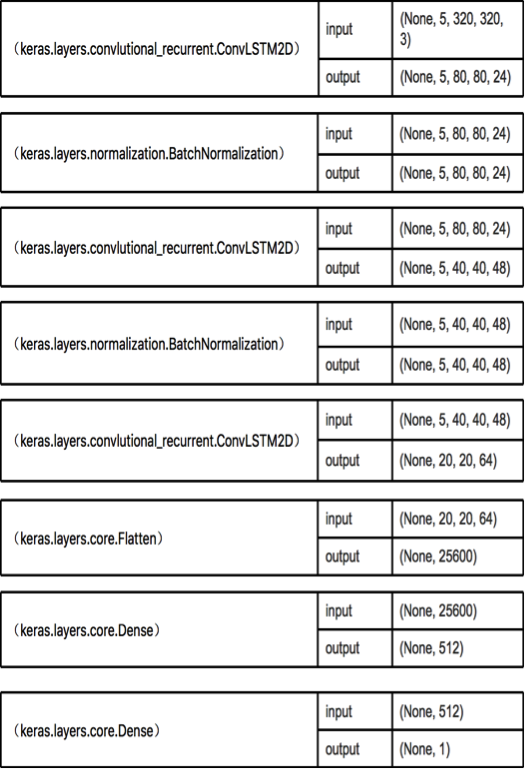

# Steering Model

The steering wheel control model computes curvature.  See:

`code file：run_model.py`
## Generator Data

The generator data module sequentially generates the collected data.

- [ ] Run the generator data for steering:

	```
	def generator_data_steering()
	```


- [ ] Filter the abnormal values：

 	```
	def filter(c,v):
		return v > 1 and c < 0.5

	```


The collected data can contain a large number of straight lines data, with a curvature less than or equal to 0.0001.

- [ ] After filtering for the abnormal values, select the straight line data by probability of 10% using the following:

    ```
    if filter(curv, speed) and (curv > 0.0001 or random.randint(1, 10) == 1)
    ```

## CNN Model
The CNN model.  See:

`model file：src\steering_model.py`


# Longitudinal Model
The longitudinal model computes the acceleration.

`code file：run_model.py`
## Generator Data

To compute the accleration, run the data generator and filter the values using the task list below.

- [ ] Run the generator for data:

	```
    def generator_data_acc():
    ```


- [ ] Filter the abnormal values：

	```
	def filter(c,v):
    	return v > 1 and c < 0.5
    ```


The longitudinal model processes the data in the following order:

- Sequentially reads the data, defines `time_step = 5`.
- Filters the abnormal data.
- Selects the five-frame image of the order.
- Computes the acceleration value at the time of the fifth frame as the input.

Each frame interval of 0.125s, with the fifth frame of the acceleration:

<p>
$$ ACC_5 = \frac{(V_6-V_4)}\{0.25} $$
</p>


If the filter removes the sixth frame velocity value, then discard the 5 frames of the timestep sample.

```
next_curv = attrs[i+1][4]
next_speed = math.sqrt(attrs[i+1][1] ** 2 + attrs[i+1][2] ** 2)
if not filter(next_curv, next_speed):
	step_cnt = 0
	continue
else:
	acc = (next_speed - step_v[3]) / t_sep

```

## Conv_LSTM Model
The Conv_LSTM  model.  See:

```
model file:src\acc_model.py
```


