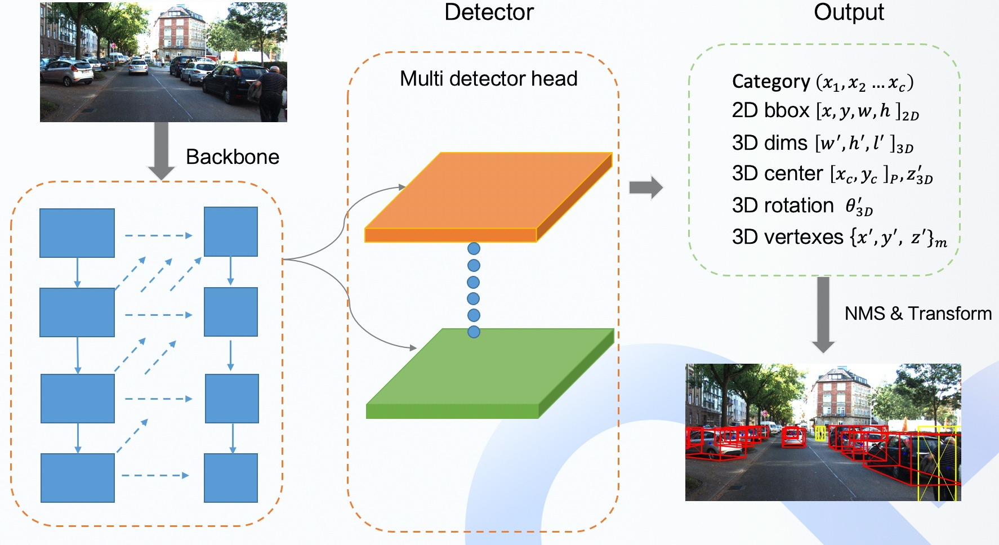
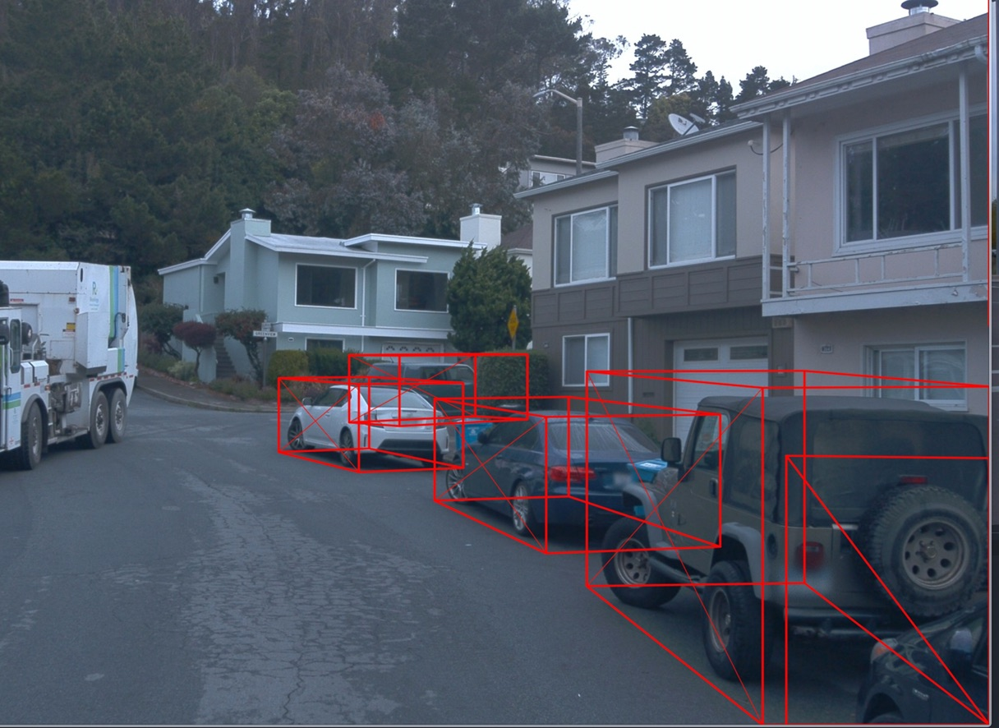

# 相机感知

## 介绍
在Apollo7.0版本中我们提供了一个新的基于视觉的障碍物检测模型，新模型基于[SMOKE](https://github.com/lzccccc/SMOKE)开发。SMOKE是一个一阶段的单目视觉障碍物检测模型，是在CenterNet网络上针对3D视觉做的一些改进。在这里我们对SMOKE模型上做了一些改进，并且在waymo开源数据集上进行了训练和测试。最终我们的新模型以新的组件的形式添加到了Apollo中。

## 结构
这里我们主要针对在SMOKE基础上的修改，关于SMOKE模型的更多细节请参考论文。
- 在自动驾驶车辆上进行部署时形变卷积操作无法转成onnx或者libtorch，因此我们使用普通卷积替代模型中的形变卷积；
- 使用2D边框的中心点以及2D中心点和3D中心点之间的偏移替代3D中心点。这项修改基于我们在实验中的一些发现：被截断的障碍物会因为3D中心点出现在图像之外导致被过滤掉。为了实现这一步，我们增加了一个用来预测2D中心点和3D中心点偏移量的head；
- 增加了预测2D边框宽度和高度的head。通过预测2D边框的中心点、宽度和高度，可以直接计算出障碍物的2D边框。

## 后处理
- 利用2D边框和其他一些3D信息，我们使用了后处理几何约束去优化预测的位置信息。首先，我们利用模型预测的3D信息计算障碍物的3D边框，如公式1所示。公式中$\theta$表示偏转角度，$h,w,l$是障碍物的长宽高，$x,y,z$代表了障碍物的位置。

<!-- $$
B = \left[\begin{matrix} \cos(\theta) & 0 & \sin(\theta) \\ 0 & 1 & 0 \\ -\sin(\theta) & 0 & \cos(\theta) \end{matrix} \right]
\left[\begin{matrix} \pm\frac{h}{2}  \\ \pm\frac{w}{2} \\ \pm\frac{l}{2} \end{matrix} \right] + 
\left[\begin{matrix} x  \\ y \\ z \end{matrix} \right]
\tag{1}
$$ -->

<div align=center>


</div>

然后根据障碍物边框之间的对应关系作为约束条件，优化障碍物的位置信息，如公式2所示。

<!-- $$
x^*, y^*, z^* = arg\,\max_{\lbrace x,y,z \rbrace}{\sum{||B - B^*||^2_{\sum}}}
\tag{2}
$$ -->

<div align=center>


</div>

最终网络结构图如下所示
<div align=center>

</div>

## 训练
我们在waymo开源数据集上进行了训练，首先我们使用了mmdetction3d框架提供的转换工具将waymo数据转化成Kitti格式，具体操作可以参考open-mmlab文档([Waymo Dataset
](https://github.com/open-mmlab/mmdetection3d/blob/master/docs/datasets/waymo_det.md))，我们只保存了前置摄像头(image_0)的数据。数据转化会占用大量的空间，请保证你的磁盘有足够的空间。将waymo数据转化为Kitti格式后我们只需要对代码进行少量调整便可以训练和测试。在waymo验证集上的测试结果如下表所示：

<div align=center>

|     |  Car  | Pedestrian | Cyclist |
| --- | :---: | :--------: | :-----: |
| mAP | 6.88  |    0.35    |  0.32   |
| bev | 11.84 |    0.41    |  0.40   |
</div>


可视化效果如下图所示：
<div align=center>

</div>

同时我们还联合百度PaddlePaddle团队提供了模型的paddle版本训练代码。详细可以参考链接[SMOKE-Paddle](https://github.com/PaddlePaddle/models/tree/develop/PaddleCV/3d_vision/SMOKE).

## 部署
这里我们使用libtorch进行线上部署，利用pytorch的torch.jit.trace函数。我们将相机内参和图像缩放系数作为参数传入到模型中，具体可以参考代码：
"modules/perception/camera/lib/obstacle/detector/smoke/smoke_obstacle_detector.cc"

## 启动
我们提供了一个新的dag文件来启动SMOKE视觉障碍物检测模型，该模型可以通过下面的命令进行启动：
```bash
mainboard -d modules/perception/production/dag/dag_streaming_obstacle_detection.dag
``` 


## Reference
- Liu, Zechen, Zizhang Wu, and Roland Tóth. "Smoke: single-stage monocular 3d object detection via keypoint estimation." In Proceedings of the IEEE/CVF Conference on Computer Vision and Pattern Recognition Workshops, pp. 996-997. 2020.

- {MMDetection3D: OpenMMLab} next-generation platform for general 3D object detection} https://github.com/open-mmlab/mmdetection3d
