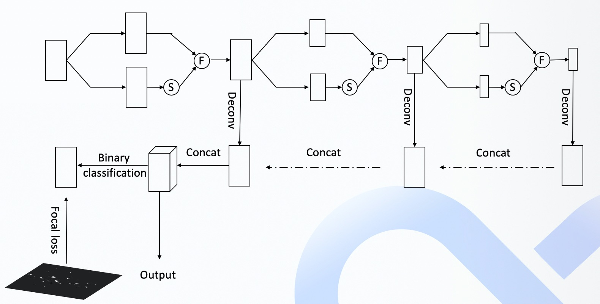
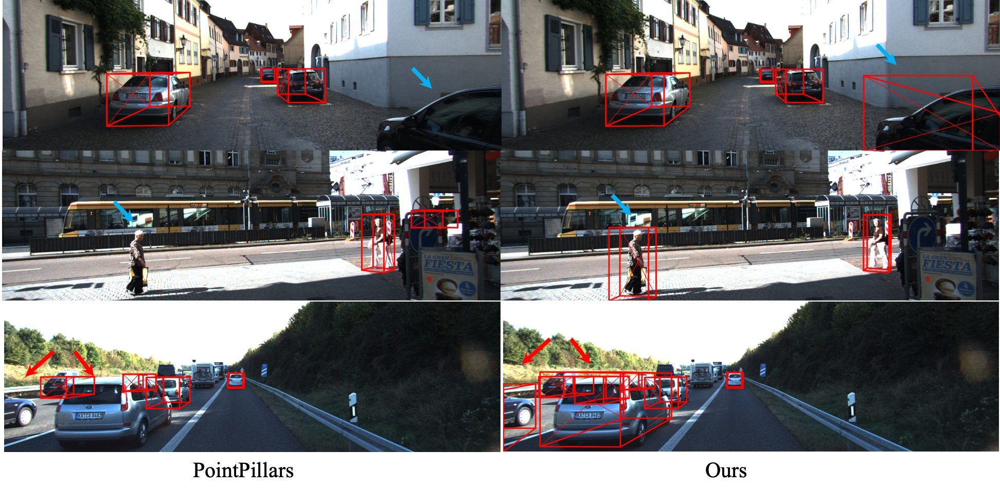

# Lidar Perception

## Introduction
In Apollo 7.0, a new LiDAR-based obstacle detection model is provided named Mask-Pillars based on PointPillars, which improves the original version in two aspects. The first one is that a residual attention module is introduced into the encoder of the backbone to learn a mask and to enhance the feature map in a residual way. The second one is that a pillar-level supervision is applied after decoder of the backbone which is only performed in the training stage. The training data for pillar-level supervision is generated by composing the distribution of foreground obstacle pillars. From the experimental validation, Mask-Pillars achieves higher performance than PointPillars on both Kitti and Waymo datasets, especially the recall on obstacles.

## Architecture
Here we mainly focus on the modifications based on PointPillars: 
### Attention Module
Although LiDAR can collect high-quality point cloud data, some obstacles may have a small number of point clouds due to occlusion or distance. Therefore, we introduce an attention layer on FPN encoder module to enhance the features refer to [Residual Attention Network for Image Classification](https://arxiv.org/abs/1704.06904). Since FPN has three feature maps with different resolutions, our attention module also acts on three feature maps at the same time. More details about the network architecture can refer to figure below，S represent Sigmoid，F function is shown as Formula 1：

$$
F(x) = (1 + M(x)) * T(x)
\tag{1}
$$
$T(x)$is the output of backbone，$M(x)$is the output of attention module.

### Pillar-level supervision
In order to improve the recall of the network, we introduce a pillar-level supervision mechanism in the training stage. We notice that the segmentation algorithms always have high recall rates because of the pixel level supervision. Therefore, we borrow the idea of segmentation network by adding a pillar-level supervision of foreground pillars that representing obstacles. The feature maps before feeding into the detection module are supervised by the pillar supervision data, which are represented as obstacle distributions. The supervision data are simply generated by composing the Guassion distributions of obstacle pillars of the training point cloud.

The network structure of the final FPN is shown in the figure below
<div align=center>

</div>

## Results
We apply the MMDetection3D framework for training. On the KITTI validation set, the results are as shown in the below table. The results of PointPillars comes from [mmdetction3d](https://github.com/open-mmlab/mmdetection3d/blob/master/configs/pointpillars/README.md)

<div align=center>

|    Method           |   3DmAP <br> Mod.|  Car <br> Easy Mod. Hard| Pedestrian <br> Easy Mod. Hard | Cyclist <br> Easy Mod. Hard|              
|---------------------|:---------:|:-----:|:----------:|:-------:|
| PointPillars        | 60.11           | 85.41     73.98	 67.76 |  52.02	      46.40        42.48| 78.72	   59.95	57.25|
| Ours                | 62.07           | 86.13     76.74	 74.14 |  50.79	      45.59	       41.50| 83.91	   63.87	61.05|

|     Method          |  BEVmAP <br> Mod.|  Car <br> Easy Mod. Hard| Pedestrian <br> Easy Mod. Hard | Cyclist <br> Easy Mod. Hard|              
|---------------------|:---------:|:-----:|:----------:|:-------:|
| PointPillars        | 67.76           | 89.93     86.57	 85.20 |  59.08	      53.36	       48.42| 80.93	   63.34	60.06|
| Ours                | 69.49          | 89.85     87.15	 85.55 |  58.29	      53.87	       49.98| 85.13	   67.43	63.85|

</div>


The detection visualization on KITTI data of PointPillars and our model are shown as below. It can be seen that our model has better detection performance. We can see that truncated and occluded vehicles are recalled by our model.
<div align=center>

</div>


## Online
Here, we use libtorch for online deployment and use the torch.jit.trace function of pytorch. We divide the original model into five parts. For more details, please refer to the code：
```
"modules/perception/lidar/lib/detector/point_pillars_detection/point_pillars.cc"
```

## Launch
In order to facilitate the extension of Apollo models, we refactor the detection module that allows more pluggable detection models. To choose a specific model, you only need to modify corresponding configuration files. The configuration files are referred to:
```
modules/perception/production/data/perception/lidar/models/lidar_obstacle_pipeline/
```
There are several directories in the path, which are related to corresponding sensors. For LiDAR sensor, you could modify the value of key "detector" in "lidar_obstacle_detection.conf" file to switch the LiDAR-based detection model.

## Reference
- MMDetection3D: OpenMMLab next-generation platform for general 3D object detection https://github.com/open-mmlab/mmdetection3d