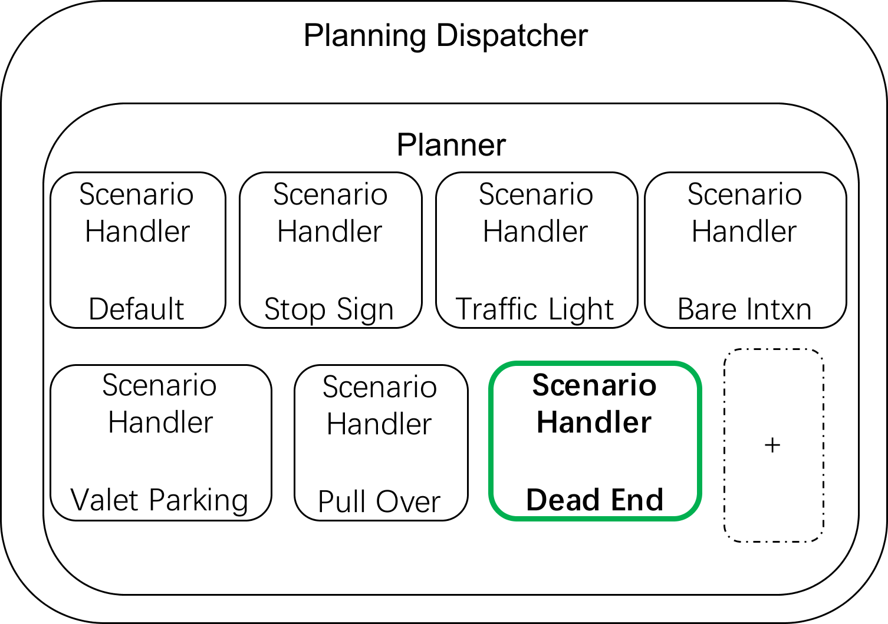
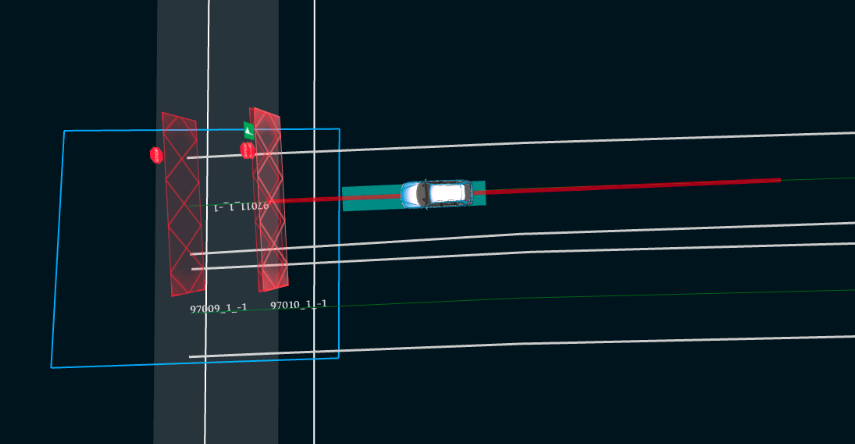

# Planning

## Introduction

Compared with previous versions, Apollo 7.0 adds a  new dead end scenario, adds the "three-point turn",  increases vehicle driving in and out ability, and expands the operation boundary of the urban road network. The "three-point turn" function is based on the open space planner framework and includes the following parts: scene conversion of dead ends, construction of open space ROI, and "three-point turn" trajectory planning.

## Input
Localization, Perception, Prediction, HD Map (in modules/map/data), routing, task_manager.

## Output
A collision-free and comfortable trajectory for control module to execute.

### Planning Scenario Architecture

## Scenario Shows

