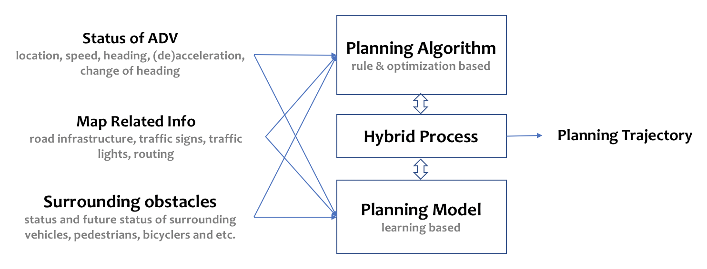
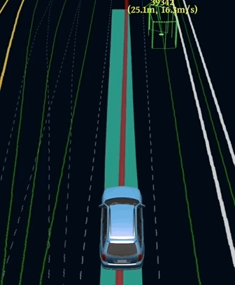
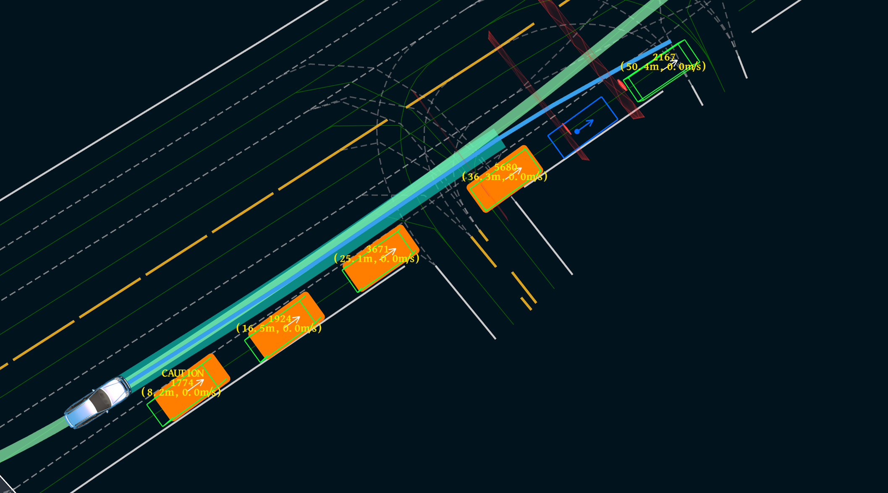
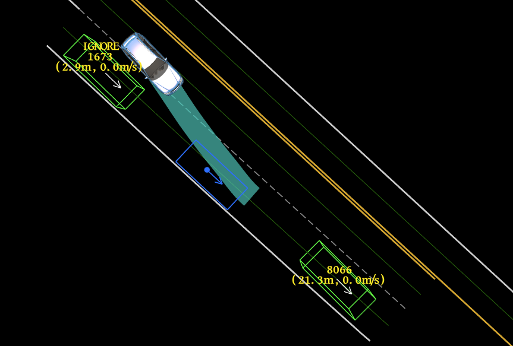
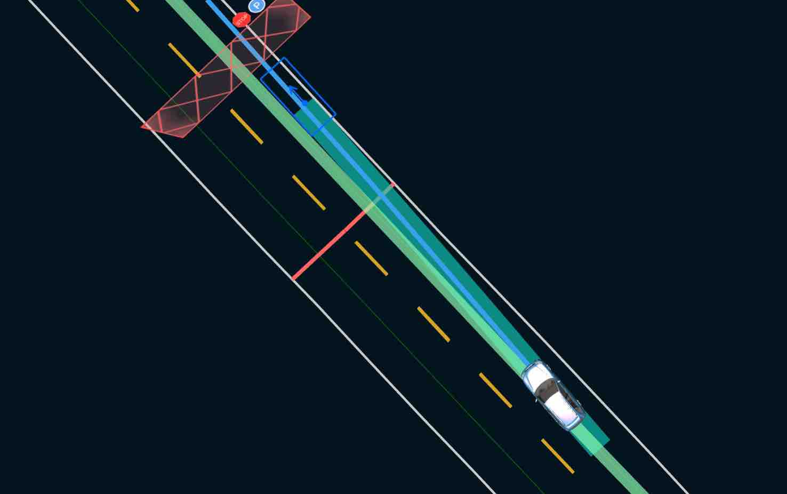

# Planning

## Introduction

Prior to the 5.5 release, Apollo uses the same configuration and parameters to
plan different driving scenarios. Although linear and easy to implement, this
approach was not flexible or scenario specific. As Apollo matures and takes on
different road conditions and driving use cases, we felt the need to move to a
more modular, scenario specific and wholistic approach for planning its
trajectory. In this approach, each driving use case is treated as a different
driving scenario. This is useful because an issue now reported in a particular
scenario can be fixed without affecting the working of other scenarios as
opposed to the previous versions, wherein an issue fix affected other driving
use cases as they were all treated as a single driving scenario.

Apollo 5.5, which focuses on curb-to-curb autonomous driving on urban roads,
introduced 2 new planning scenarios.

Apollo 6.0 extended the technology to incorporate data-driven mothedologies to tackle trajectory planning problems with learning-based models, and introduced two new planning modes: E2E mode and Hybrid mode, by which the new capability of dynamically nudginng moving obstacles are demonstrated. In these two modes, a series of APIs is also defined  where developers can generate their own training data and integrate their own models.

**Note:** The current development of E2E mode is in an early stage where the model is trained for the dynamic nudge scenario as a research demonstration purpose. The capability of the model is limited, and suboptimality is expected when it is tested with a wider selection of  scenarios. E2E mode and Hybrid mode are not tested on real roads yet, but rather serve as a baseline to promote and encourage extensive research on learning based planning.  All developers are welcome to collaborate with us by any means including algorithms, models and data.

## E2E Mode
   
### How to Enable
- Change the configuration "learning_mode" in apollo/modules/planning/conf/planning_config.pb.txt to be "E2E_TEST" if Apollo is run in simulation or "E2E" on real vehicle
- Change the configuration "model_type" in apollo/modules/planning/conf/scenario/learning_model_sample_config.pb.txt to be either "CNN_LSTM" or "CNN" and adapt the following "cpu_model_file" and "gpu_model_file" file paths. "CNN_LSTM" is the preferred model for now.

### Model Inputs and Outputs
- Model input consists of a birdview image centered by vehicle pose and vehicle current velocity.
- Model output is planning trajectory

## Hybrid Mode
   
### How to Enable
In configuration file,
```
./modules/planning/conf/planning_config.pb.txt
```
set learning_mode: `learning_mode: ` as `HYBRID` for road test or `HYBRID_TEST` for simulation.

### Parameters
The configurable parameters in hybrid model are listed in the configuration file
```
modules/planning/conf/scenario/lane_follow_hybrid_config.pb.txt
```
The parameter `path_reference_l_weight` is for adjusting hybrid model path output. A larger value of `path_reference_l_weight` means higher penalty of the difference between hybrid model path and learning model path in lateral direction.

## Apollo 5.5 vs E2E Mode vs Hybrid Mode

We demonstrate simulation results on a dynamic nudge scenario with Apollo 5.5, E2E mode, and Hybrid mode.

- Apollo 5.5


- E2E  Mode



- Hybrid Mode


## Driving Scenarios

There are 5 main driving scenarios that we will focus on Lane Follow, Intersection, Pull-Over, and the newly introduced Park-and-go and Emergency. Let's dive into them individually:

### Lane Follow - Default

As seen in the figure below, the lane-follow scenario, our default driving scenario, includes but is not limited to driving in a single lane (like cruising) or changing lane, following basic traffic convention or basic turning.

   

> Note: Side Pass
>
> > While the functionality of side pass still exists, it has now been made universal rather than limiting it to a type of scenario. The side-pass feature is incorporated as part of the path-bounds decider task. You can choose to turn it on or off by properly configuring the path-lane-borrow decider task. For example, if you want the vehicle to be agile, then turn side-pass on for all scenarios; if you feel it not safe to side-pass in intersections, then turn it off for those related scenarios.

### Intersection

The new intersection scenario includes STOP Signs, Traffic Lights and Bare Intersections which do not have either a light or a sign.

#### STOP Sign

There are two separate driving scenarios for STOP signs:

- **Unprotected**: In this scenario, the car is expected to navigate through a crossroad having a two-way STOP. Our ADC therefore has to creep through and gauge the crossroad's traffic density before continuing onto its path.

     

- **Protected**: In this scenario, the car is expected to navigate through a crossroad having a four-way STOP. Our ADC will have to gauge the cars that come to a STOP before it and understand its position in the queue before moving.

    

In order to safely pass through a STOP sign, both protected and unprotected, the following steps are performed:

- Arriving at the STOP sign: Perceive all other cars or obstacles that are currently waiting at the other stop signs

- Come to a complete stop: Monitor to see if the cars that were previously stationary at other STOP signs have moved or not. It is essential that the cars that arrived before have all left

- Move forward slightly (Creep): Check to see if any other car is moving or in the case of unprotected stop, check to see if there are any oncoming vehicles on either side of the lane

- Safely move through the crossroad

> Note:
>
> > The team is working to add additional driving scenarios into our planner. One such example is handling Traffic Lights.

#### Traffic Light

In order to safely and smoothly pass through a traffic light, we created 3 driving scenarios:

- **Protected**: In this scenario, our ego car has to pass through an intersection with a clear traffic light indicator. A left arrow or right arrow in green for the corresponding turn.

- **Unprotected Left**: In this scenario, our ego car will have to make a left turn without a distinct light, meaning the car would need to yield to oncoming traffic. Just like in the unprotected STOP scenario, our ego car would have to creep to ensure that it is safe to cross the intersection before safely moving through the lane.

- **Unprotected Right**: In this scenario, our ego car is expected to make an unprotected right turn while yielding to oncoming traffic. Our ego car will need to creep slowly and gauge the traffic and then make a safe turn.

As discussed above, based on the three driving scenarios, the following 3 steps are performed:

- **Stop/Approach**: If a stop is required, our ego car will stop in front of traffic light stop line

- **Move forward slightly (Creep)**: Check to see if any other car is moving or in the case of unprotected turns, check to see if there are any oncoming vehicles on either side of the lane

- **Move**: Safely drive through the intersection

#### Bare Intersection

Bare intersection is a scenario designated to an intersection without either a STOP sign or a traffic light. In this scenario, the following steps are performed:

- **Approach**: Reach the intersection

- **Move forward slightly (Creep)**: Check to see if any other car is moving or in the case of unprotected stop, check to see if there are any oncoming vehicles on either side of the lane

- **Move**: Safely move through the intersection

### Park

The Apollo team is proud to introduce Open Space Planner, a new planning algorithm that can be used for several use cases especially the parking scenario. To learn more about Open Space Planner, please refer to [Open Space Planner Algorithm](https://github.com/ApolloAuto/apollo/blob/master/docs/specs/Open_Space_Planner.md)

#### Valet

The Valet scenario was designed to safely park your ego car in a targeted parking spot. There are 2 main stages that are performed in order to park your ego car:

1. **Approaching the Parking Spot**: In this stage, standard planning algorithms are used to approach the designated parking spot. The car will gradually cruise to a halt once it has found the right stopping point required in order to reverse into the parking spot as seen in the image below

    

2. **Parking**: In this stage, Open Space Planner algorithm is used to generate a zig-zag trajectory which involves both forward and reverse driving (gear changes) in order to safely park the ego car. A sample trajectory generated for the scenario in the previous image, can be seen below:

    

#### Pull Over

The Pull Over scenario was designed especially for maneuvering to the side of the road upon reaching your destination like for curb-side parallel parking. There are 3 main stages to accomplish the pull over scenario.

1. **Approaching**: In this stage, as there is no clear designated parking spot, the ego car simply approaches the side of the road where it seems feasible to park. Standard Planning algorithms are used for this stage. Once it comes to a halt, the second stage begins. An example of stage 1 can be seen in the image below:

    

2. **Retry Approach Parking**: In this stage the ego car adjusts itself to enter the parking spot. It is similar to the `Approach Parking Spot` case in the Valet scenario. An example of stage 2 can be seen in the image below:

    

3. **Retry Parking**: This stage uses Open Space Planner to parallel park the vehicle. A zig-zag trajectory is generated to help the ego car park itself on the side of the road. A sample trajectory generated for the scenario in the previous image, can be seen below:

    

There is a special case in the Pull Over scenario that does not need the Open Space Planner stage. This case occurs when there are no obstacles blocking the curb-side parking of the ego car. An example can be seen below. In such a case, the car simply approaches the parking spot and then enters the spot using standard planning.



### Park-and-go

Apollo 5.5 which focuses on curb-to-curb driving introduces the Park-and-go scenario which was designed to handle curb side parking, planning a new trajectory to the next destination and then driving along that trajectory. This scenario is extremely useful in situations like curb-side delivery or passenger pickup or drop-off. This scenario combines Open Space Planner along with other traditional trajectory planners to ensure that the car not only parks safely but is also able to exit per the new trajectory.


## Emergency

The Emergency scenario is another newly introduced scenario in Apollo 5.5, developed to ensure that the vehicle can be brought to a stop safely in the situation of a given trigger event (either via human input or due to a failure in one or more of the vehicle's hardware or software modules). This scenario is extremely crucial to urban driving as one often encounters several unforeseen situations on the road that requires the vehicle to come to a complete stop. There are two types of emergency stops that are performed using this scenario:

1. **Pull Over and Stop**: In this scenario, the autonomous car uses Open Space Planner to pull-over and then come to a full stop on the curb-side

2. **In Lane Stop**: In this scenario, the autonomous car comes to a complete stop in its lane. In this situation the car is well aware of its surrounding obstacles to prevent any rear-end collisions and ensure not just the safety of itself but also the vehicles around it.


## Planning Module Architecture

In Apollo 5.5, the Planning module architecture has been modified to incorporate new curb-to-curb driving scenarios on urban roads. As seen in the figure below, we have 2 new complex scenarios Emergency and Park-and-go. In order to plan these scenarios effectively, we have 2 new Deciders - Path Reuse Decider and Speed Bound Decider and have updated existing deciders making the planning architecture robust and flexible enough to handle many different types of urban road driving scenarios.

Each driving scenario has its set of driving parameters that are unique to that scenario making it safer, efficient, easier to customize and debug and more flexible.

> Note:
>
> > If you wish to include your own driving scenarios, please refer to existing scenarios as a reference. We currently do not have a template for writing your own planning scenario.


## Related Paper

1. [He R, Zhou J, Jiang S, Wang Y, Tao J, Song S, Hu J, Miao J, Luo Q. "TDR-OBCA: A Reliable Planner for Autonomous Driving in Free-Space Environment." *arXiv preprint arXiv:2009.11345.* ](https://arxiv.org/pdf/2009.11345.pdf)
2. [Zhou J, He R, Wang Y, Jiang S, Zhu Z, Hu J, Miao J, Luo Q. "DL-IAPS and PJSO: A Path/Speed Decoupled Trajectory Optimization and its Application in Autonomous Driving." *arXiv preprint arXiv:2009.11135.*](https://arxiv.org/pdf/2009.11135.pdf)
