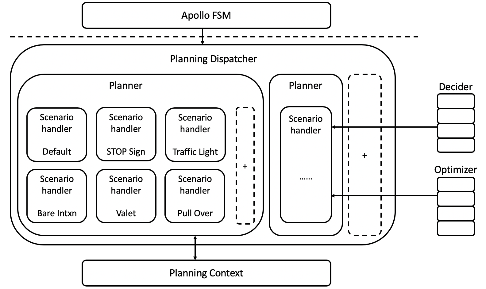

# 规划

## 介绍

Apollo的之前版本，包含3.0都是用了相同的配置和参数规划不同的场景，这种方法虽然线性且实现简单，但不够灵活或用于特定场景。随着Apollo的成熟并承担不同的道路条件和驾驶用例，我们认为有必要采用更加模块化、适用于特定场景和整体的方法来规划其轨迹。

在这个方法中，每个驾驶用例都被当作不同的驾驶场景。这样做非常有用，因为与先前的版本相比，现在在特定场景中报告的问题可以在不影响其他场景的工作的情况下得到修复，其中问题修复影响其他驾驶用例，因为它们都被当作单个驾驶场景处理。

## 驾驶场景

Apollo3.5主要聚焦在三个主要驾驶场景，即：
### 车道保持 - 默认

如下图所示，车道保持场景（我们的默认驾驶场景）包括但不限于在单车道（如巡航）或换道行驶，遵循基本的交通约定或基本转弯。


### Side Pass

在这种情况下，如果在自动驾驶车辆（ADC）的车道上有静态车辆或静态障碍物，并且车辆不能在不接触障碍物的情况下安全地通过车道，则执行以下策略：
- 检查邻近车道是否接近通行
- 如果无车辆，进行绕行，绕过当前车道进入邻道
- 一旦障碍物安全通过，回到原车道上


### 停止标识

停止标识有两种分离的驾驶场景：
1、未保护：在这种情况下，汽车预计会通过具有双向停车位的十字路口。因此，我们的ADC必须爬过并测量十字路口的交通密度，然后才能继续走上它的道路。


2、受保护：在此场景中，汽车预期通过具有四向停车位的十字路口导航。我们的ADC将必须对在它之前停下来的汽车进行测量，并在移动之前了解它在队列中的位置。


为了安全地通过受保护和未受保护的停止标志，执行逻辑如下：
- 到达停车标志处：感知正等待在其他停车标志处的所有汽车或障碍物；
- 完全停止：Monitor检查之前停在其他停车标志处的汽车是否已经移动。以前到达的汽车必须全部离开；
- 稍微向前移动(爬行)：检查是否有其他车辆正在移动或在无保护停车的情况下，检查车道两侧是否有迎面而来的车辆
- 安全通过十字路口

```
Note:
Apollo团队正在努力增加额外的驾驶场景到规划器。其中一个例子是处理交通灯。
```

## Planning 模块架构

Apollo 3.5 Planning模块的架构已经改变，以反映我们针对不同驾驶场景的模块化方法。

如下图所示，在规划器中，是上面讨论的各个驾驶场景及其处理逻辑。

每个驾驶场景都有其独特的驾驶参数集，这些参数使该场景更安全、高效、更易于定制和调试，并且更加灵活。每个阶段可配置的，且被划分为 **任务**，并且可以通过编辑该场景的`config`文件来移动或创建每个任务。

部分重要特性包含如下：
- Apollo FSM（finite state machine）:一个有限状态机，与高清地图确定车辆状态给定其位置和路线。
- Planning Dispatcher: 根据车辆的状态和其他相关信息，调用合适的Planner
- Planner:获取所需的上下文数据和其他信息，确定相应的车辆意图，执行该意图所需的规划任务并生成规划轨迹。它还将更新未来作业的上下文。
- Deciders & Optimizers :一组实现决策任务和各种优化的无状态库。优化器特别优化车辆的轨迹和速度。决策者是基于规则的分类决策者，他们建议何时换车道、何时停车、何时爬行(慢速行进)或爬行何时完成。
- 黄色框：这些框被包含在未来的场景和/或开发人员中，以便基于现实世界的驱动用例贡献他们自己的场景

```
Note:
如果您希望包括您自己的驾驶场景，请参考现有方案作为参考。我们目前没有用于编写您自己的规划场景的模板。
```


