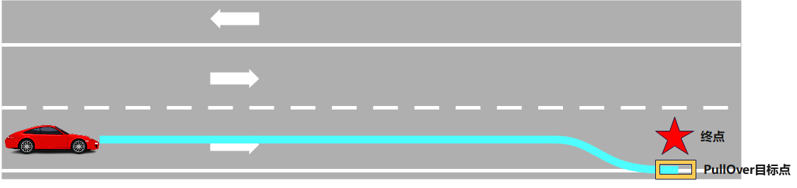

Planning
============

## 简介
`planning base`是planning模块的主要流程和入口package，包含planning模块的整体架构和流程。
planning模块根据上游模块输入的感知周围环境信息，地图定位导航信息，以及全局路径信息，为自动驾驶车辆规划出一条运动轨迹（包含坐标，速度，加速度，jerk加加速度，时间等信息），然后将这些信息传递给控制模块。


### planning package介绍
planning模块由以下几种package构成：
- **`planning_base`**：包含planning的外部接口类，planning接口父类，主流程和框架，以及一些基础算法库。
- **`pnc_map`**：生成参考线基于的pnc_map类，根据输入的planning导航命令或地图等信息，生成参考线数据，作为planning局部路径规划的路线参考。
- **`scenarios`**：planning模块支持的场景插件，每个目录下包含一个独立的场景插件包，包含scenario和stage类的定义。
- **`tasks`**：planning模块中支持的任务插件，每个目录下包含一个独立的任务插件包，包含task类的定义。
- **`traffic_rules`**：planning模块支持的通用交通规则插件，每个目录下包含一个独立的traffic rule插件包，traffic rules作用于所有运行的场景中。

### planning框架介绍
#### 场景机制
planning模块从apollo 3.5开始使用了双层状态机的场景机制，相比于apollo 3.0之前的版本，每个驾驶用例都被当作不同的驾驶场景，现在在特定场景中报告的问题可以在不影响其他场景的工作的情况下得到修复，其中问题修复不会影响其他驾驶用例。


双层状态机的Top Layer是Scenario状态机，BottomLayer是Stage状态机。在Top Layer中进行场景切换，ScenarioManager根据周围的环境和地图信息，决定需要切换到哪个场景，如LaneFollow沿道路行驶的场景，PullOver靠边停车的场景。在Bottom Layer中进行Stage的切换，如果上个Stage已经执行完成，继续执行下一个Stage。如果所有的Stage都执行完毕，认为当前Scenario也执行完毕。

目前planning支持以下几种场景：
- **`LaneFollowScenario：`**：车道保持场景，是默认的自动驾驶场景，在这个场景中车辆沿着路由线路行驶，遇到障碍物根据情况在当前车道线内绕行，或者借道到相邻的车道绕行，并根据routing中的路线信息换道行驶。对道路上的交通标志，如停止，让行标志，人行道或减速带等，根据交通规则进行减速或停止让行。
  
- **`PullOverScenario：`**：靠边停车场景，如果参数配置enable_pull_over_at_destination设置为true,当车辆到达终点附近时，将自动切入PullOverScenario并完成靠边停车。
  
- **`BareIntersectionUnprotectedScenario`**：无保护交通路口场景，在交通路口既没有停止标志，也没有交通灯，车辆在路口前一段距离范围内切换到此场景。
  
- **`TrafficLightProtectedScenario`**：有保护的交通灯路口场景，在这种路口对前行，左转，右转都有明确的交通灯指示。
  
- **`TrafficLightUnprotectedLeftTurnScenario`**：无保护的交通灯左转，这种场景下，车辆在交通灯路口左转时，仍然会有对向车辆通过路口，这时车辆需要让行。所以TrafficLightUnprotectedLeftTurnScenario场景设计思路与有保护交通灯的区别是，在通过交通路口时，需要增加减速慢行阶段（Creep），以便观察对向车辆，并根据情况让行。
  
- **`TrafficLightUnprotectedRightTurnScenario`**：无保护的交通灯右转，这种场景下，车辆在交通灯右转时，可能会有对向车辆通过，这时车辆需要缓行，并观察红绿灯情况，在安全的前提下右转。
  
- **`StopSignUnprotectedScenario`**：无保护停止标志路口场景，这种场景下的路口，只有一个双向停止标志，车辆在通过路口前，需要观察路口来往车辆，在路口通行车辆密度较小时才通过路口。
  
  
  <center>双向停止标志路口</center>

  
  <center>四向停止标志路口</center>

- **`YieldSignScenario`**：路口有让行标志的场景，在车辆遇到让行标志时，对向有车辆时，要先让对向车辆先行。
  
- **`ValetParkingScenario`**：泊车入库的场景，当planning的输入命令RoutingResponse中包含了parking_id的信息时，即是指定将车辆泊入地图中parking_id对应的停车位中。
  
- **`EmergencyPullOverScenario`**：紧急停车场景，车辆在行驶过程中如果收到PadMessage命令“PULL_OVER”，车辆就近找到合适的位置在当前车道内停车，相比于直接停止，这样保证了行驶过程中的停车安全。
  
- **`ParkAndGoScenario`**：车辆靠边停车后，从当前位置起步向指定的下一个目标行驶的命令，这种场景适用于巴士接驳的情况。场景中使用了Open Space的算法，保证车辆能够安全从指定位置泊出。
  

#### planning模块运行流程
planning模块运行流程如下图所示，模块的入口是PlanningComponent，当有预测信息PredictionObstacles输入时，触发它的Proc函数，进行轨迹规划处理。

planning支持两种规划模式：OnLanePlanning和NaviPlanning，前者是基于高精地图的轨迹规划，也是默认的规划模式；后者是相对地图导航规划，主要用于交通规则较简单的高速公路。

每种规划模式可以通过PlannerDispatcher选择使用的Planner，目前planning模块中共有4种Planner：
- **`PublicRoadPlanner`**：基于高精地图的规划器；
- **`NaviPlanner`**：基于实时相对地图的规划器；
- **`LatticePlanner`**：基于网格算法的规划器
- **`RTKReplayPlanner`**：基于录制轨迹的规划器

planning模块中有两个主要的线程，一个是根据输入环境和车辆信息，进行轨迹规划的主流程；另外一个是根据地图和输入的全局路线，生成参考线信息，这个线程是周期运行的线程，主流程规划都是在它生成的参考线基础上进行的。

在planning主流程中，默认使用OnLanePlanning->PublicRoadPlanner进行轨迹规划，在PublicRoadPlanner中，根据周围环境信息，切换到不同的场景中，规划生成轨迹并发送给control模块。

#### planning模块入口
PlanningComponent是planning模块的入口，它是一个由topic触发的Component，接口函数是：
```c++
    bool Proc(
        const std::shared_ptr<prediction::PredictionObstacles>& prediction_obstacles,
        const std::shared_ptr<canbus::Chassis>& chassis,
        const std::shared_ptr<localization::LocalizationEstimate>&
            localization_estimate) override;
```
当接收到新的PredictionObstacles数据时，会触发执行Proc函数，并获取最新的Chassis车辆信息和LocalizationEstimate车辆定位数据进行处理，计算planning轨迹。
#### planning初始化
planning初始化在PlanningComponent::Init函数中进行，在这里创建PlanningBase对象（默认OnLanePlanning），它是轨迹规划的主体；除此之外，还需要创建planning其他输入消息的订阅对象，以及输出的消息发布对象：
| <div style="width: 100pt">成员对象        | <div style="width: 100pt">类型                            | <div style="width: 300pt">描述          |
| ----------------- | ------------------------------- | -----------------    |
| **`planning_command_reader_`** | std::shared_ptr<cyber::Reader<[planning::PlanningCommand](modules/common_msgs/planning_msgs/planning_command.proto)>> | 输入导航命令订阅 |
| **`traffic_light_reader_`** | std::shared_ptr<cyber::Reader\<[perception::TrafficLightDetection](modules/common_msgs/perception_msgs/traffic_light_detection.proto)>> | 交通灯消息订阅 |
| **`pad_msg_reader_`** | std::shared_ptr<cyber::Reader\<[planning::PadMessage](modules/common_msgs/planning_msgs/pad_msg.proto)>> | planning操作命令（start，stop）消息订阅 |
| **`story_telling_reader_`** | std::shared_ptr<cyber::Reader\<[storytelling::Stories](modules/common_msgs/storytelling_msgs/story.proto)>> | storytelling消息订阅  |
| **`relative_map_reader_`** | std::shared_ptr<cyber::Reader\<[relative_map::MapMsg](modules/common_msgs/planning_msgs/navigation.proto)>> | 实时相对地图消息订阅（用于NaviPlanning）  |
| **`planning_writer_`** | std::shared_ptr<cyber::Writer\<[planning::ADCTrajectory](modules/common_msgs/planning_msgs/planning.proto)>> | planning输出轨迹消息发布  |
| **`rerouting_client_`** | std::shared_ptr<cyber::Client\<[external_command::LaneFollowCommand](modules/common_msgs/external_command_msgs/lane_follow_command.proto),[external_command::CommandStatus](modules/common_msgs/external_command_msgs/command_status.proto)>> | planning阻塞时需要重新路由的请求  |
| **`command_status_writer_`** | std::shared_ptr<cyber::Writer\<[external_command::CommandStatus](modules/common_msgs/external_command_msgs/command_status.proto)>> | planning实时任务状态消息发布  |

#### 场景配置
planning中目前主要使用OnLanePlanning->PublicRoadPlanner，后面的介绍也以PublicRoadPlanner为主。在PublicRoadPlanner中使用了双层状态机的场景机制，用户希望具体运行时都支持哪些场景的处理，可以在配置文件“modules/planning/planning_base/conf/planning_config.pb.txt”中的standard_planning_config字段指定，例如以下配置支持LaneFollowScenario和ValetParkingScenario两种场景：
```c++
standard_planning_config {
  planner_type: PUBLIC_ROAD
  planner_public_road_config {
    scenario {
      name: "VALET_PARKING"
      type: "ValetParkingScenario"
    }
    scenario {
      name: "LANE_FOLLOW"
      type: "LaneFollowScenario"
    }
  }
}
```
配置列表中场景先后按照优先级从高到低排序，如果判断可以切入前面的场景，则后面的场景不再进行检查。
#### 场景切换
在主流程的线程中每次调用PlanningComponent::Proc函数都要根据当前上下文环境，重新判断需要切入哪种场景。

场景更新切换在ScenarioManager::Update中进行，它对场景列表中的所有场景遍历，调用场景子类的重写函数IsTransferable，用于判断当前环境是否能切入到这个场景子类中。因为场景列表优先级从高到低，如果遍历时遇到第一个可以切入的场景，后面的场景不需要再判断，直接使用这个场景作为本次运行周期的当前场景。

#### 场景运行
场景的运行也是在PlanningComponent::Proc函数中调用，因为每个场景包含多个Stage，每个Stage又包含多个Task，所以执行一个场景，就是顺序执行不同阶段的不同任务。

 <center></center>
 <center>planning主流程</center>
  
  <center>场景执行流程</center>

#### traffic rules
traffic rules是planning在运行场景之前，根据不同的交通规则，决策车辆是否需要停车，减速或其他操作。因为它是在运行场景之前进行的，所以对所有的场景都会起作用。

目前支持的traffic rules有：
- **`backside_vehicle`**：后向车辆的处理，决定是否要忽略后向车辆
- **`crosswalk`**：人行道交通规则，根据人行道附近障碍物情况，决定是否要停车
- **`destination`**：靠近终点的处理，在接近终点时设置停止墙
- **`keepclear`**：禁停区域的处理，在禁停区域车辆不能停车，如果禁停区域内有block障碍物，需要在禁停区域外停车
- **`reference_line_end`**：接近参考线终点的处理，在参考线终点设置停止墙
- **`rerouting`**：planning被阻塞时需要重新路由时的处理，发送rerouting请求
- **`stop_sign`**：停止标志交通规则的处理，在停止标志前停车
- **`traffic_light`**：交通信号灯的处理，在交通灯为绿色通行，否则需要停车
- **`yield_sign`**：停止让行标志的处理，在这个标志附近如果有冲突车辆，自车停止让行
#### reference line
参考线是planning规划算法的基础，ReferenceLineProvider根据车辆的实时位置，计算车辆前后一定范围内（几百米）的参考线信息，相对于全局路由线路来说，参考线是局部路线信息，但参考线中还附加了车辆周围的动态信息，如障碍物，交通灯等。

参考线相关重要的两个数据：
- **`ReferenceLine`**：根据全局路由线路生成的原始路径信息，包含地图上道路之间的静态关系，并且经过平滑之后的结果。
- **`ReferenceLineInfo`**：在`ReferenceLine`的基础上添加了动态信息，如决策信息，ST图等，planning的规划操作基本都在这个数据结构上进行。
可以建立理解为ReferenceLine提供的是轨迹信息，而ReferenceLineInfo在ReferenceLine的基础上新添加了决策信息。

参考线生成的流程如下图所示：
<center></center>

其中CreateRouteSegments函数是将车辆附近范围内的全局路由线路转换成参考线的格式；SmoothRouteSegment函数是将原始的参考线进行平滑。

参考线一共有三种平滑方式，离散点的平滑（默认）、螺旋线的平滑以及样条曲线的平滑。


- [参考线平滑算法](./docs/reference_line_smoother_cn.md)

### 如何进行planning扩展
planning模块框架如下图所示，planning-base包含了主流程，以及相关的外部接口类。planning模块可以让用户根据自己的场景灵活扩展或改造所需要的功能，主要通过以下几种方式：

- **`修改配置参数`**：用户需要的功能已经实现，但需要修改某些场景下的性能表现，可以修改相应的参数来实现。
- **`调用外部接口命令`**：当用户的场景需要进行多次规划任务才能完成一次作业要求，或者需要在规划任务执行过程中动态改变任务状态，可以在业务层根据您的业务需求自行编排规划任务，对规划模块发送命令。目前支持的外部接口有：

  | <div style="width: 200pt">命令名称        | <div style="width: 200pt">描述          |
  | ----------------- | -----------------    |
  | [**LaneFollowCommand**](modules/common_msgs/external_command_msgs/lane_follow_command.proto) | 点到点沿道路行驶 |
  | [**ValetParkingCommand**](modules/common_msgs/external_command_msgs/valet_parking_command.proto) | 泊车 |
  | [**ActionCommand**](modules/common_msgs/external_command_msgs/action_command.proto)**-PULL_OVER** | 紧急靠边停车 |
  | [**ActionCommand**](modules/common_msgs/external_command_msgs/action_command.proto)**-STOP** | 紧急停车 |
  | [**ActionCommand**](modules/common_msgs/external_command_msgs/action_command.proto)**-START** | 继续行驶 |
  | [**ActionCommand**](modules/common_msgs/external_command_msgs/action_command.proto)**-SWITCH_TO_MANUAL** | 切换到手动模式 |
  | [**ActionCommand**](modules/common_msgs/external_command_msgs/action_command.proto)**-SWITCH_TO_AUTO** | 切换到自动模式 |
  | [**ActionCommand**](modules/common_msgs/external_command_msgs/action_command.proto)**-VIN_REQ** | vin code验证 |

- **`扩展插件`**：包含scenario，task或traffic rule
  
  planning的二次开发扩展都是以开发插件的形式给出的，在开发planning插件之前需要先了解[插件的相关知识和概念](todo:插件的readme)。
  - **开发scenario插件**
  
    Scenario可以根据地理位置来划分，当场景中主车在特定区域规划动作和默认场景（Lane Follow）存在有所不同是，为了避免影响默认场景的运行，可以为其开发一个新的场景，比如前方有红绿灯需要开发红绿灯场景，前方停止标志需要开发停止标志场景；

    Scenario也可根据命令来划分，当接收到紧急靠边停车命令时，进入紧急靠边停车场景。比如接收到泊车命令时，进入泊车场景。
    开发一个新的Scenario需要继承[Scenario](./scenario_base/scenario.h)基类，并实现以下几个函数：
    - **初始化函数**，从场景插件中加载场景的流水线，以及配置参数等：bool Init(std::shared_ptr<DependencyInjector> injector,
                            const std::string& name)。
    - **切换函数**，被[ScenarioManager](./scenario_base/scenario_manager.h)中调用，判断是否需要切入该场景：bool IsTransferable(
    const Scenario* const other_scenario, const Frame& frame)。
    - **进入场景时的操作函数**，在首次进入场景前调用做一些预处理的工作，重置场景内变量，如果不需要做任何操作可以不重写：bool Enter(Frame* frame)。
    - **退出场景时的操作函数**，在场景切出时会被调用，可以用来清除一些全局变量，如果不需要做任何操作可以不重写：bool Exit(Frame* frame)。
  - **开发task插件**
  
    当Apollo中的任务(Task)无法满足场景需求时，需要开发全新的任务插件。Apollo中存在多种类型的[Task](./task_base/task.h)基类：

    - [PathGeneration](./common/path_generation.h)：主要用于在主路上生成路径，比如规划借道路径LaneBorrowPath、靠边停车路径PullOverPath，沿车道行驶路径LaneFollowPath等。
    - [SpeedOptimizer](./common/speed_optimizer.h)：主要用于在主路上规划速度曲线，比如基于二次规划的速度规划，基于非线性规划的速度规划。
    - [TrajectoryOptimizer](./common/trajectory_optimizer.h)：主要用于生成轨迹，比如开放空间规划OpenSpaceTrajectoryProvider。
  
    如果上述任务不能满足场景要求，可以继承Task基类实现这个需求，开发新的Task子类需要实现以下几个函数：
    - **初始化函数**，Stage在首次运行任务前，会调用任务的Init函数对任务进行初始化，初始化函数中主要对任务的成员变量进行初始化，以及加载配置参数：bool Init(const std::string& config_dir, const std::string& name,
                const std::shared_ptr<DependencyInjector>& injector)。
    - **运行函数**，运行函数包含任务的主要运行逻辑：apollo::common::Status Process(
    Frame* frame, ReferenceLineInfo* reference_line_info)。
  - **开发traffic rule插件**

    交通规则插件traffic rule主要是在规划模块执行Scenario前对交通规则进行处理，当需要增加新的对于全场景生效的决策逻辑时，可以开发新的交通规则插件。

    traffic rule插件继承自traffic rule基类，而后由planning_base中的traffic_decider对各个插件进行生成并调用。planning每进行一次规划任务，会通过traffic_decider调用各个traffic rule,从而使traffic rule插件生效。

    开发新的traffic rule插件子类继承自[TrafficDecider](./traffic_rules_base/traffic_decider.h)，并实现以下函数：
    - **初始化函数**，在这个函数中加配置插件的配置参数：bool Init(const std::string& name,
                     const std::shared_ptr<DependencyInjector>& injector)。
    - **运行函数**，运行函数包含traffic rule的主要生效逻辑：Status ApplyRule(Frame* const frame,
                            ReferenceLineInfo* const reference_line_info)。

## 目录结构

```shell

modules/planning/
├── planning_base
    ├── common                  // 公共算法库
    ├── conf                    // 公共（全局）参数配置文件
    ├── constraint_checker      // lattice算法使用的碰撞检查算法
    ├── dag                     // 模块启动文件(mainboard)
    ├── data                    // 模型文件
    ├── images                  // 图片
    ├── integration_tests       // 集成单元测试
    ├── lattice                 // lattice算法库
    ├── launch                  // 模块启动文件(cyber_launch)
    ├── learning_based          // 基于学习算法相关库
    ├── math                    // 基础数学库
    ├── navi                    // NaviPlanner相关Task
    ├── open_space              // open_space相关算法库
    ├── planner                 // 几种planner的定义
    ├── proto                   // 公共（全局）参数配置结构定义
    ├── reference_line          // 参考线以及参考线处理类
    ├── scenario_base           // scenario和stage父类接口
    ├── task_base               // task父类接口
    ├── testdata                // 单元测试数据
    ├── tools                   // 工具类
    ├── traffic_rules_base      // 交通规则父类接口
    ├── BUILD                   // 构建规则文件
    ├── cyberfile.xml           // 包管理配置文件
    ├── navi_planning.cc        // NaviPlanning相对地图导航模式源码
    ├── navi_planning.h         // NaviPlanning相对地图导航模式头文件
    ├── on_lane_planning.cc     // OnLanePlanning基于高精地图导航模式源码
    ├── on_lane_planning.h      // OnLanePlanning基于高精地图导航模式头文件
    ├── planning_base.cc        // planning模式父类源码
    ├── planning_base.h         // planning模式父类头文件
    ├── planning_component.cc   // planning组件外部接口类源码
    ├── planning_component.h    // planning组件外部接口类头文件
    └── README_cn.md            // 说明文档
├── scenarios                   // 场景插件
├── tasks                       // 任务插件
├── traffic_rules               // 交通规则插件
├── pnc_map                     // pnc_map插件

```

## 模块

### 输入

Planning模块需要获取外部环境信息，车辆自身信息进行轨迹规划，以下是planning的外部输入信息：
| <div style="width: 100pt">Channel 名        | <div style="width: 100pt">类型                            | <div style="width: 300pt">描述          |
| ----------------- | ------------------------------- | -----------------    |
| `/apollo/prediction` | [apollo::prediction::PredictionObstacles](modules/common_msgs/prediction_msgs/prediction_obstacle.proto) | 障碍物预测信息，可通过 `modules/planning/planning_base/dag/planning.dag` 启动文件修改channel名 |
| `/apollo/perception/traffic_light` | [apollo::perception::TrafficLight](modules/common_msgs/perception_msgs/traffic_light_detection.proto) | perception模块输出的交通灯感知信息，包含交通灯亮起的颜色，id等信息 |
| `/apollo/localization/pose` | [apollo::localization::LocalizationEstimate](modules/common_msgs/localization_msgs/localization.proto) | 定位信息，可通过 `modules/planning/planning_base/dag/planning.dag` 配置文件修改channel名 |
| `/apollo/canbus/chassis` | [apollo::canbus::Chassis](modules/common_msgs/chassis_msgs/chassis.proto) | canbus模块输出的车辆底盘信息，包含底盘速度，油门，刹车，档位，灯光等状态， `modules/planning/planning_base/dag/planning.dag` 配置文件修改channel名  |

此外，planning模块还需要外部输入的导航命令信息，用户首先向external_command发送导航命令请求，external_command再将这些命令进行处理后转发给planning模块。下面介绍用户可以发送的几种导航命令：

| <div style="width: 100pt">Channel 名        | <div style="width: 100pt">类型                            | <div style="width: 300pt">描述          |
| ----------------- | ------------------------------- | -----------------    |
| `/apollo/external_command/lane_follow` | [apollo::external_command::LaneFollowCommand](modules/common_msgs/external_command_msgs/lane_follow_command.proto) | 基于高精地图导航的命令，给定终点的位置或朝向，从当前车辆位置导航到目标终点位置 |
| `/apollo/external_command/valet_parking` | [apollo::external_command::ValetParkingCommand](modules/common_msgs/external_command_msgs/valet_parking_command.proto) | 从当前位置导航泊车到停车位上 |
| `/apollo/external_command/action` | [apollo::planning::ActionCommand](modules/common_msgs/external_command_msgs/action_command.proto) | HMI发送的流程操作命令 |

### 输出

| <div style="width: 100pt">Channel 名        | <div style="width: 100pt">类型                            | <div style="width: 300pt">描述          |
| ----------------- | ------------------------------- | -----------------    |
| `/apollo/planning` | [apollo::planning::ADCTrajectory](modules/common_msgs/planning_msgs/planning.proto) | 输出规划轨迹，包含轨迹点，速度和时间等信息 |
| `/apollo/planning/command_status` | [external_command::CommandStatus](modules/common_msgs/external_command_msgs/command_status.proto) | 导航命令的执行状态 |
| `/apollo/external_command/lane_follow` | [apollo::external_command::LaneFollowCommand](modules/common_msgs/external_command_msgs/lane_follow_command.proto) | 在道路被阻塞，换道失败超时时，发送重新路由的申请 |

### 配置

| <div style="width: 100pt">文件路径 | <div style="width: 100pt">类型/结构 | <div style="width: 300pt">说明 |
| -------- | --------- | ---- |
| [`modules/planning/planning_base/conf/planning_config.pb.txt`](./conf/planning_config.pb.txt) | [apollo::planning::PlanningConfig](./proto/planning_config.proto) | planning组件的配置文件 |
| [`modules/planning/planning_base/conf/traffic_rule_config.pb.txt`](./conf/traffic_rule_config.pb.txt) | [apollo::planning::TrafficRulesPipeline](./traffic_rules_base/proto/traffic_rules_pipeline.proto) | 支持的traffic rules列表的配置文件 |
| [`modules/planning/planning_base/conf/discrete_points_smoother_config.pb.txt`](./conf/discrete_points_smoother_config.pb.txt) | [apollo::planning::ReferenceLineSmootherConfig](./proto/reference_line_smoother_config.proto) | 参考线使用离散点平滑时的配置文件 |
| [`modules/planning/planning_base/conf/qp_spline_smoother_config.pb.txt`](./conf/qp_spline_smoother_config.pb.txt) | [apollo::planning::ReferenceLineSmootherConfig](./proto/reference_line_smoother_config.proto) | 参考线使用五次多项式平滑时的配置文件 |
| [`modules/planning/planning_base/conf/spiral_smoother_config.pb.txt`](./conf/spiral_smoother_config.pb.txt) | [apollo::planning::ReferenceLineSmootherConfig](./proto/reference_line_smoother_config.proto) | 参考线使用五次螺旋线平滑时的配置文件 |
| [`modules/planning/planning_base/conf/planner_open_space_config.pb.txt`](./conf/planner_open_space_config.pb.txt) | [apollo::planning::PlannerOpenSpaceConfig](./proto/planner_open_space_config.proto) | 开放空间规划算法的配置文件 |


### Flags

| <div style="width: 100pt">文件路径 | <div style="width: 100pt">类型/结构 | <div style="width: 300pt">说明 |
| -------- | --------- | ---- |
| [`modules/planning/planning_base/conf/planning.conf`](./conf/planning.conf) | [apollo::planning::PlanningConfig](./common/planning_gflags.h) | planning模块的flag配置文件 |

### 使用方式

#### 使用 mainboard 启动

```shell
mainboard -d modules/planning/planning_base/dag/planning.dag
```

#### 使用 cyber_launch 启动

```shell
cyber_launch start modules/planning/planning_base/launch/planning.launch
```