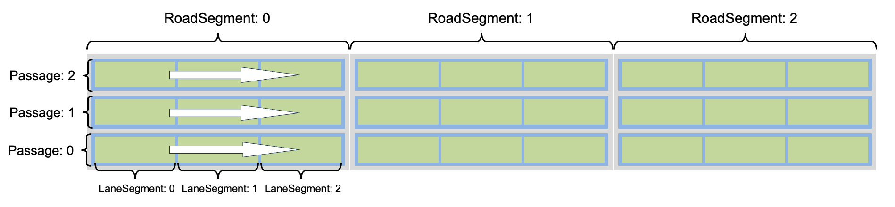

planning-pnc_map-lane_follow_map
============

## 简介

`LaneFollowMap`: `PncMapBase`的一个子类，在`lane_follow_command`指令下，从routing结果转换到ReferenceLine的过程中做前期准备，主要功能是处理routing结果，将routing数据处理并存储在map相关的数据结构中；根据routing结果及当前车辆位置，计算可行驶的passage信息，并转换成RouteSegments结构，为ReferenceLine提供数据传入参数。封装在reference_line_provider中。

### 基本结构说明
`LaneFollowMap`中对路径进行RoadSegment，Passage，LaneSegment的存储如下图所示



### 主要成员变量说明

#### 数据结构说明
- 定义存储lane数据，其中`index`为当前lane_segment 的 `{road_index, passage_index, lane_index}`的三元组。
```
struct RouteIndex {
    apollo::hdmap::LaneSegment segment;
    std::array<int, 3> index;
  };
```

- 定义存储waypoint，以及该waypoint在`route_indices_`中的序号index。
```
struct WaypointIndex {
    apollo::hdmap::LaneWaypoint waypoint;
    int index;
    WaypointIndex(const apollo::hdmap::LaneWaypoint &waypoint, int index)
        : waypoint(waypoint), index(index) {}
  };
```

| 成员变量                                                                | 说明             |
| --------------------------------------------------------------------- | ---------------- |
| `std::vector<RouteIndex> route_indices_` | 存储routing所有road，passage，lane的信息   |
| `int range_start_`      | 主车根据routing结果更新搜索区间的起始序号 |
| `int range_end_`      | 主车根据routing结果更新搜索区间的终止序号 |
| `std::unordered_set<std::string> range_lane_ids_` | 在搜索区间内的所有lane的id  |
| `std::unordered_set<std::string> all_lane_ids_`  | 当前routing结果的所有lane的id  |
| `std::vector<WaypointIndex> routing_waypoint_index_` | 当前routing结果的所有waypoint及对应序号 |
| `std::size_t next_routing_waypoint_index_` | 下一个经过的waypoint |
| `common::VehicleState adc_state_` | 主车状态 |
| `int adc_route_index_` | 主车所处的route的序号 |
| `apollo::hdmap::LaneWaypoint adc_waypoint_` | 主车所处的waypoint |

### 主要成员函数说明

#### 1. UpdatePlanningCommand
- 传入参数为`planning::PlanningCommand &command`，每当有新的routing结果时，用最新的RoutingResponse对`LaneFollowMap`里的数据进行更新。用三个for循环分别剥离出routing结果里的road，passage，lane，将每条lane的id存进`all_lane_ids_`这个数组中；将每个`lane_segment`及`{road_index, passage_index, lane_index}`存进`route_indices_`中。
- 重置`range_start_`，`range_end_`，`adc_route_index_`，`next_routing_waypoint_index_`，调用`UpdateRoutingRange`成员函数将routing结果的lane_id存放进`range_lane_ids_`中。
- 将routing_request中的waypoint信息存储进`routing_waypoint_index_`中，routing信息的转换完毕。

#### 2. UpdateVehicleState
- 传入参数为`VehicleState &vehicle_state`，根据主车状态，调用`GetNearestPointFromRouting`成员函数从routing中查找到最近的道路点`adc_waypoint_`。
- 并根据`adc_waypoint_`调用`GetWaypointIndex`成员函数查找到当前行驶的LaneSegment在`route_indices_`中的序号`route_index`，并更新至`adc_route_index_`。
- 调用`UpdateNextRoutingWaypointIndex`成员函数，传入参数`route_index`, 计算主车下一个必经的waypoint点，并赋给`next_routing_waypoint_index_`。
- 调用`UpdateRoutingRange`成员函数，传入参数`adc_route_index_`，更新主车未经过的路线存放进`range_lane_ids_`中。

#### 3. GetRouteSegments
- 在`ReferenceLineProvider`中被调用，用于更新获取当前`route_segments`，为参考线构建提供数据支持。
- 传入参数`const VehicleState &vehicle_state, std::list<hdmap::RouteSegments> *const route_segments`，引用传参`route_segments`更新route数据。
- 调用`LookForwardDistance`，根据车辆当前速度计算前向搜索距离look_forward_distance。后向搜索look_backward_distance由参数控制。
- 调用`GetRouteSegments`的重载函数获取`route_segments`，传入参数为`vehicle_state, look_backward_distance, look_forward_distance, route_segments`。

#### 4. `GetRouteSegments`重载
- 传入参数为`vehicle_state, look_backward_distance, look_forward_distance, route_segments`。
- 调用`UpdateVehicleState`，更新route状态。
- 由更新的`adc_route_index_`,获得当前出车所处的`RoadSegment`和`Passage`的序号`road_index`、`passage_index`，根据当前road和passage，调用`GetNeighborPassages`计算当前车道的所有相邻passage的信息`drive_passages`。
- for循环遍历`drive_passages`进行操作。调用`PassageToSegments`成员函数，将passage转换为`hdmap::RouteSegments segments`，并且计算主车到当前`segments`的投影点，从该投影点，按照前向搜索距离look_forward_distance，后向搜索距离look_backward_distance，进行segments的扩展。从而得到当前passage的`segments`，并且保存至`route_segments`。
- 
#### 5. GetNeighborPassages
- 传入参数为`const routing::RoadSegment &road, int start_passage`，被`GetRouteSegments`调用，实线从主车当前所在`start_passage`获取临近passage。
- 如果`source_passage.change_lane_type() == routing::FORWARD`，当前passage可以不经过变道直达目标点；或者 `source_passage.can_exit()`，当前passage可退出，到达目标点，则不需要搜索临近passages，return退出。
- 根据`source_passage`获取`source_segments`，并根据当前lane_segemnts，以及目标通路的方向，分别向左右搜索临近的车道，将id保存至`neighbor_lanes`。
- 遍历`road`的所有passages，保存与`neighbor_lanes`相同id的`lane_segment`。
 
#### 6. PassageToSegments
- 传入参数`routing::Passage passage, hdmap::RouteSegments *segments`
- 遍历`passage`中的`lane_segment`，将其类型转换为`RouteSegments`，保存至`segments`。

#### 7. UpdateRoutingRange
- 传入参数`adc_index`
- 遍历`route_indices_`，从主车当前`adc_index`开始的route id保存至`range_lane_ids_`。

#### 8. GetNearestPointFromRouting
- 传入参数`const VehicleState &state, hdmap::LaneWaypoint *waypoint`，根据主车位置获取最近`waypoint`。
- 遍历`all_lane_ids_`，获取所有可用lane，保存至`valid_lanes`。
- 遍历`valid_lanes`，获取所有主车纵向所处车道内的waypoints，保存至`valid_way_points`。
- 遍历`valid_way_points`，获取所有主车纵向所处车道内的waypoints，保存至`valid_way_points`。
- 遍历`valid_way_points`，获取最近的`waypoint`。

#### 9. GetWaypointIndex
- 传入参数`const hdmap::LaneWaypoint &waypoint`，通过前向和后向搜索，返回该waypoint在`route_indices_`中的index。

#### 10.UpdateNextRoutingWaypointIndex
- 传入参数`int cur_index`，从当前index，计算routing结果中的下一个需要经过的waypoint，更新`next_routing_waypoint_index_`。


## 目录结构

```shell
modules/planning/pnc_map/lane_follow_map/
├── BUILD
├── cyberfile.xml
├── images
│   └── map_road_info.png
├── lane_follow_map.cc
├── lane_follow_map.h
├── lane_follow_map_test.cc
├── plugins.xml
└── README_cn.md
```

## 模块

### LaneFollowMap

apollo::planning::LaneFollowMap

#### 使用方式

##### 配置使用 LaneFollowMap
在`modules/planning/planning_component/conf/planning_config.pb.txt`文件中修改`reference_line_config`的配置，配置使用`LaneFollowMap`。
``` shell
# modules/planning/planning_component/conf/planning_config.pb.txt
reference_line_config {
  pnc_map_class: "apollo::planning::LaneFollowMap"
}
```