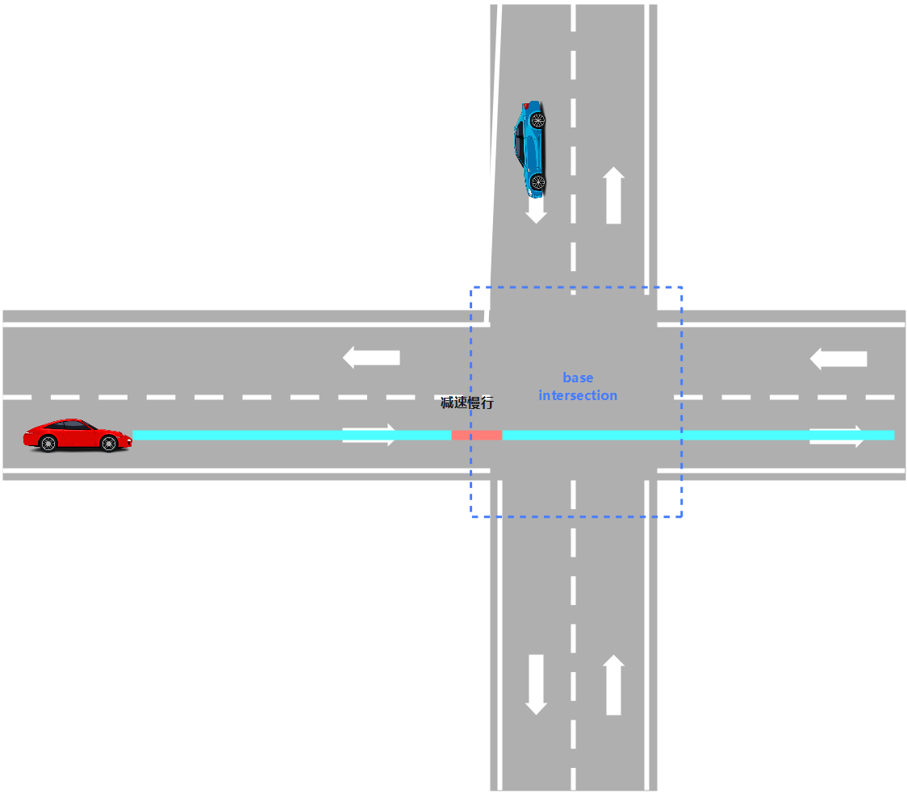

planning-scenario-bare-intersection-unprotected
============

## 简介

`BareIntersectionUnprotectedScenario`: 无保护裸露交叉路口场景，在交通路口既没有停止标志，也没有交通灯，车辆在路口前一段距离范围内切换到此场景。



### IsTransferable: 场景切入条件
  1. 当前command为`lane_follow_command`
  2. 参考线不为空
  3. 排序后遇到的overlap不为空
- 获取overlap信息：从参考线信息的`first_encounter_overlaps_`中获取最先遇到的`traffic_sign_overlap`和`pnc_junction_overlap`。
- 考虑最近的`pnc_junction_overlap`，主车距离路口小于`start_bare_intersection_scenario_distance`，大于0米，表示进入无保护裸露交叉路口场景。


### Stages

| 阶段名                                                     | 类型                                                                        | 描述                     |
| ---------------------------------------------------------- | --------------------------------------------------------------------------- | ------------------------ |
| `BARE_INTERSECTION_UNPROTECTED_APPROACH`                | `apollo::planning::BareIntersectionUnprotectedStageApproach`               | 主车减速接近无保护路口区域 |
| `BARE_INTERSECTION_UNPROTECTED_INTERSECTION_CRUISE`                 | `apollo::planning::BareIntersectionUnprotectedStageIntersectionCruise`              | 主车通过路口   |


#### 1. BARE_INTERSECTION_UNPROTECTED_APPROACH
`BareIntersectionUnprotectedStageApproach` : 该阶段用于主车减速接近无保护路口区域，主车距离达到阈值后退出。

**Process**: 该阶段处理的主函数，输入为规划初始点 `planning_init_point`、`Frame`；输出为当前阶段处理状态`StageResult`
- ExecuteTaskOnReferenceLine：输入为规划初始点`planning_init_point`、`Frame`信息，按照该stage配置的task列表，依次进行规划。
- 通过reference_line_info中的overlap，检查路口是否存在。如果不存在，则`FinishScenario()`，直接退出`BareIntersectionUnprotectedScenario`场景。
- 检查主车到路口距离，如果满足`distance_adc_to_pnc_junction < -kPassStopLineBuffer`，进入`FinishStage`，结束当前Stage，进入`BARE_INTERSECTION_UNPROTECTED_INTERSECTION_CRUISE`阶段。
- 设置主车限速，实现主车减速接近路口。
- 设置路口路权，`reference_line_info.SetJunctionRightOfWay`，主车处于非保护状态。
- 再次执行Task 规划，`ExecuteTaskOnReferenceLine`。
- CheckClear：统计主车需要等待的障碍物序列`wait_for_obstacle_ids`。
- 参数配置策略：enable_explicit_stop。如果True，则在主车需要等到，设置`stop = true`，为`wait_for_obstacle_ids`障碍物建立STOP虚拟墙。在连续5帧不需要等待的情况下，`stop = false`。

**CheckClear**: 检查当前是否由障碍物阻塞。
- 输入为`const ReferenceLineInfo& reference_line_info, std::vector<std::string>* wait_for_obstacle_ids`。
- 引用传参`wait_for_obstacle_ids`，在函数执行之后，返回阻塞需要等待的障碍物序列。


**FinishStage**: 该阶段的退出函数。
- 退出`BARE_INTERSECTION_UNPROTECTED_APPROACH`阶段，进入`BARE_INTERSECTION_UNPROTECTED_INTERSECTION_CRUISE`阶段。
- 重新设置巡航限速为`FLAGS_default_cruise_speed`。


#### 2. BARE_INTERSECTION_UNPROTECTED_INTERSECTION_CRUISE
`BareIntersectionUnprotectedStageApproach` : 该阶段用于主车通过路口。

**Process**: 该阶段处理的主函数，输入为规划初始点 `planning_init_point`、`Frame`；输出为当前阶段处理状态`StageResult`
- ExecuteTaskOnReferenceLine：输入为规划初始点`planning_init_point`、`Frame`信息，按照该stage配置的task列表，依次进行规划。
- CheckDone：检查主车是否通过路口。如果通过，进入`FinishStage`，结束当前Stage。否则，返回状态值`StageStatusType::RUNNING`。

**CheckDone**: 基类`BaseStageCruise`的一个成员函数。
- 输入为：`const Frame& frame, const PlanningContext* context, const bool right_of_way_status`。
- 在无保护路口时，`right_of_way_status = false`。检查主车是否依然处于路口。

**FinishStage**: 该阶段的退出函数。
- 退出`BARE_INTERSECTION_UNPROTECTED_INTERSECTION_CRUISE`阶段，退出`BareIntersectionUnprotectedScenario`场景。

## 目录结构

```shell
modules/planning/scenarios/bare_intersection_unprotected/
├── bare_intersection_unprotected_scenario.cc
├── bare_intersection_unprotected_scenario.h
├── bare_intersection_unprotected_scenario_test.cc
├── BUILD
├── conf
│   ├── pipeline.pb.txt
│   └── scenario_conf.pb.txt
├── cyberfile.xml
├── images
│   └── bare_intersection_scenario.png
├── plugins.xml
├── proto
│   ├── bare_intersection_unprotected_scenario.proto
│   └── BUILD
├── README_cn.md
├── stage_approach.cc
├── stage_approach.h
├── stage_approach_test.cc
├── stage_intersection_cruise.cc
└── stage_intersection_cruise.h
```

## 模块

### BareIntersectionUnprotectedScenario 插件

apollo::planning::BareIntersectionUnprotectedScenario


#### 配置

| 文件路径                                                                     | 类型/结构                                       | <div style="width: 300pt">说明</div> |
| --------------------------------------------------------------------- | ---------------- | ---------------- |
| `modules/planning/scenarios/bare_intersection_unprotected/conf/scenario_conf.pb.txt`| `apollo::planning::ScenarioBareIntersectionUnprotectedConfig` | 场景的配置文件   |
| `modules/planning/scenarios/bare_intersection_unprotected/conf/pipeline.pb.txt`     | `apollo::planning::ScenarioPipeline` | 场景的流水线文件 |
| `modules/planning/planning_component/conf/planning_config.pb.txt`                 | `apollo::planning::PlanningConfig`              | planning组件的配置文件               |

#### 使用方式
##### 配置加载 EmergencyStopScenario 插件
- 在`modules/planning/planning_component/conf/planning_config.pb.txt`文件中增加`standard_planning_config`的配置，配置使用当前场景插件。
  ``` shell
  # modules/planning/planning_component/conf/planning_config.pb.txt

  standard_planning_config {
    planner_type: ......
    planner_public_road_config {
      ......
      scenario {
        name: "BARE_INTERSECTION_UNPROTECTED"
        type: "BareIntersectionUnprotectedScenario"
      }
      ......
    }
  }
  ```
- 在`modules/planning/scenarios/bare_intersection_unprotected/conf/pipeline.pb.txt`中编辑该场景下所有`Stage`，以及各`Stage`对应的`Task`列表。
- 同时支持自主开发，对于新增`Stage`插件，需要添加至`modules/planning/scenarios/bare_intersection_unprotected/plugins.xml`。
  ```shell
  # modules/planning/scenarios/bare_intersection_unprotected/plugins.xml 
  <library path="modules/planning/scenarios/bare_intersection_unprotected/libbare_intersection_unprotected_scenario.so">
      <class type="apollo::planning::BareIntersectionUnprotectedScenario" base_class="apollo::planning::Scenario"></class>
      <class type="apollo::planning::BareIntersectionUnprotectedStageApproach" base_class="apollo::planning::Stage"></class>
      <class type="apollo::planning::BareIntersectionUnprotectedStageIntersectionCruise" base_class="apollo::planning::Stage"></class>
  </library>
  ```

##### 配置 EmergencyStopScenario 参数
- `proto`文件配置：`modules/planning/scenarios/bare_intersection_unprotected/proto/bare_intersection_unprotected_scenario.proto`
- EmergencyStopScenario参数配置为：`modules/planning/scenarios/bare_intersection_unprotected/conf/scenario_conf.pb.txt`
