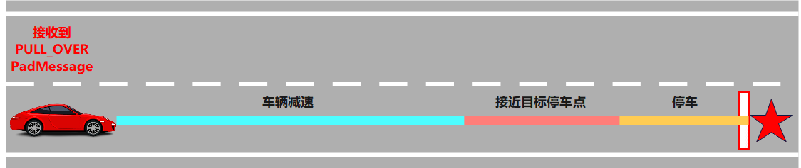

planning-scenario-emergency-pull-over
============

## 简介

`EmergencyPullOverScenario`: 紧急靠边停车场景，车辆在行驶过程中如果收到PadMessage命令“PULL_OVER”，车辆就近找到合适的位置在当前车道内停车，相比于直接停车，这样保证了行驶过程中的停车安全性和舒适性。




### IsTransferable: 场景切入条件
  1. 当前帧参考线不为空
  2. 接收到PadMessage命令为 `PadMessage::PULL_OVER`

### Stages

| 阶段名                                        | 类型                                                   | 描述                                                                            |
| -------------------------------------------- | ------------------------------------------------------| -------------------------------------------------------------------------------|
| `EMERGENCY_PULL_OVER_SLOW_DOWN`              | `apollo::planning::EmergencyPullOverStageSlowDown`    | 停车前减速阶段，修改参考线主车限速，主车速度达到阈值后退出                                  |
| `EMERGENCY_PULL_OVER_APPROACH`               | `apollo::planning::EmergencyPullOverStageApproach`    | 减速后`PULL_OVER_PATH` task 计算停车点，主车靠近停车终点，主车速度和距离达到阈值后退出该阶段   |
| `EMERGENCY_PULL_OVER_STANDBY`                | `apollo::planning::EmergencyPullOverStageStandby`     | 主车在停车点保持停车，`PadMessage`从 `PULL_OVER` 切换至其他状态后退出该阶段                 |


#### 1. EMERGENCY_PULL_OVER_SLOW_DOWN
`EmergencyPullOverStageSlowDown` : 该阶段用于主车停车前减速，修改参考线主车限速，主车速度达到阈值后退出。

**Process**: 该阶段处理的主函数，输入为规划初始点 `planning_init_point`、`Frame`；输出为当前阶段处理状态`StageResult`
- 主车限速调整：根据场景配置文件，获取`target_slow_down_speed`，调用`reference_line_info.LimitCruiseSpeed()`函数进行限速修改，达到主车减速目的。
- ExecuteTaskOnReferenceLine：输入为规划初始点`planning_init_point`、`Frame`信息，按照该stage配置的task列表，依次进行规划。
- 检查主车状态：检查主车是否减速达到目标速度。如果减速达到目标速度，进入`FinishStage`，结束当前Stage，进入`EMERGENCY_PULL_OVER_APPROACH`阶段。如果未达到目标速度，则仍处于`EMERGENCY_PULL_OVER_SLOW_DOWN`阶段，返回状态值`StageStatusType::RUNNING`。

**FinishStage**: 该阶段的退出函数。
- 退出`EMERGENCY_PULL_OVER_SLOW_DOWN`阶段， 设置主车`pull_over_status->set_plan_pull_over_path(true)`，进入`EMERGENCY_PULL_OVER_APPROACH`阶段。

#### 2. EMERGENCY_PULL_OVER_APPROACH
`EmergencyPullOverStageApproach` : 该阶段用于主车减速后，接近停车目标点。

**Process**: 该阶段处理的主函数，输入为规划初始点 `planning_init_point`、`Frame`；输出为当前阶段处理状态`StageResult`
- 设置主车限速，`reference_line_info.LimitCruiseSpeed`；打开转向灯表明靠边临时停车，`reference_line_info.SetTurnSignal(VehicleSignal::TURN_RIGHT)`。
- 构建虚拟障碍物：根据规划计算的停车点，构建id为`EMERGENCY_PULL_OVER`的虚拟障碍物。
- ExecuteTaskOnReferenceLine：输入为规划初始点`planning_init_point`、`Frame`信息，按照该stage配置的task列表，依次进行规划。
- 检查主车状态：检查主车速度与距离是否满足阈值。如果满足，进入`FinishStage`，结束当前Stage，进入`EMERGENCY_PULL_OVER_STANDBY`阶段。如果不满足，则仍处于`EMERGENCY_PULL_OVER_APPROACH`阶段，返回状态值`StageStatusType::RUNNING`。

**FinishStage**: 该阶段的退出函数。
- 退出`EMERGENCY_PULL_OVER_APPROACH`阶段， 进入`EMERGENCY_PULL_OVER_STANDBY`阶段。

#### 3. EMERGENCY_PULL_OVER_STANDBY
`EmergencyPullOverStageStandby` : 该阶段用于主车保持紧急靠边停车状态。

**Process**: 该阶段处理的主函数，输入为规划初始点 `planning_init_point`、`Frame`；输出为当前阶段处理状态`StageResult`
- 设置主车限速，`reference_line_info.LimitCruiseSpeed`；打开危险报警闪光灯，`reference_line_info.SetEmergencyLight()`；关闭转向灯，`reference_line_info.SetTurnSignal(VehicleSignal::TURN_NONE)`。
- 构建虚拟障碍物：根据规划计算的停车点，构建id为`EMERGENCY_PULL_OVER`的虚拟障碍物。
- ExecuteTaskOnReferenceLine：输入为规划初始点`planning_init_point`、`Frame`信息，按照该stage配置的task列表，依次进行规划。
- 检查PadMessage：`PadMessage`从 `PULL_OVER` 切换至其他状态后，进入`FinishStage`，结束当前Stage；否则仍处于`EMERGENCY_PULL_OVER_STANDBY`阶段，返回状态值`StageStatusType::RUNNING`。

**FinishStage**: 该阶段的退出函数。
- 退出`EMERGENCY_PULL_OVER_STANDBY`阶段， 进入`EmergencyPullOverScenario`场景。

## 目录结构

```shell
modules/planning/scenarios/emergency_pull_over/
├── BUILD
├── conf
│   ├── emergency_pull_over_approach
│   │   └── pull_over_path.pb.txt
│   ├── pipeline.pb.txt
│   └── scenario_conf.pb.txt
├── cyberfile.xml
├── emergency_pull_over_scenario.cc
├── emergency_pull_over_scenario.h
├── emergency_pull_over_scenario_test.cc
├── images
│   └── emergency_pull_over_scenario.png
├── plugins.xml
├── proto
│   ├── BUILD
│   └── emergency_pull_over.proto
├── README_cn.md
├── stage_approach.cc
├── stage_approach.h
├── stage_approach_test.cc
├── stage_slow_down.cc
├── stage_slow_down.h
├── stage_slow_down_test.cc
├── stage_standby.cc
├── stage_standby.h
└── stage_standby_test.cc
```

## 模块

### EmergencyPullOverScenario插件

apollo::planning::EmergencyPullOverScenario


#### 配置文件

| 文件路径                                                                     | 类型/结构                                       | <div style="width: 300pt">说明</div> |
| --------------------------------------------------------------------- | ---------------- | ---------------- |
| `modules/planning/scenarios/emergency_pull_over/conf/scenario_conf.pb.txt`| `apollo::planning::ScenarioEmergencyPullOverConfig` | 场景的配置文件   |
| `modules/planning/scenarios/emergency_pull_over/conf/pipeline.pb.txt`     | `apollo::planning::ScenarioPipeline` | 场景的流水线文件 |
| `modules/planning/scenarios/emergency_pull_over/conf/emergency_pull_over_approach/pull_over_path.pb.txt`                 | `apollo::planning::PullOverPathConfig`              | Task配置文件               |
| `modules/planning/planning_component/conf/planning_config.pb.txt`                 | `apollo::planning::PlanningConfig`              | planning组件的配置文件               |

#### 使用方式
##### 配置加载 EmergencyPullOverScenario 插件
- 在`modules/planning/planning_component/conf/planning_config.pb.txt`文件中增加`standard_planning_config`的配置，配置使用当前场景插件。
  ``` shell
  # modules/planning/planning_component/conf/planning_config.pb.txt

  standard_planning_config {
    planner_type: ......
    planner_public_road_config {
      scenario {
        name: "EMERGENCY_PULL_OVER"
        type: "EmergencyPullOverScenario"
      }
      ......
    }
  }
  ```
- 在`modules/planning/scenarios/emergency_pull_over/conf/pipeline.pb.txt`中编辑该场景下所有`Stage`，以及各`Stage`对应的`Task`列表。
- 同时支持自主开发，对于新增`Stage`插件，需要添加至`modules/planning/scenarios/emergency_pull_over/plugins.xml`。
  ```shell
  # modules/planning/scenarios/emergency_pull_over/plugins.xml
  <library path="modules/planning/scenarios/emergency_pull_over/libemergency_pull_over_scenario.so">
      <class type="apollo::planning::EmergencyPullOverScenario" base_class="apollo::planning::Scenario"></class>
      <class type="apollo::planning::EmergencyPullOverStageApproach" base_class="apollo::planning::Stage"></class>
      <class type="apollo::planning::EmergencyPullOverStageSlowDown" base_class="apollo::planning::Stage"></class>
      <class type="apollo::planning::EmergencyPullOverStageStandby" base_class="apollo::planning::Stage"></class>
  </library>
  ```


##### 配置 EmergencyPullOverScenario 参数
- `proto`文件配置：`modules/planning/scenarios/emergency_pull_over/proto/emergency_pull_over.proto`
- EmergencyPullOverScenario参数配置为：`modules/planning/scenarios/emergency_pull_over/conf/scenario_conf.pb.txt`
- - 各`Stage`参数配置，位于`modules/planning/scenarios/emergency_pull_over/conf/<stage_name>/`文件夹下

  ```shell
  # modules/planning/scenarios/emergency_pull_over/conf/
  ├── emergency_pull_over_approach/
  │   └── pull_over_path.pb.txt
  ├── pipeline.pb.txt
  └── scenario_conf.pb.txt
  ```